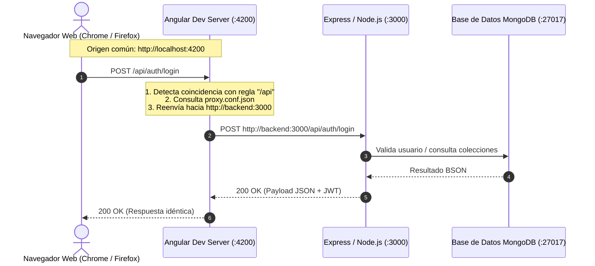

# Comunicación Frontend-Backend, Proxy Inverso y Resolución de Rutas /api

Este documento técnico detalla la arquitectura de red y el mecanismo de enrutamiento que permite a la aplicación web (SPA) en el navegador realizar peticiones HTTP hacia `http://localhost:4200/api/...` y comunicarse de manera transparente con el servidor backend de Express que se ejecuta en el puerto `3000`, tanto en el entorno de desarrollo como en producción.

---

## 1. Visión General y Pregunta Fundamental

> **¿Por qué el navegador solicita `http://localhost:4200/api/...` si el backend escucha en el puerto `3000`?**

En lugar de que el código cliente de Angular apunte de forma fija a `http://localhost:3000`, el frontend utiliza **rutas relativas** (ej. `/api/auth/login`, `/api/mapa-intermodular`). 

Un componente intermedio (**Proxy Inverso**) intercepta todas las peticiones con prefijo `/api` y las redirige internamente hacia el backend en el puerto `3000`.

---

## 2. Diagrama de Arquitectura y Flujo de Comunicación



---

## 3. Implementación en los Distintos Entornos

### 3.1. Entorno de Desarrollo Local (Angular CLI + Docker)

Durante el desarrollo local, el servidor de desarrollo de Angular (`ng serve`) actúa simultáneamente como:
1. **Servidor HTTP de archivos estáticos:** Compila TypeScript/SCSS en memoria y sirve la Single Page Application (SPA).
2. **Servidor Proxy HTTP:** Redirige selectivamente llamadas HTTP hacia servidores de backend.

#### Archivos de configuración:

1. **[`frontend/proxy.conf.json`](file:///Users/csgj/dev/pai-app/frontend/proxy.conf.json):**
   ```json
   {
     "/api": {
       "target": "http://backend:3000",
       "secure": false
     }
   }
   ```
   - `/api`: Filtro o prefijo de ruta que se desea interceptar.
   - `target`: Destino hacia donde se reenvía la petición. En la red de Docker Compose, el nombre del servicio `backend` resuelve por DNS interno al contenedor `pai_backend`.
   - `secure: false`: Permite conexiones locales sin certificados SSL estrictos.

2. **[`frontend/package.json`](file:///Users/csgj/dev/pai-app/frontend/package.json#L6):**
   ```json
   "scripts": {
     "start": "ng serve --host 0.0.0.0 --poll 1000 --proxy-config proxy.conf.json"
   }
   ```
   El flag `--proxy-config` activa el middleware de proxy (`http-proxy-middleware`) integrado en el servidor de Angular.

3. **[`docker-compose.yml`](file:///Users/csgj/dev/pai-app/docker-compose.yml):**
   ```yaml
   services:
     backend:
       container_name: pai_backend
       ports:
         - "3000:3000"
     frontend:
       container_name: pai_frontend
       ports:
         - "4200:4200"
       command: npm start
   ```
   Ambos contenedores comparten la red bridge creada por Docker, lo que permite al frontend resolver `http://backend:3000`.

---

### 3.2. Entorno de Producción (Servidor EC2 + Nginx)

En producción no se utiliza `ng serve`, sino archivos estáticos precompilados mediante `ng build --configuration production` servidos por **Nginx**.

El servidor Nginx en el host o en contenedor asume el rol de Proxy Inverso:

```nginx
server {
    listen 80;
    server_name plappin.org;

    # 1. Rutas de API: Redirigidas al backend Node.js
    location /api/ {
        proxy_pass http://localhost:3000/api/;
        proxy_http_version 1.1;
        proxy_set_header Upgrade $http_upgrade;
        proxy_set_header Connection 'upgrade';
        proxy_set_header Host $host;
        proxy_cache_bypass $http_upgrade;
    }

    # 2. Rutas de Frontend: Servidas desde los archivos estáticos de Angular
    location / {
        root /usr/share/nginx/html;
        try_files $uri $uri/ /index.html;
    }
}
```

---

## 4. Ventajas Fundamentales de este Patrón

### 4.1. Prevención de Problemas CORS (*Cross-Origin Resource Sharing*)
En la especificación de seguridad de los navegadores (*Same-Origin Policy*), dos URLs tienen diferente origen si difiere el **protocolo**, el **dominio** o el **puerto**:
- `http://localhost:4200` y `http://localhost:3000` son orígenes distintos.

Si el frontend llamara directamente al puerto `3000`:
- El navegador emitiría peticiones preflight `OPTIONS` antes de cada `POST`, `PUT` o `DELETE`.
- Se requeriría sincronizar cabeceras `Access-Control-Allow-Origin` permisivas en el backend.
- Con el proxy, todas las peticiones se realizan a `localhost:4200/api/...`, manteniendo **el mismo origen** y eliminando bloqueos de CORS.

### 4.2. Desacoplamiento y Código Agnóstico del Entorno
En los servicios de Angular ([`AuthFacade`](file:///Users/csgj/dev/pai-app/frontend/src/app/features/auth/services/auth.facade.ts), [`MapaIntermodularService`](file:///Users/csgj/dev/pai-app/frontend/src/app/features/mapa-intermodular/services/mapa-intermodular.service.ts), etc.), las rutas se declaran siempre relativas:

```typescript
// Código limpio y portable:
this.http.post('/api/auth/login', credentials);
this.http.get('/api/mapa-intermodular', { params: { tab } });
```

No es necesario configurar variables de entorno en frontend con IPs duras (`http://192.168.1.50:3000` o `http://ec2-xx-xx.compute.amazonaws.com:3000`). El código es 100% idéntico en local, staging y producción.

### 4.3. Seguridad y Abstracción
El puerto interno del backend (`3000`) o de la base de datos (`27017`) no necesitan exponerse públicamente hacia Internet en producción. Únicamente el puerto del servidor web (`80`/`443`) queda accesible al exterior.

---

## 5. Diagnóstico de Errores: ¿Qué significa un error `502 Bad Gateway`?

Cuando en la consola de red del navegador aparece:
```text
POST http://localhost:4200/api/auth/login  502 (Bad Gateway)
```

### Significado Técnico:
- El navegador se comunicó con éxito con el servidor dev de Angular en el puerto `4200`.
- El servidor dev intentó reenviar la llamada a `http://backend:3000`.
- **El servicio destino no respondió** (porque el backend no arrancó, se cayó con una excepción no capturada o el puerto estaba inaccesible).
- El servidor proxy, al no poder establecer conexión con el backend de destino, devuelve el código HTTP **`502 Bad Gateway`** (*Pasarela Incorrecta*).

### Protocolo de Verificación ante un 502:
1. Inspeccionar los logs del contenedor backend:
   ```bash
   docker logs --tail 50 pai_backend
   ```
2. Verificar si el puerto `3000` está activo y escuchando:
   ```bash
   lsof -i :3000
   ```
3. Realizar una llamada de prueba directa al backend para aislar el fallo:
   ```bash
   curl -i http://localhost:3000/api/auth/login
   ```
