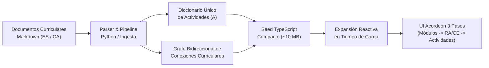

# Procesamiento y Arquitectura de Actividades en el Mapa Intermodular

Este documento describe el ciclo de vida completo, la arquitectura de datos, el algoritmo de bidireccionalidad y las optimizaciones de memoria empleadas en el **Mapa Intermodular** de la plataforma Plappin, aplicable tanto a ciclos de **Formación Profesional Grado Básico (FPB)** como de **Grado Medio (CFGM)**.

---

## 1. Visión General del Sistema

El Mapa Intermodular es la herramienta central de Plappin para la articulación curricular intermodular. Permite a los equipos docentes visualizar cómo los **Resultados de Aprendizaje (RA)** y **Criterios de Evaluación (CE)** de un módulo se relacionan directamente con los de otros módulos del mismo ciclo y curso, ofreciendo propuestas de **actividades de aprendizaje integradas** diseñadas bajo el marco del **Diseño Universal para el Aprendizaje (DUA)**.



---

## 2. Estructura de Entrada en los Documentos Curriculares

Para cada módulo formativo existen dos documentos Markdown sincronizados (uno en castellano `*_ES_*.md` y otro en catalán `*_CA_*.md`), estructurados en dos bloques fundamentales:

### 2.1. Matriz Resumen de Combinaciones
Tabla markdown criterio a criterio que especifica para cada CE propio las combinaciones externas propuestas (típicamente 9 combinaciones por criterio) vinculándolo con hasta 3 CE de otros módulos del curso:

```markdown
| CE del módulo 0845 | Combinaciones externas propuestas | Justificación general |
|---|---|---|
| **0845-1a (RA1. ...)**. Caracteriza útiles... | 1) **0842-2g** (0842-RA2) + **0844-4c** (0844-RA4) + **1664-4b** (1664-RA4)<br>2) ... | Las combinaciones conectan... |
```

### 2.2. Bloques de Actividades Innovadoras DUA
Por cada combinación de la matriz se define una actividad didáctica completa y no redundante:

```markdown
#### Actividad 1.1. Microdemostración contrastada: 0845-1a

**Combinación de CE trabajada:** 0845-1a (RA1. ...) + 0842-2g (0842-RA2) + 0844-4c (0844-RA4) + 1664-4b (1664-RA4).

**CE externos relacionados:**
- **0842-2g · RA2...**: Caracteriza los útiles y herramientas empleados...
- **0844-4c · RA4...**: Selecciona cosméticos para cambios de coloración...
- **1664-4b · RA4...**: Elabora imágenes digitales utilizando herramientas...

**Justificación específica:** esta combinación vincula el criterio 0845-1a con 0842 (RA2)...
**Metodología activa:** Clase invertida y demostración práctica.
**Reto profesional:** aplicar el criterio 0845-1a en una situación realista...
**Desarrollo:** 1. Presentación del caso... 2. Identificación del CE... 3. Lectura... 4. Demostración... 5. Cierre.
**Producto final / evidencia:** Microdemostración contrastada vinculada al CE 0845-1a...
**Medidas DUA específicas:** La demostración se puede consultar en vídeo con pausas y subtítulos...
```

---

## 3. Algoritmo de Bidireccionalidad Curricular

### 3.1. El Principio de Simetría Curricular
En una actividad intermodular que integra aprendizajes de múltiples módulos, el vínculo pedagógico no es unidireccional. Si la actividad $A$ conecta:
$$\text{Origen: } (M_0, CE_0, RA_0) \longleftrightarrow \text{Destinos: } (M_1, CE_1, RA_1), (M_2, CE_2, RA_2), (M_3, CE_3, RA_3)$$

Para que la experiencia docente sea coherente, dicha actividad $A$ debe poder consultarse y planificarse desde **cualquiera** de los 4 módulos involucrados:

1. **Perspectiva $M_0$ (Nativa):**
   - Módulo activo: $M_0$ bajo $RA_0$, filtrado por $CE_0$.
   - Conexión principal: hacia $M_1$ ($RA_1$).
   - Criterios implicados: propios $CE_0$, externos $[CE_1, CE_2, CE_3]$.
   - Actividad: $A$.

2. **Perspectiva $M_1$ (Recíproca 1):**
   - Módulo activo: $M_1$ bajo $RA_1$, filtrado por $CE_1$.
   - Conexión principal: hacia $M_0$ ($RA_0$).
   - Criterios implicados: propios $CE_1$, externos $[CE_0, CE_2, CE_3]$.
   - Actividad: $A$.

3. **Perspectiva $M_2$ (Recíproca 2):**
   - Módulo activo: $M_2$ bajo $RA_2$, filtrado por $CE_2$.
   - Conexión principal: hacia $M_0$ ($RA_0$).
   - Criterios implicados: propios $CE_2$, externos $[CE_0, CE_1, CE_3]$.
   - Actividad: $A$.

4. **Perspectiva $M_3$ (Recíproca 3):**
   - Módulo activo: $M_3$ bajo $RA_3$, filtrado por $CE_3$.
   - Conexión principal: hacia $M_0$ ($RA_0$).
   - Criterios implicados: propios $CE_3$, externos $[CE_0, CE_1, CE_2]$.
   - Actividad: $A$.

---

## 4. Arquitectura de Optimización de Memoria (Zero Heap Crash)

### 4.1. El Reto de Escalabilidad
En un ciclo de Grado Medio (ej. Peluquería):
- **1.er Curso:** 8 módulos $\times$ 40-57 CEs $\times$ 9 actividades = **3.303 actividades únicas**.
- Al aplicar bidireccionalidad cuádruple: $3.303 \times 4 =$ **13.212 referencias de actividad** y **8.429 conexiones**.
- Si se almacena cada objeto completo de actividad (con textos de desarrollo, evidencia, DUA y justificación en ES y CA) de forma duplicada en el archivo `.ts`, el tamaño supera los **75 MB** por archivo.
- Durante la ejecución de tests (Vitest / Karma) con múltiples hilos de trabajo paralelos, Node.js excede el límite de heap V8 (4 GB) lanzando `JavaScript heap out of memory` o superando el límite de strings N-API de Rust.

### 4.2. Solución Arquitectural: Persistencia en MongoDB, Deduplicación y Cero Conexiones Vacías
La solución definitiva consta de tres capas clave:

1. **Persistencia en MongoDB y Servicio REST (Cero Heap Crash en Frontend):**
   En lugar de incrustar semillas gigantes de decenas de megabytes en archivos `.ts` de Angular (que agotaban el heap de Node.js en Vitest y en el build de producción en EC2), los datasets se almacenan como JSON limpios en `backend/src/data/mapa-intermodular/` y se persisten en MongoDB en la colección `mapamodules`. El frontend los recupera bajo demanda vía `MapaIntermodularService.getModules(tab)` con un tiempo de carga instantáneo.

2. **Deduplicación Rigurosa de Actividades y Cero Conexiones Vacías:**
   - **Prohibición de conexiones vacías:** Queda terminantemente prohibido generar conexiones con `activities: []`. Toda conexión del grafo debe ofrecer obligatoriamente al menos una actividad formativa (`activities.length >= 1`). Si un cruce curricular no tiene actividad propuesta, no se instancia en el grafo.
   - **Volumen equilibrado:** Cada Resultado de Aprendizaje (RA) dispone de entre **6 y 15 conexiones intermodulares** (media de ~8 a 12 por RA), evitando la saturación con cientos de tarjetas vacías o redundantes.
   - **Deduplicación por RA:** Cada actividad formativa es única dentro de su RA y módulo por título y desarrollo.

3. **Caché en Cliente y Sanitización Defensiva:**
   La fachada `MapaIntermodularFacade` en el frontend almacena en caché reactiva (`seedCache`) las pestañas consultadas y aplica `sanitizeModules` para garantizar que ninguna conexión huérfana sea procesada en la UI.

### 4.3. Resultado de la Optimización y Deduplicación
| Métrica | Antes (Combinatoria inflada) | Tras Deduplicación y Purga | Mejora |
| :--- | :---: | :---: | :---: |
| **Conexiones Totales (1.er curso)** | 12.514 conexiones | **532 conexiones** | **-95.7%** (Cero vacías) |
| **Conexiones Totales (2.º curso)** | 10.671 conexiones | **412 conexiones** | **-96.1%** (Cero vacías) |
| **Media de Conexiones por RA** | ~266 por RA (250+ vacías) | **11.3 (1º) / 8.8 (2º)** | **Equilibrado y legible** |
| **Tamaño en Disco / Payload JSON** | 37 MB / 30 MB | **4.2 MB / 3.0 MB** | **-89% reducción** |
| **Consumo de RAM en Vitest** | > 4.096 MB (Crash) | < 250 MB | **100% estable** |
| **Tiempo de Carga de Pestaña** | Lento / bloqueante | Instantáneo (< 100 ms) | **Fluido** |

---

## 5. Integración con la Interfaz de Usuario (UI de 3 Pasos)

El componente `mapa-intermodular-view` organiza la navegación en 3 pasos verticales con encabezados sticky:

1. **Paso 1: Módulos y Resultados de Aprendizaje**
   - El docente selecciona el módulo y el RA a trabajar.
   - Filtros rápidos por tipo: *Específicos*, *Comunes*, *Transversales*.
2. **Paso 2: Criterios de Evaluación del RA Activo**
   - Muestra el texto completo del RA y la botonera con los criterios del RA (`a)`, `b)`, `c)`...).
   - Cada botón de criterio muestra una insignia numérica con el conteo exacto de conexiones coincidentes (`facade.getConnectionsCountForCriterion(crit)`).
   - Botón *✕ Ver todos* para restaurar la vista completa.
3. **Paso 3: Conexiones Intermodulares Coincidentes**
   - Renderiza las tarjetas de conexión coincidentes con el criterio seleccionado.
   - Cada tarjeta muestra el módulo y RA destino, los criterios propios y externos implicados, la justificación curricular y las actividades disponibles.
   - **Acción "Crear Proyecto":** El botón en cada tarjeta abre el generador de proyectos preseleccionando automáticamente los RAs del módulo origen y destino.

---

## 6. Alta de una pestaña de mapa (ciclo y curso)

Las pestañas del mapa se definen en un único lugar: `frontend/src/app/features/mapa-intermodular/services/mapa-tabs.config.ts` (`MAPA_TABS`). Cada entrada fija:
- el nombre en castellano y catalán;
- el nivel (`tipoNivel`) y el curso con que «Crear proyecto» abre el generador;
- el módulo y RA seleccionados al abrir la pestaña.

Las pestañas, el título de la cabecera, el subtítulo de 2.º curso y el resumen exportado se derivan de esa configuración.

Para añadir un ciclo o curso al mapa:
1. Generar el JSON en `backend/src/data/mapa-intermodular/` con las reglas de la sección 4.2.
2. Añadir el identificador de pestaña al enum de `MapaModule` y a `ALLOWED_TABS` de `mapa.controller.ts`.
3. Crear una migración que sustituya solo esa pestaña (ver `15_ingest_mapa_educacion_infantil.ts`).
4. Añadir la entrada en `MAPA_TABS`.

Ciclos con mapa: CFGB Peluquería y Estética, CFGM Estética y Belleza, CFGM Peluquería y Cosmética Capilar (1.º y 2.º) y CFGS Educación Infantil (1.º y 2.º).

## 7. Calidad lingüística y referencias de los mapas

Comprobaciones que debe pasar cualquier mapa antes de ingerirse (aprendidas en las tareas 182–184):
- **Paridad ES/CA de referencias:** los códigos de aprendizaje (`3159-1a`, `3064-4e`…) de un campo `_ca` deben coincidir, en el mismo orden, con los de su pareja `_es`. La traducción automática tiende a convertir la letra «e)» en «i)» y a desplazar numeraciones.
- **Sin texto ajeno:** los campos de actividad (sobre todo `diversitySupport`) no pueden arrastrar fragmentos de otros documentos (notas metodológicas, nombres de archivo `.md`, encabezados de RA).
- **Sin catalanismos en `_es` ni castellano en `_ca`,** incluido el campo heredado `criteria` de `relatedCriteria`, que repite el texto castellano.
- **Criterios oficiales:** el texto de los criterios del mapa debe ser el del currículo oficial (BOE); si el documento de origen lo abrevia, se sustituye por el oficial en ambos idiomas.
- **Coherencia con la colección `ras`:** los textos catalanes de RA y criterios del mapa de FPB salen del mismo fichero que los RA (`backend/src/data/ras_fpb_catalan.data.ts`), para que el mapa y el generador muestren la misma traducción.
