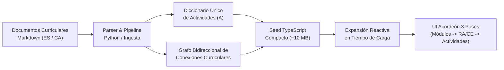

# Procesamiento y Arquitectura de Actividades en el Mapa Intermodular

Este documento describe el ciclo de vida completo, la arquitectura de datos, el algoritmo de bidireccionalidad y las optimizaciones de memoria empleadas en el **Mapa Intermodular** de la plataforma Plappin, aplicable tanto a ciclos de **Formación Profesional Grado Básico (FPB)** como de **Grado Medio (CFGM)**.

---

## 1. Visión General del Sistema

El Mapa Intermodular es la herramienta central de Plappin para la articulación curricular intermodular. Permite a los equipos docentes visualizar cómo los **Resultados de Aprendizaje (RA)** y **Criterios de Evaluación (CE)** de un módulo se relacionan directamente con los de otros módulos del mismo ciclo y curso, ofreciendo propuestas de **actividades de aprendizaje integradas** diseñadas bajo el marco del **Diseño Universal para el Aprendizaje (DUA)**.



---

## 2. Estructura de Entrada en los Documentos Curriculares

Para cada módulo formativo existen dos documentos Markdown sincronizados (uno en castellano `*_ES_*.md` y otro en catalán `*_CA_*.md`), estructurados en dos bloques fundamentales:

### 2.1. Matriz Resumen de Combinaciones
Tabla markdown criterio a criterio que especifica para cada CE propio las combinaciones externas propuestas (típicamente 9 combinaciones por criterio) vinculándolo con hasta 3 CE de otros módulos del curso:

```markdown
| CE del módulo 0845 | Combinaciones externas propuestas | Justificación general |
|---|---|---|
| **0845-1a (RA1. ...)**. Caracteriza útiles... | 1) **0842-2g** (0842-RA2) + **0844-4c** (0844-RA4) + **1664-4b** (1664-RA4)<br>2) ... | Las combinaciones conectan... |
```

### 2.2. Bloques de Actividades Innovadoras DUA
Por cada combinación de la matriz se define una actividad didáctica completa y no redundante:

```markdown
#### Actividad 1.1. Microdemostración contrastada: 0845-1a

**Combinación de CE trabajada:** 0845-1a (RA1. ...) + 0842-2g (0842-RA2) + 0844-4c (0844-RA4) + 1664-4b (1664-RA4).

**CE externos relacionados:**
- **0842-2g · RA2...**: Caracteriza los útiles y herramientas empleados...
- **0844-4c · RA4...**: Selecciona cosméticos para cambios de coloración...
- **1664-4b · RA4...**: Elabora imágenes digitales utilizando herramientas...

**Justificación específica:** esta combinación vincula el criterio 0845-1a con 0842 (RA2)...
**Metodología activa:** Clase invertida y demostración práctica.
**Reto profesional:** aplicar el criterio 0845-1a en una situación realista...
**Desarrollo:** 1. Presentación del caso... 2. Identificación del CE... 3. Lectura... 4. Demostración... 5. Cierre.
**Producto final / evidencia:** Microdemostración contrastada vinculada al CE 0845-1a...
**Medidas DUA específicas:** La demostración se puede consultar en vídeo con pausas y subtítulos...
```

---

## 3. Algoritmo de Bidireccionalidad Curricular

### 3.1. El Principio de Simetría Curricular
En una actividad intermodular que integra aprendizajes de múltiples módulos, el vínculo pedagógico no es unidireccional. Si la actividad $A$ conecta:
$$\text{Origen: } (M_0, CE_0, RA_0) \longleftrightarrow \text{Destinos: } (M_1, CE_1, RA_1), (M_2, CE_2, RA_2), (M_3, CE_3, RA_3)$$

Para que la experiencia docente sea coherente, dicha actividad $A$ debe poder consultarse y planificarse desde **cualquiera** de los 4 módulos involucrados:

1. **Perspectiva $M_0$ (Nativa):**
   - Módulo activo: $M_0$ bajo $RA_0$, filtrado por $CE_0$.
   - Conexión principal: hacia $M_1$ ($RA_1$).
   - Criterios implicados: propios $CE_0$, externos $[CE_1, CE_2, CE_3]$.
   - Actividad: $A$.

2. **Perspectiva $M_1$ (Recíproca 1):**
   - Módulo activo: $M_1$ bajo $RA_1$, filtrado por $CE_1$.
   - Conexión principal: hacia $M_0$ ($RA_0$).
   - Criterios implicados: propios $CE_1$, externos $[CE_0, CE_2, CE_3]$.
   - Actividad: $A$.

3. **Perspectiva $M_2$ (Recíproca 2):**
   - Módulo activo: $M_2$ bajo $RA_2$, filtrado por $CE_2$.
   - Conexión principal: hacia $M_0$ ($RA_0$).
   - Criterios implicados: propios $CE_2$, externos $[CE_0, CE_1, CE_3]$.
   - Actividad: $A$.

4. **Perspectiva $M_3$ (Recíproca 3):**
   - Módulo activo: $M_3$ bajo $RA_3$, filtrado por $CE_3$.
   - Conexión principal: hacia $M_0$ ($RA_0$).
   - Criterios implicados: propios $CE_3$, externos $[CE_0, CE_1, CE_2]$.
   - Actividad: $A$.

---

## 4. Arquitectura de Optimización de Memoria (Zero Heap Crash)

### 4.1. El Reto de Escalabilidad
En un ciclo de Grado Medio (ej. Peluquería):
- **1.er Curso:** 8 módulos $\times$ 40-57 CEs $\times$ 9 actividades = **3.303 actividades únicas**.
- Al aplicar bidireccionalidad cuádruple: $3.303 \times 4 =$ **13.212 referencias de actividad** y **8.429 conexiones**.
- Si se almacena cada objeto completo de actividad (con textos de desarrollo, evidencia, DUA y justificación en ES y CA) de forma duplicada en el archivo `.ts`, el tamaño supera los **75 MB** por archivo.
- Durante la ejecución de tests (Vitest / Karma) con múltiples hilos de trabajo paralelos, Node.js excede el límite de heap V8 (4 GB) lanzando `JavaScript heap out of memory` o superando el límite de strings N-API de Rust.

### 4.2. Solución Arquitectural: Normalización y Expansión Reactiva
La solución implementada consta de tres capas:

1. **Diccionario Global de Actividades Únicas (`A`):**
   Cada actividad única se serializa **una sola vez** en un mapa indexado por ID (`Record<string, IntermodularActivity>`):
   ```typescript
   const A: Record<string, IntermodularActivity> = {
     "act_0845_1_1": {
       id: "act_0845_1_1",
       title_es: "Microdemostración contrastada",
       title_ca: "Microdemostració contrastada",
       motivatingFactor_es: "...",
       description_es: "...",
       ...
     }
   };
   ```

2. **Esquema Compacto de Conexiones en Disco:**
   Las conexiones almacenadas en el seed utilizan tuplas con claves breves:
   ```json
   {
     "s": "0845-1a",
     "t": "0842-2g",
     "r": ["0842-2g", "0844-4c", "1664-4b"],
     "a": ["act_0845_1_1"]
   }
   ```
   - `s`: Criterio fuente completo (`sourceCriteria`).
   - `t`: Criterio objetivo principal (`targetCe`).
   - `r`: Códigos de criterios relacionados (`relatedCriteriaCodes`).
   - `a`: Identificadores de actividades (`activity_ids`).

3. **Resolución Dinámica en Tiempo de Carga:**
   Una función `expandConnection` resuelve al cargar el módulo en memoria los datos derivados a partir de `CFGM_PELUQUERIA_RAS_DATA`:
   - `targetModuleCode` $\leftarrow$ prefijo de `t` (`0842`).
   - `targetRaCode` $\leftarrow$ búsqueda en `CRIT_LOOKUP` (`RA2`).
   - `targetModuleName_es` / `targetModuleName_ca` $\leftarrow$ lookup en `MOD_NAMES`.
   - `targetRaText_es` / `targetRaText_ca` $\leftarrow$ lookup en `RA_LOOKUP`.
   - `criteriaKeys` $\leftarrow$ `[letter, ce, s]`.
   - `relatedCriteria` $\leftarrow$ mapeo de cada código en `r` recuperando el texto curricular oficial.
   - `activities` $\leftarrow$ desreferencia `a.map(id => A[id])`.

### 4.3. Resultado de la Optimización
| Métrica | Antes (Duplicación directa) | Después (Normalización + Expansión) | Mejora |
| :--- | :---: | :---: | :---: |
| **Tamaño en Disco (1.er curso)** | 71.64 MB | 13.76 MB | **-81%** |
| **Tamaño en Disco (2.º curso)** | 55.82 MB | 11.24 MB | **-80%** |
| **Consumo de RAM en Vitest** | > 4.096 MB (Crash) | < 250 MB | **Estable y rápido** |
| **Tiempo de compilación TypeScript** | > 15 s | 1.1 s | **$\times 13$ más rápido** |

---

## 5. Integración con la Interfaz de Usuario (UI de 3 Pasos)

El componente `mapa-intermodular-view` organiza la navegación en 3 pasos verticales con encabezados sticky:

1. **Paso 1: Módulos y Resultados de Aprendizaje**
   - El docente selecciona el módulo y el RA a trabajar.
   - Filtros rápidos por tipo: *Específicos*, *Comunes*, *Transversales*.
2. **Paso 2: Criterios de Evaluación del RA Activo**
   - Muestra el texto completo del RA y la botonera con los criterios del RA (`a)`, `b)`, `c)`...).
   - Cada botón de criterio muestra una insignia numérica con el conteo exacto de conexiones coincidentes (`facade.getConnectionsCountForCriterion(crit)`).
   - Botón *✕ Ver todos* para restaurar la vista completa.
3. **Paso 3: Conexiones Intermodulares Coincidentes**
   - Renderiza las tarjetas de conexión coincidentes con el criterio seleccionado.
   - Cada tarjeta muestra el módulo y RA destino, los criterios propios y externos implicados, la justificación curricular y las actividades disponibles.
   - **Acción "Crear Proyecto":** El botón en cada tarjeta abre el generador de proyectos preseleccionando automáticamente los RAs del módulo origen y destino.
