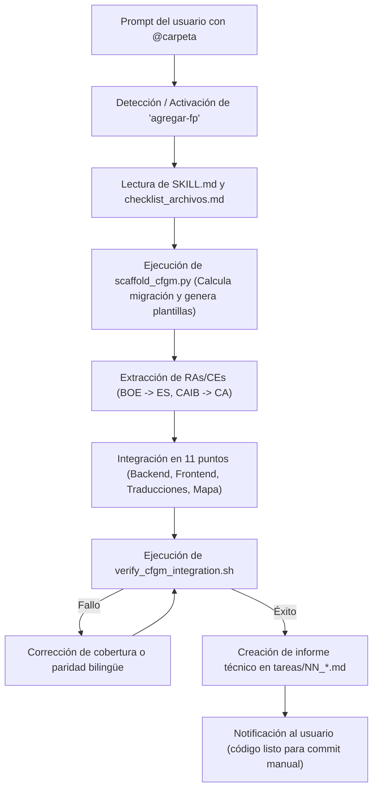

# Guía de Uso e Invocación de Skills en Antigravity CLI

Esta guía describe cómo invocar y utilizar las **Skills** de Antigravity (tanto desde la línea de comandos con el CLI `agy` como desde el entorno IDE), con foco específico en la skill [`agregar-fp`](../.agents/skills/agregar-fp/).

---

## 1. ¿Cómo funcionan las Skills en Antigravity?

A diferencia de las herramientas tradicionales de terminal, en Antigravity las Skills **no son comandos binarios de consola** (no se ejecutan como `agy run skill...`).

Funcionan mediante **revelación progresiva (*Progressive Disclosure*) y activación por contexto**:
1. **Descubrimiento automático:** Al abrir el proyecto o iniciar `agy`, Antigravity escanea automáticamente el directorio `.agents/skills/` en la raíz del repositorio.
2. **Registro de capacidades:** El motor inyecta únicamente el `name` y la `description` de cada skill en el prompt de sistema del asistente.
3. **Carga bajo demanda:** Cuando tu mensaje coincide con el propósito de la skill (o la mencionas explícitamente), el asistente lee el archivo maestro `SKILL.md` y sus referencias para ejecutar el procedimiento paso a paso.

---

## 2. Métodos de Invocación en `agy`

Puedes activar la skill de dos formas en el chat del asistente:

### A. Por Lenguaje Natural (Detección Semántica) — *Recomendado*
No necesitas recordar nombres técnicos ni sintaxis de flags. Basta con expresar la intención y pasarle el recurso:

> *"Quiero añadir el nuevo grado medio que tengo en la carpeta @add_mid_grades/Grado medio farmacia"*

El agente evalúa las descripciones de las skills activas, identifica que [`agregar-fp`](../.agents/skills/agregar-fp/SKILL.md) es la idónea, lee sus directrices y arranca el proceso automáticamente.

### B. Invocación Explícita (Mención directa)
Si deseas asegurar o forzar que el agente utilice estrictamente esta skill y sus comprobaciones:

> *"Usa la skill `agregar-fp` para añadir el ciclo de Farmacia y Parafarmacia que está en @add_mid_grades/Grado medio farmacia"*

---

### Fuentes Oficiales de Contraste
Para contrastar normativas, códigos y denominaciones bilingües oficiales:
- **TodoFP (Ministerio de Educación, FP y Deportes de España):** [https://www.todofp.es/inicio.html](https://www.todofp.es/inicio.html) (Títulos estatales, BOE y denominaciones oficiales en castellano).
- **FP Illes Balears (CAIB):** [https://www.caib.es/sites/fp/ca/inici/](https://www.caib.es/sites/fp/ca/inici/) (Normativa autonómica balear, currículos autonómicos y denominaciones en catalán).

---

## 3. Parámetros y Argumentos Mínimos

La skill está optimizada para pedir el **mínimo de información posible** y soporta tanto **Grado Básico (FP Básica / FPB)** como **Grado Medio (CFGM)**:

| Parámetro | Requerido | Formato / Ejemplo | Descripción |
| :--- | :---: | :--- | :--- |
| **Carpeta curricular** | **SÍ** | `@add_mid_grades/Grado medio farmacia/` o `@FPB/` | Ruta a la carpeta que contiene los documentos normativos oficiales (BOE estatal y CAIB autonómico). |
| **Nivel Educativo** | Opcional | Grado Medio (`CFGM`) o Grado Básico (`FP_BASICA`) | Se detecta automáticamente por el contenido de los archivos curriculares. |
| **Nombre del Ciclo** | Opcional | *"Farmacia y Parafarmacia"* / *"Farmàcia i Parafarmàcia"* | Si no se indica, la skill lo extrae de los documentos normativos o portales oficiales. |

### ¿Qué se deduce y automatiza automáticamente?
- **Slug identificador:** Se genera en mayúsculas con prefijo estándar (ej. `CFGM_FARMACIA`).
- **Número de migración backend:** Se calcula la siguiente migración secuencial disponible en `backend/src/migrations/`.
- **Textos oficiales bilingües:** Extracción directa de RAs y CEs del BOE (castellano) y CAIB (catalán).
- **Semilla del mapa intermodular:** Conexiones y propuestas de actividades para los módulos de 1.er curso.
- **Validación y tests:** Ejecución automática de pruebas de backend y frontend garantizando cobertura.

---

## 4. Ejemplos Prácticos de Prompt

### Ejemplo 1: En una sola línea (mínimo esfuerzo)
```text
Añade el nuevo grado medio de la carpeta @add_mid_grades/Grado medio farmacia usando la skill agregar-fp
```

### Ejemplo 2: Indicando explícitamente nombres en Castellano y Catalán
```text
Usa la skill agregar-fp para integrar el ciclo:
- Nombre ES: Grado Medio en Farmacia y Parafarmacia
- Nombre CA: Grau Mitjà en Farmàcia i Parafarmàcia
- Archivos: @add_mid_grades/Grado medio farmacia
```

### Ejemplo 3: Prompt para generar conexiones y actividades del mapa intermodular
```text
Quiero que para el "mapa intermodular" busques las conexiones entre los modulos de un mismo curso. Tiene que seguir el mismo esquema como hasta ahora, explicitando los criterios de evaluacion relacionados con otros modulos y justificando la conexión, explicitando el codigo y el nombre de los otros RAs y Criterios de Evaluacion (CE). Has de proponer además, al menos 9 actividades en las que se trabaje con esta combinacion de CE, dirigidas a los alumnos de una edad correspondiente al curso. años. Las actividades han de basarse en las metodologias activas de aprendizaje (Proyectos, problemas, servicio, etc.). Se ha de especificar las medidas DUA a tener en cuenta adaptadas a cada actividad. Todos los CRiterios de evaluacion (CE) han de tener actividades relacionadas con otros modulos, y no se pueden contemplar mas de tres CE, a parte del propio del modulo, por actividad. No importa si son muchas combinaciones y actividades, hazlo asi. Además, ha de ser bideccional, si hay una relacion y unas actividades entre los RA de dos modulos, han de aparecer en ambos. El documento ha de tener una version en catalan y otra en castellano sin faltas de ortografia y sin mezclar las dos lenguas.
```

---

## 5. Flujo de Ejecución Interno de la Skill

Al recibir la petición, el agente ejecuta el siguiente flujo estandarizado:



---

## 6. Scripts Auxiliares de Terminal (Opcionales)

Aunque la skill está diseñada para que el asistente la ejecute de forma autónoma, sus scripts auxiliares pueden ser ejecutados manualmente por el desarrollador en la terminal si se desea:

### 1. Generador de Scaffolding
Calcula el siguiente número de migración disponible y crea los archivos de datos iniciales:
```bash
python3 .agents/skills/agregar-fp/scripts/scaffold_cfgm.py \
  --slug CFGM_FARMACIA \
  --name-es "Farmacia y Parafarmacia" \
  --name-ca "Farmàcia i Parafarmàcia"
```

### 2. Validador Integral de Integración y Paridad Bilingüe
Comprueba estáticamente los 8 puntos clave (incluyendo que no haya textos clonados entre `_es` y `_ca`), lanza los tests unitarios de frontend (con comprobación de cobertura estricta `>= 80%` en HTML) y los tests de backend:
```bash
bash .agents/skills/agregar-fp/scripts/verify_cfgm_integration.sh CFGM_FARMACIA
```
