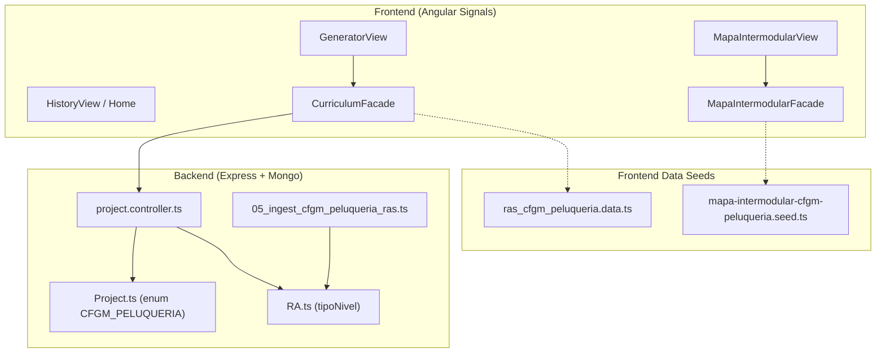

# Tarea 119: Incorporación de CFGM Peluquería y Cosmética Capilar

## Propósito
Integrar el ciclo formativo de grado medio **CFGM Peluquería y Cosmética Capilar** (`CFGM_PELUQUERIA`) de forma completa en la plataforma Plappin. Esto permite:
1. Generar proyectos educativos interdisciplinares contextualizados para 1.º y 2.º curso de Peluquería con sus RAs y criterios de evaluación oficiales (bilingües en castellano y catalán según la distribución curricular de Illes Balears).
2. Explorar y seleccionar coincidencias y conexiones curriculares a través de una nueva pestaña específica en el **Mapa Intermodular** (`CFGM_PELUQUERIA`).
3. Filtrar, clasificar y visualizar proyectos históricos y en curso con la insignia y etiquetas correspondientes al nuevo grado en el Historial, Panel de Control y Perfil.

## Arquitectura / Flujo
El flujo de datos para este nuevo nivel educativo se sincroniza a través de las siguientes capas:

1. **Capa de Modelo y Persistencia (Backend):**
   - Se amplía el enum de `tipoNivel` en `Project.ts` para aceptar `'CFGM_PELUQUERIA'`.
   - Se define la migración `05_ingest_cfgm_peluqueria_ras.ts` y la colección de datos `ras_cfgm_peluqueria.data.ts` que almacena los módulos (0845, 0842, 0844, 0846, 0849, 1664, 1709, 0156 para 1.er curso; 0640, 0643, 0843, 0848, 0636, 1708, 1710, 1713 para 2.º curso) con sus RAs y criterios en castellano y catalán.
   - En `project.controller.ts`, el generador contextualiza el prompt para IA identificando el curso de Peluquería solicitado y enlazando los criterios de evaluación adecuados.

2. **Capa de Estado y Lógica de Negocio (Frontend Facades):**
   - `CurriculumFacade`: administra las señales de selección de nivel (`tipoNivel`), el orden canónico de módulos (`CFGM_PELUQUERIA_MODULE_ORDER`) y los cursos válidos (`1r`, `2n`). Incorpora un mecanismo de fallback estático directo desde `ras_cfgm_peluqueria.data.ts` cuando la API aún no ha sincronizado la base de datos.
   - `MapaIntermodularFacade`: incorpora la pestaña `'CFGM_PELUQUERIA'` cargando la semilla `mapa-intermodular-cfgm-peluqueria.seed.ts` de forma reactiva al conmutar entre pestañas (FPB / CFGM Estètica / CFGM Perruqueria).

3. **Capa de Presentación (Componentes y Vistas):**
   - `GeneratorViewComponent`: botón selector de nivel y filtrado de asignaturas/módulos para Peluquería.
   - `MapaIntermodularViewComponent`: pestaña dedicada con código de colores diferenciado, exploración de módulos de primer curso, visualización de coincidencias intermodulares y propuestas de actividades DUA.
   - `HistoryViewComponent`, `HomeDashboardComponent`, `PersonalViewComponent`: badges y filtros adaptados para mostrar el nombre e icono correspondiente según el idioma activo (es/ca).

## Archivos Modificados

### Archivos Creados
- `backend/src/data/ras_cfgm_peluqueria.data.ts`: catálogo completo de módulos, RAs y criterios bilingües de Peluquería.
- `backend/src/migrations/05_ingest_cfgm_peluqueria_ras.ts`: migración MongoDB para ingesta de RAs del ciclo.
- `frontend/src/app/features/curriculum/data/ras_cfgm_peluqueria.data.ts`: catálogo espejo para el cliente web con tipado `CfgmRaData[]`.
- `frontend/src/app/features/mapa-intermodular/data/mapa-intermodular-cfgm-peluqueria.seed.ts`: estructura del mapa intermodular (8 módulos de 1.er curso, RAs, criterios y conexiones curriculares cruzadas).
- `tareas/119_incorporacion_cfgm_peluqueria_nuevo_proyecto.md`: este documento de diseño técnico.

### Archivos Modificados
- `backend/src/models/Project.ts`: ampliación del enum `tipoNivel` con `'CFGM_PELUQUERIA'`.
- `backend/src/controllers/project.controller.ts`: mapeo y descripción del curso de Peluquería en el prompt del generador de proyectos.
- `frontend/src/app/services/translations.es.ts` y `translations.ca.ts`: nuevas claves de internacionalización (`courseLevelCFGMPeluqueria`, títulos y etiquetas de tabs).
- `frontend/src/app/features/curriculum/services/curriculum.facade.ts`: integración de `'CFGM_PELUQUERIA'` en tipos, señales, fallbacks y ordenación de módulos.
- `frontend/src/app/features/curriculum/services/curriculum.facade.spec.ts`: cobertura de pruebas unitarias para el nuevo ciclo formativo.
- `frontend/src/app/features/generator/components/generator-view/generator-view.component.ts` y `.html`: pestaña de nivel educativo para generación de proyectos.
- `frontend/src/app/features/generator/components/generator-view/generator-view.component.spec.ts`: pruebas de selección y conmutación de nivel.
- `frontend/src/app/features/mapa-intermodular/services/mapa-intermodular.facade.ts`: gestión de pestaña `'CFGM_PELUQUERIA'` y carga de la semilla respectiva.
- `frontend/src/app/features/mapa-intermodular/components/mapa-intermodular-view/mapa-intermodular-view.component.ts` y `.html`: soporte de navegación tri-tab (FPB / CFGM Estètica / CFGM Perruqueria), headers dinámicos y eventos en plantilla.
- `frontend/src/app/features/mapa-intermodular/components/mapa-intermodular-view/mapa-intermodular-view.component.spec.ts`: cobertura exhaustiva con simulación de clics en el DOM para alcanzar el 100% de cobertura en plantillas.
- `frontend/src/app/features/history/components/history-view/history-view.component.ts` y `.spec.ts`: filtrado e insignias para Peluquería.
- `frontend/src/app/features/home/components/home-dashboard/home-dashboard.component.ts`: visualización en panel de inicio.
- `frontend/src/app/features/personal/components/personal-view/personal-view.component.ts` y `.spec.ts`: soporte de proyectos de Peluquería en perfil de usuario.
- `frontend/src/app/features/projects/services/projects.facade.ts`: tipado y normalización del nivel.
- `frontend/src/app/app.facade.ts` y `app.facade.spec.ts`: sincronización general del estado de la aplicación.

## Detalles Técnicos
- **Terminología Lingüística Balear:** En la traducción curricular al catalán se respetaron escrupulosamente los términos del sector formativo balear: *cabell* (evitando *pelo* o *cabello*), *tisores* (evitando *tijeras*), *màrqueting* (evitando *marketing*), *pentinats i recollits*, *tall de cabells*, etc.
- **Paleta de Identidad Visual para Módulos:** Para evitar ambigüedades visuales respecto a Estética, se asignaron códigos hexadecimales específicos para cada módulo de Peluquería: 0845 (`#60a5fa` - azul), 0842 (`#34d399` - verde esmeralda), 0844 (`#f472b6` - rosa capilar), 0846 (`#a78bfa` - violeta), 0849 (`#fb923c` - naranja), 1664 (`#94a3b8` - gris pizarra), 1709 (`#fbbf24` - ámbar) y 0156 (`#6ee7b7` - menta).
- **Cobertura de Funciones en Plantillas Angular:** En Angular v22 con control flow `@if` y `@for`, las funciones generadas por el compilador para listeners de eventos `(click)` y expresiones `track` requieren que los eventos sean disparados sobre los elementos del DOM real durante las pruebas unitarias. Al añadir la tercera pestaña `.mapa-tab-btn`, se garantizó que los tests ejecuten `click()` en todos los botones del DOM, elevando la cobertura de funciones del template del 78.26% al **100%** (superando el umbral estricto del 80% requerido por `check-coverage.js`).
- **Verificación de Suites:**
  - Frontend: **31 suites, 404 tests aprobados (100% éxito)**.
  - Backend: **15 suites, 123 tests aprobados (100% éxito)**.
