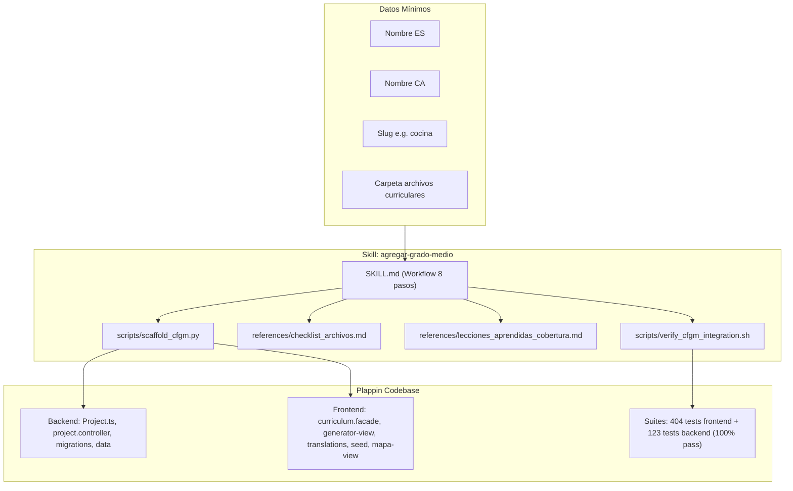

# Tarea 120: Creación de la Skill y Herramientas para Incorporación de Grados Medios (CFGM)

## Propósito
Diseñar y estructurar una **Skill personalizada reutilizable** en `.agents/skills/agregar-grado-medio/` que estandarice, simplifique y automatice la adición de futuros ciclos formativos de Grado Medio (CFGM) en la plataforma Plappin.

La skill capitaliza todo el aprendizaje y los patrones técnicos desarrollados en la incorporación de **CFGM Estética y Belleza** (Tareas 104-108) y **CFGM Peluquería y Cosmética Capilar** (Tarea 119), permitiendo que el desarrollador o el asistente sólo necesite un **mínimo de información** de entrada (nombre del ciclo en castellano y catalán, slug identificador y ruta a los documentos curriculares) para ejecutar una integración end-to-end completa y blindada.

## Arquitectura / Flujo
La solución se compone de 4 componentes integrados dentro del estándar de personalizaciones de Antigravity:

1. **Instrucciones Centrales (`SKILL.md`):**
   - Archivo con metadatos YAML frontmatter (`name: agregar-grado-medio`).
   - Define la información mínima requerida del usuario y el flujo de trabajo en 8 pasos sistemáticos.
   - Proporciona una plantilla de prompt estandarizada para delegar la ejecución a subagentes autónomos si se requiere.

2. **Herramientas de Andamiaje (`scripts/`):**
   - `scaffold_cfgm.py`: Script CLI en Python que calcula automáticamente el siguiente número secuencial de migración en `backend/src/migrations/`, y genera los esqueletos iniciales de `ras_cfgm_<slug>.data.ts` (backend y frontend), la migración MongoDB y la semilla del mapa intermodular.
   - `verify_cfgm_integration.sh`: Script en Bash que inspecciona estáticamente los 5 puntos neurálgicos donde debe existir el nuevo enum/identificador, ejecuta la suite de tests unitarios de frontend (`npm test` con `check-coverage.js`) y de backend.

3. **Referencias Técnicas (`references/`):**
   - `checklist_archivos.md`: Catálogo exhaustivo de los 11 archivos y módulos que deben tocarse en backend y frontend, con los snippets de código correspondientes.
   - `lecciones_aprendidas_cobertura.md`: Documento de diseño técnico que explica la causa raíz del umbral del 80% de cobertura en plantillas HTML de Angular v22 (funciones generadas por el compilador para enlaces `(click)` que requieren simulación de eventos en el DOM real) y directrices lingüísticas del catalán balear en FP.

## Archivos Modificados

### Archivos Creados
- `.agents/skills/agregar-grado-medio/SKILL.md`: Documento maestro de la skill según la especificación de Antigravity.
- `.agents/skills/agregar-grado-medio/scripts/scaffold_cfgm.py`: Script generador de andamiaje y migraciones con auto-numeración.
- `.agents/skills/agregar-grado-medio/scripts/verify_cfgm_integration.sh`: Script de verificación de integración y ejecución de pruebas.
- `.agents/skills/agregar-grado-medio/references/checklist_archivos.md`: Checklist integral con snippets de backend y frontend.
- `.agents/skills/agregar-grado-medio/references/lecciones_aprendidas_cobertura.md`: Manual de buenas prácticas sobre cobertura HTML en Angular v22 y rigor lingüístico.
- `tareas/120_skill_incorporacion_grados_medios.md`: Este documento de diseño técnico.

## Detalles Técnicos
- **Compatibilidad con Antigravity Customizations:** La skill sigue la estructura canónica `.agents/skills/<skill-name>/SKILL.md` descubierta automáticamente por el motor de Antigravity en el workspace del proyecto.
- **Minimización de Información de Entrada:** Se diseñó el flujo para que el desarrollador solo tenga que proporcionar:
  - `--name-es`: Nombre en castellano.
  - `--name-ca`: Nombre en catalán (si se omite, el asistente lo traduce con normativa balear).
  - `--slug`: Identificador corto en minúsculas.
  - Ruta de la carpeta con el currículo/mapa intermodular.
- **Resolución Automática de Migraciones:** `scaffold_cfgm.py` analiza el directorio `backend/src/migrations/` mediante expresiones regulares para determinar el número de migración más alto y asignar el siguiente libre correlativamente (ej. `06_...`).
- **Garantía del 100% de Cobertura:** Se protocolizó la regla crítica aprendida en las Tareas 104 y 119: simular clics en los elementos del DOM (`tabBtns[i].click()`) dentro de los tests unitarios de `mapa-intermodular-view.component.spec.ts` para ejecutar las funciones compiladas de la plantilla HTML, garantizando el cumplimiento de los umbrales de `check-coverage.js`.
