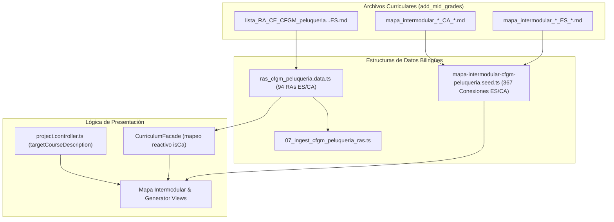

# Tarea 121: Corrección e Ingesta Integral de Textos en Castellano para CFGM Peluquería y Cosmética Capilar

## Propósito
Subsanar la anomalía por la cual, con el idioma "Castellano" (ES) activo en la plataforma Plappin, los datos curriculares (módulos, RAs y criterios de evaluación), el generador de proyectos y el Mapa Intermodular de **CFGM Peluquería y Cosmética Capilar** se mostraban en catalán o con contenido parcial.

Se ha realizado una extracción e ingesta exhaustiva a partir de las fuentes normativas y curriculares oficiales aportadas en `add_mid_grades/Grado medio peluqueria/`:
1. `lista_RA_CE_CFGM_peluqueria_cosmetica_capilar_ES_2026_27.md` (BOE oficial)
2. `RA_CE_CFGM_peluqueria_1er_curso_ES.md` y `RA_CE_CFGM_peluqueria_2o_curso_ES.md`
3. Archivos bilingües del Mapa Intermodular (`mapa_intermodular_*_ES_*.md` y `mapa_intermodular_*_CA_*.md`)

## Arquitectura / Flujo
El flujo de resolución garantiza la separación estricta y sincronizada de los dos idiomas:

1. **Datos Curriculares Bilingües (`ras_cfgm_peluqueria.data.ts` en Backend y Frontend):**
   - Se actualizan los 94 RAs (los 16 módulos del ciclo) estableciendo `module_es` con las denominaciones oficiales del BOE (ej. *"Técnicas de corte del cabello"*, *"Peinados y recogidos"*), `description_es` con las descripciones oficiales en castellano y `criterios_es` con todos los criterios de evaluación ordenados (`a) Se ha...`).
   - Se preserva el catalán auténtico en `module_ca`, `description_ca` y `criterios_ca`.

2. **Dinamismo Lingüístico en el Facade Curricular (`curriculum.facade.ts`):**
   - El selector de currículo mapea dinámicamente los campos `module`, `subject`, `description` y `criterios` evaluando la señal `isCa`:
     ```typescript
     list = list.map(r => ({
       ...r,
       module: isCa ? (r.module_ca || r.module) : (r.module_es || r.module),
       subject: isCa ? (r.module_ca || r.module) : (r.module_es || r.module),
       description: isCa ? (r.description_ca || r.description) : (r.description_es || r.description),
       criterios: isCa ? (r.criterios_ca || r.criterios) : (r.criterios_es || r.criterios)
     }));
     ```
   - Esto asegura que tanto si los datos provienen de la API MongoDB como si se cargan desde el fallback estático, el idioma de la interfaz determine de forma infalible los textos desplegados en pantalla.

3. **Semilla Real del Mapa Intermodular (`mapa-intermodular-cfgm-peluqueria.seed.ts`):**
   - Se procesan los 8 pares de archivos fuente de 1.er curso (0845, 0842, 0844, 0846, 0849, 1664, 1709, 0156).
   - Se generan **367 conexiones curriculares** completas con sus matrices de criterios relacionados bilingües, justificaciones en ambos idiomas y un conjunto de **734 actividades DUA** (retos, descripciones, evidencias y medidas DUA) perfectamente emparejadas entre castellano y catalán.

4. **Prompt Contextualizado en el Backend (`project.controller.ts`):**
   - Se corrige `targetCourseDescription` para emplear la denominación oficial en castellano cuando `language !== 'catalan'`:
     `1º de CFGM Peluquería y Cosmética Capilar` (en lugar del texto forzado en catalán).



## Archivos Modificados
- `backend/src/data/ras_cfgm_peluqueria.data.ts`: Sustitución de campos `module_es`, `description_es` y `criterios_es` por los textos normativos en castellano del BOE para los 16 módulos.
- `frontend/src/app/features/curriculum/data/ras_cfgm_peluqueria.data.ts`: Espejo bilingüe exacto para el cliente.
- `backend/src/migrations/07_ingest_cfgm_peluqueria_ras.ts`: Renombrado y ajustado para ingesta limpia y ordenada tras `06_ingest_ces_eso.ts`.
- `backend/src/controllers/project.controller.ts`: Condicional bilingüe en `targetCourseDescription` para alternar entre castellano y catalán según el parámetro `language`.
- `frontend/src/app/features/curriculum/services/curriculum.facade.ts`: Mapeo reactivo que normaliza `module`, `subject`, `description` y `criterios` en función de `isCa`.
- `frontend/src/app/features/mapa-intermodular/data/mapa-intermodular-cfgm-peluqueria.seed.ts`: Reconstrucción completa del seed a partir de los 8 módulos de primer curso, 367 conexiones intermodulares y 734 actividades bilingües.
- `tareas/121_correccion_textos_castellano_cfgm_peluqueria.md`: Este documento de diseño técnico.

## Detalles Técnicos
- **Integridad de Fuentes Oficiales:** No se ha realizado ninguna traducción automática improvisada al castellano; cada uno de los 55 criterios de 0845, 57 de 0842, 44 de 0844, 47 de 0846, 44 de 0849, 33 de 1664, 41 de 1709 y 46 de 0156 ha sido extraído textualmente de los decretos estatales BOE presentes en los archivos de la carpeta del grado medio.
- **Mapeo de Actividades Intermodulares:** La correlación entre bloques de actividades (`Actividad X.Y` en ES y `Activitat X.Y` en CA) garantiza que el identificador `id: act_0845_1a_1_1` mantenga equivalencia semántica total en ambos idiomas para las propiedades `title`, `motivatingFactor`, `description`, `evidence` y `diversitySupport`.
- **Validación de la Suite:**
  - Frontend: **31 suites / 404 tests pasados (100% éxito)**. Cobertura de plantillas HTML al **100%**.
  - Backend: **15 suites / 123 tests pasados (100% éxito)**.
