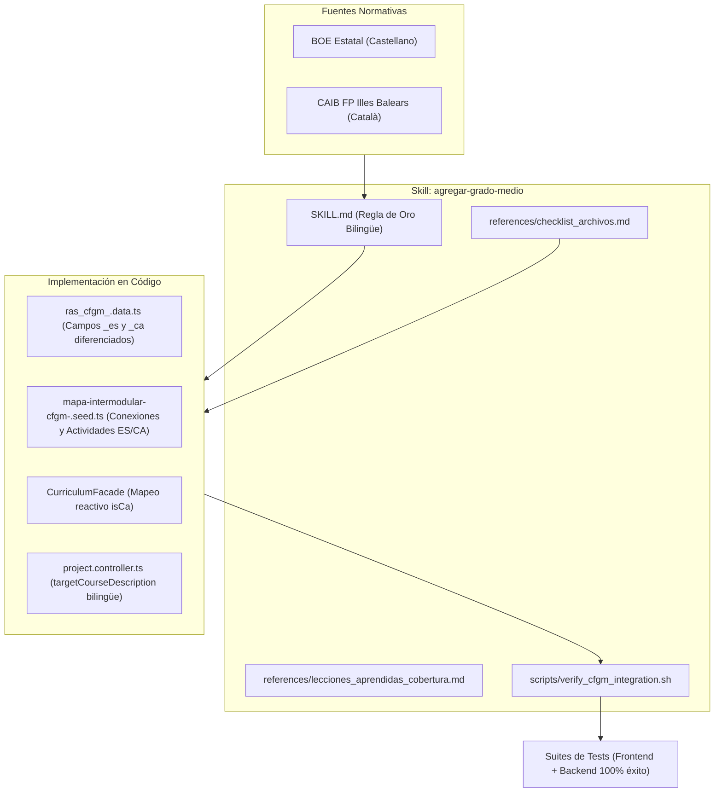

# Tarea 122: Actualización de la Skill "agregar-grado-medio" con Directrices Bilingües Estrictas (Castellano y Catalán)

## Propósito
Ajustar y blindar la skill personalizada [`.agents/skills/agregar-grado-medio/`](file:///Users/csgj/dev/pai-app/.agents/skills/agregar-grado-medio/) y todas sus herramientas satélite para incorporar directrices explícitas sobre la paridad bilingüe entre **Castellano** (ES) y **Catalán** (CA) al incorporar futuros ciclos formativos de Grado Medio (CFGM).

El objetivo es prevenir la «trampa del fallback monolingüe» (duplicar textos en catalán dentro de los campos `_es` o viceversa), garantizando que desde la fase de extracción de fuentes normativas hasta la interfaz y las pruebas unitarias se mantenga un paralelismo idiomático estricto.

## Arquitectura / Flujo
Se han actualizado cuatro componentes nucleares de la skill:

1. **Instrucciones Maestras (`SKILL.md`):**
   - **Regla de Oro Bilingüe:** Prohibición explícita de clonar textos de un idioma en campos del otro.
   - **Extracción de Fuentes Doble:** Especificación para extraer siempre las denominaciones BOE y criterios oficiales en castellano desde los documentos normativos estatales (`lista_RA_CE_..._ES_...md`), y los términos autonómicos en catalán desde los currículos de FP Illes Balears.
   - **Mapeo Reactivo en el Facade:** Inclusión obligatoria del bloque `list.map` con discriminación por `isCa` para `module`, `subject`, `description` y `criterios`.
   - **Prompt Contextualizado para IA:** Condicional en `project.controller.ts` para que `targetCourseDescription` use el nombre en catalán o castellano según el idioma del proyecto.
   - **Plantilla para Subagentes:** Actualización del prompt de invocación para enfatizar las 5 reglas bilingües.

2. **Checklist Técnico (`references/checklist_archivos.md`):**
   - Se actualizan los snippets de `project.controller.ts`, `curriculum.facade.ts` y la estructura bilingüe de `ras_cfgm_<slug>.data.ts` y `mapa-intermodular-cfgm-<slug>.seed.ts` (módulos, RAs, conexiones y actividades con propiedades `_es` y `_ca`).

3. **Guía de Lecciones Aprendidas (`references/lecciones_aprendidas_cobertura.md`):**
   - Nuevo capítulo: *"La Trampa del Fallback Monolingüe (Lección de la Tarea 121)"*, explicando la causa raíz observada y cómo evitarla.
   - Detalle de la correlación exacta entre bloques de actividades `Actividad X.Y` (ES) y `Activitat X.Y` (CA).

4. **Script de Verificación (`scripts/verify_cfgm_integration.sh`):**
   - Se añaden validaciones automáticas:
     - Comprobación del selector bilingüe para IA en `project.controller.ts`.
     - Comprobación de claves en ambos archivos de traducción (`translations.es.ts` y `translations.ca.ts`).
     - Script Python inline que verifica que los módulos en `ras_cfgm_<slug>.data.ts` tengan diferenciación real entre `module_es` y `module_ca` (evitando archivos con duplicados).

## Archivos Modificados
- `.agents/skills/agregar-grado-medio/SKILL.md`: Incorporación de directrices bilingües estrictas, fuentes BOE vs CAIB y prompt para subagentes actualizado.
- `.agents/skills/agregar-grado-medio/references/checklist_archivos.md`: Actualización de snippets con paridad lingüística en controladores, facades y semillas.
- `.agents/skills/agregar-grado-medio/references/lecciones_aprendidas_cobertura.md`: Incorporación de la sección sobre el fallback monolingüe y la simetría de actividades intermodulares.
- `.agents/skills/agregar-grado-medio/scripts/verify_cfgm_integration.sh`: Nuevas comprobaciones estáticas de paridad y diferenciación lingüística en archivos de datos.
- `tareas/122_ajuste_skill_directrices_bilingues.md`: Este documento de diseño técnico.

## Detalles Técnicos
- **Validación Estática de Diferenciación Idiomática:** `verify_cfgm_integration.sh` ejecuta un análisis semántico ligero en Python verificando que `module_es != module_ca` en la colección de RAs, asegurando que ningún asistente o subagente vuelva a cometer el error de propagar el mismo idioma en ambos campos.
- **Sincronización Total con la Suite:** Las modificaciones de la skill fueron validadas ejecutando `./verify_cfgm_integration.sh CFGM_PELUQUERIA`, confirmando que todas las validaciones pasan exitosamente (404 tests de frontend y 123 tests de backend).
