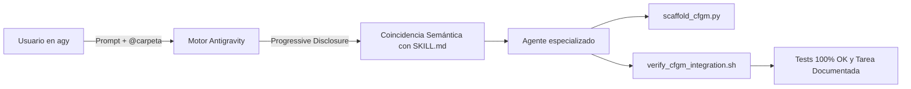

# Tarea 123: Documentación de Invocación y Uso de Skills en Antigravity CLI

## Propósito
Elaborar una guía técnica clara y accesible en la carpeta [`documentation/`](file:///Users/csgj/dev/pai-app/documentation/) que resuelva las dudas operativas sobre cómo se descubren, activan e invocan las Skills en Antigravity (especialmente en `agy` CLI e IDE), detallando los requisitos mínimos de entrada necesarios para la skill [`agregar-grado-medio`](file:///Users/csgj/dev/pai-app/.agents/skills/agregar-grado-medio/).

## Arquitectura / Flujo
El documento detalla el ciclo de vida de una Skill en Antigravity basado en el principio de **revelación progresiva (*Progressive Disclosure*)**:

1. **Fase de Descubrimiento:**
   - Antigravity inspecciona `.agents/skills/` en la raíz del workspace al inicializarse.
   - Publica el catálogo ligero (`name` y `description`) en las instrucciones de sistema del modelo.
2. **Fase de Activación:**
   - **Activación Semántica:** Detección automática por intención en lenguaje natural (ej. mención de añadir ciclo + ruta `@carpeta`).
   - **Activación Explícita:** Referencia directa por nombre (`skill agregar-grado-medio`).
3. **Fase de Ingesta y Parámetros Mínimos:**
   - Reducción del input del usuario a 1 o 2 elementos esenciales: carpeta de archivos curriculares (obligatorio) y nombre del grado (opcional/deducible).
   - Inferencia automática de slugs, secuencias de migración en base de datos y extracción de fuentes bilingües oficiales (BOE / CAIB).
4. **Fase de Verificación y Documentación:**
   - Ejecución de scripts CLI satélite (`scaffold_cfgm.py` y `verify_cfgm_integration.sh`).
   - Generación del informe técnico en `tareas/`.

## Archivos Modificados
- `documentation/uso_skill_agregar_grado_medio.md`: Nueva guía de referencia para el equipo sobre cómo interactuar con las skills y ejemplos de prompts.
- `tareas/123_guia_invocacion_skills_antigravity.md`: Este documento de diseño técnico.

## Detalles Técnicos
- **Formato Markdown Estándar y Diagramas Mermaid:** La guía incluye tablas resumen, bloques de código listos para copiar y pegar, y un diagrama de flujo para facilitar la comprensión operativa sin necesidad de consultar el código fuente de la skill.
- **Acceso a Herramientas Satélite:** Se documenta la posibilidad de ejecutar de forma independiente los scripts Python/Bash creados para la skill en caso de requerir un flujo manual o asistido fuera del chat del agente.
