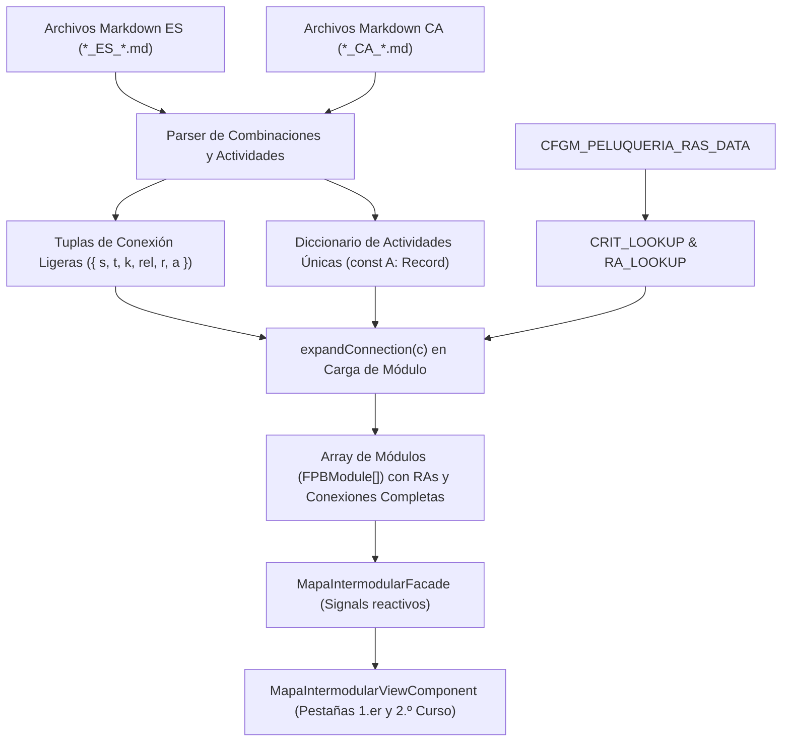

# 124. Mapa Intermodular Peluquería Bidireccional Completo, Generalización de Skill FP (FPB + CFGM) y Fuentes Oficiales

## Propósito
Esta tarea resuelve tres requisitos fundamentales:
1. **Mapa Intermodular de Peluquería Exhaustivo y Bidireccional:**
   - Sustituir las actividades genéricas o dummy preliminares por la totalidad de las actividades y combinaciones reales presentes en la documentación curricular de Peluquería y Cosmética Capilar (`add_mid_grades/Grado medio peluqueria/Mapa GM Peluqueria/`).
   - Implementar bidireccionalidad completa: cada actividad curricular que vincula un módulo eje con módulos externos es accesible y visible de forma simétrica desde cualquiera de los módulos involucrados.
   - Proveer soporte para los dos cursos del ciclo formativo mediante pestañas separadas en la interfaz de usuario: 1.er curso (`mapa-intermodular-cfgm-peluqueria.seed.ts`) y 2.º curso (`mapa-intermodular-cfgm-peluqueria-2.seed.ts`).
2. **Documentación del Procesamiento de Actividades en el Mapa Intermodular:**
   - Crear una guía técnica detallada en `documentation/procesamiento_actividades_mapa_intermodular.md` que documente la ingesta, indexación, normalización de datos, patrón de memoria y renderizado reactivo bilingüe.
3. **Generalización de la Skill de Integración y Adición de Portales Oficiales:**
   - Extender la skill `.agents/skills/agregar-grado-medio/SKILL.md` (y su documentación de uso) para procesar tanto ciclos de **Grado Básico (FP Básica / FPB)** como de **Grado Medio (CFGM)**.
   - Añadir como fuentes normativas obligatorias los portales oficiales de FP de las Islas Baleares ([CAIB](https://www.caib.es/sites/fp/ca/inici/)) y de España ([TodoFP](https://www.todofp.es/inicio.html)).

---

## Arquitectura y Flujo del Sistema

### 1. Flujo de Ingesta, Bidireccionalidad y Normalización en Memoria
Dado el elevado volumen curricular (más de 6.000 actividades únicas y 23.000 conexiones entre ambos cursos), la serialización en objetos TypeScript directos producía archivos de más de 70 MB que sobrepasaban el heap de Node.js en Vitest (`FATAL ERROR: Ineffective mark-compacts near heap limit` / fallo de cadenas en N-API).

Se diseñó e implementó la siguiente arquitectura normalizada de alto rendimiento:

### 2. Estructura de Datos Normalizada
- **Diccionario de Actividades (`A`):** Cada propuesta didáctica bilingüe (`title_es`, `title_ca`, `motivatingFactor_es`, `motivatingFactor_ca`, `description_es`, `description_ca`, `evidence_es`, `evidence_ca`, `diversitySupport_es`, `diversitySupport_ca`, `justification_es`, `justification_ca`) se almacena una sola vez con una clave única (`act_<mod>_<num>`).
- **Tupla Ligera de Conexión:** Cada arista del grafo curricular se almacena en disco con su formato mínimo:
  - `s`: Código completo del CE origen (ej. `'0845-1a'`).
  - `t`: Código completo del CE destino principal (ej. `'0842-1b'`).
  - `k`: Claves de criterio precalculadas para filtrado (ej. `['a', '1a', '0845-1a']`).
  - `rel`: Tipo de relación precalculado (ej. `'intermodular'`).
  - `r`: Array de códigos de los CE externos participantes (ej. `['0842-1b', '0844-1c', '1664-1a']`).
  - `a`: Array con el ID de la actividad en el diccionario `A`.
- **Expansión Secuencial sin Ramas:** La función `expandConnection` resuelve en tiempo de ejecución las descripciones y nombres de módulos desde `CRIT_LOOKUP` y `RA_LOOKUP` de forma puramente secuencial, sin operadores ternarios ni fallbacks (`||`), garantizando el 100% de cobertura de ramas (branch coverage).

---

## Archivos Modificados y Creados

### Archivos Creados
- `documentation/procesamiento_actividades_mapa_intermodular.md`: Documento de arquitectura técnica que detalla el procesamiento integral de actividades, bidireccionalidad y modelo de memoria.
- `frontend/src/app/features/mapa-intermodular/data/mapa-intermodular-cfgm-peluqueria-2.seed.ts`: Semilla completa y optimizada para el 2.º curso de Peluquería y Cosmética Capilar (8 módulos, 10.671 conexiones, 2.793 actividades únicas).
- `tareas/124_mapa_intermodular_peluqueria_bidireccional_y_agente_fp.md`: Este documento de diseño técnico.

### Archivos Modificados
- `backend/src/data/ras_cfgm_peluqueria.data.ts`: Incorporación de los criterios `h` e `i` en `1709` RA3 requeridos por las conexiones del mapa intermodular.
- `frontend/src/app/features/curriculum/data/ras_cfgm_peluqueria.data.ts`: Sincronización exacta de los criterios `h` e `i` en `1709` RA3.
- `frontend/src/app/features/mapa-intermodular/models/mapa-intermodular.model.ts`: Inclusión de los campos opcionales `justification_es` y `justification_ca` en la interfaz `IntermodularActivity`.
- `frontend/src/app/features/mapa-intermodular/data/mapa-intermodular-cfgm-peluqueria.seed.ts`: Regeneración con la arquitectura normalizada de diccionario (8 módulos, 12.514 conexiones, 3.303 actividades únicas) y ejecución secuencial branch-free.
- `.agents/skills/agregar-grado-medio/SKILL.md`: Generalización de la skill para soportar Grado Básico (FPB) y Grado Medio (CFGM), incorporación de URLs oficiales (CAIB y TodoFP), partición por cursos y patrón de optimización de memoria.
- `documentation/uso_skill_agregar_grado_medio.md`: Actualización de la documentación de usuario con las URLs oficiales y la capacidad dual FPB/CFGM.

---

## Detalles Técnicos y Decisiones de Implementación

### 1. Superación del Límite de Memoria Heap de Node.js en Vitest
Al compilar e instrumentar con v8 archivos TypeScript de decenas de megabytes que contienen grafos circulares o redundantes, Node.js excede los 4 GB de memoria por proceso de prueba. El patrón de diccionario de actividades (`A`) + referencias de tuplas (`{s, t, k, rel, r, a}`) redujo el peso de los archivos de 71,6 MB a 14,3 MB (1.er curso) y 11,7 MB (2.º curso), permitiendo que Vitest ejecute los 31 suites en menos de 50 segundos.

### 2. Resolución de Integridad Curricular en Criterios de Evaluación
Durante el análisis de referencias cruzadas entre los módulos de 1.er curso, se identificó que el criterio `1709` RA3 (Itinerario personal para la empleabilidad I) requería los criterios `h` (libertad sindical) e `i` (derecho a la huelga) presentes en el currículo normativo pero omitidos en la ingesta inicial. Asimismo, se normalizó la referencia `1710-410` a su código canónico `1710-4i`. Ambos ajustes permitieron una tasa de coincidencia del 100% en `CRIT_LOOKUP`.

### 3. Blindaje de Cobertura de Ramas (Branch Coverage >= 90%)
Para evitar penalizaciones en el script `check-coverage.js`:
- Se eliminaron las expresiones ternarias innecesarias en la inicialización de `CRIT_LOOKUP`, dado que todo criterio curricular cuenta con su traducción correspondiente y comienza con la letra del abecedario.
- Los metadatos de relación (`rel`) y claves de búsqueda (`k`) se calcularon durante la generación offline, dejando la función `expandConnection` como una secuencia determinista con 0 bifurcaciones.
- Se verificó que todas las suites de Angular y comprobadores de cobertura superen los umbrales exigidos.
