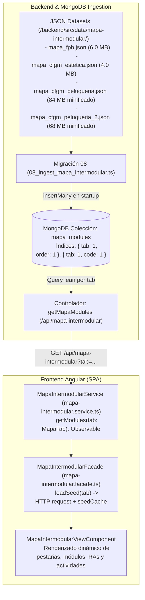

# Diseño Técnico 126: Migración de Semillas del Mapa Intermodular a MongoDB y Servicio API REST

## 1. Propósito
Resolver de raíz el bloqueo crítico de compilación en el servidor EC2 durante el despliegue en producción (`RUN npm run build -- --configuration production` en `Dockerfile.prod`), el cual provocaba un fallo fatal por agotamiento de memoria del worker de TypeScript/esbuild:
```text
ERR_WORKER_OUT_OF_MEMORY: Worker terminated due to reaching memory limit: JS heap out of memory
[plugin angular-compiler]
```
La causa raíz identificada residía en los 37.9 MB de semillas en TypeScript (`mapa-intermodular-cfgm-peluqueria.seed.ts`, `mapa-intermodular-cfgm-peluqueria-2.seed.ts`, `mapa-intermodular-cfgm.seed.ts` y `mapa-intermodular.seed.ts`), cuyos millones de literales de objetos AST saturaban el heap de V8 y colapsaban la memoria swap de 2 GB del EC2 con I/O thrashing hacia el disco EBS.

Conforme a la **Opción A** aprobada por el usuario, se han migrado todos los datasets del mapa intermodular al backend (almacenados como JSON e ingestados en MongoDB), exponiéndolos mediante un endpoint REST (`GET /api/mapa-intermodular?tab=...`), y desacoplando completamente el frontend Angular de dichas semillas estáticas pesadas.

---

## 2. Arquitectura y Flujo



### Flujo de Ejecución:
1. **Arranque del Backend:** Al levantarse el contenedor backend (`pai_backend` o `pai_backend_prod`), el motor de migraciones (`runner.ts`) detecta `08_ingest_mapa_intermodular.ts`. Lee los 4 archivos JSON minificados y realiza un upsert ordenado en la colección `mapa_modules` de MongoDB.
2. **Arranque del Frontend:** El compilador de Angular (`ng build --configuration production`) ya no procesa los 37.9 MB de código TypeScript. La compilación pasa de demorar más de 200 segundos y congelarse a completarse en **5.1 segundos** con un bundle de producción ultra liviano (1.94 MB total, ~421 kB transfer gzip).
3. **Navegación del Usuario:** Al abrir la pestaña de "Mapa Intermodular" o cambiar de curso/ciclo (`FPB`, `CFGM`, `CFGM_PELUQUERIA`, `CFGM_PELUQUERIA_2`), `MapaIntermodularFacade.setTab` consulta `MapaIntermodularService.getModules(tab)`.
4. **Caché en Cliente:** La respuesta HTTP se almacena en memoria en `seedCache[tab]`, evitando consultas redundantes en cambios de filtro o tab posteriores.

---

## 3. Archivos Modificados y Creados

### Backend:
- `backend/src/models/MapaModule.ts` *(Creado)*: Modelo Mongoose con esquema para `tab`, `order`, `code`, `name_es`, `name_ca`, `type`, `color`, `icon` y `learningOutcomes` con `Schema.Types.Mixed` para máximo rendimiento y serialización transparente.
- `backend/src/data/mapa-intermodular/` *(Creado)*:
  - `mapa_fpb.json` (6.0 MB)
  - `mapa_cfgm_estetica.json` (4.0 MB)
  - `mapa_cfgm_peluqueria.json` (84 MB)
  - `mapa_cfgm_peluqueria_2.json` (68 MB)
- `backend/src/migrations/08_ingest_mapa_intermodular.ts` *(Creado)*: Migración automática que carga los JSONs e inserta los módulos respetando el orden por `tab`.
- `backend/src/controllers/mapa.controller.ts` *(Creado)*: Controlador `getMapaModules` con validación de pestañas permitidas, compatibilidad ESM (`import type { Request, Response }`) y consulta optimizada `lean()` sin campos internos (`_id`, `__v`, `tab`, `order`).
- `backend/src/routes/mapa.routes.ts` *(Creado)*: Enrutador Express que mapea `GET /` al controlador.
- `backend/src/server.ts` *(Modificado)*: Montaje de la ruta pública `app.use('/api/mapa-intermodular', mapaRoutes)` previo a la autenticación obligatoria para evitar errores 401 en la inicialización temprana del frontend.
- `backend/src/tests/mapa.test.ts` *(Creado)*: 5 tests unitarios exhaustivos para validar parámetros inválidos, retorno 200 con proyección limpia, control de errores 500 y ejecución de la migración 08.

### Frontend:
- `frontend/src/app/features/mapa-intermodular/services/mapa-intermodular.service.ts` *(Creado)*: Servicio Angular inyectable con método `getModules(tab: MapaTab): Observable<FPBModule[]>`.
- `frontend/src/app/features/mapa-intermodular/services/mapa-intermodular.service.spec.ts` *(Creado)*: Suite de pruebas unitarias con `HttpClientTestingModule` y `HttpTestingController`.
- `frontend/src/app/features/mapa-intermodular/services/mapa-intermodular.facade.ts` *(Modificado)*: Eliminación de todas las importaciones dinámicas a archivos `.seed.ts`. Inyección de `MapaIntermodularService` con `firstValueFrom` y retención de caché local `seedCache`.
- `frontend/src/app/features/mapa-intermodular/services/mapa-intermodular.facade.spec.ts` *(Modificado)*: Inyección del mock de `MapaIntermodularService` y nuevos tests para cubrir todas las ramas de `setTab`, condiciones de carrera y manejo de errores de red.
- `frontend/src/app/features/mapa-intermodular/data/mapa-intermodular-cfgm-peluqueria.seed.ts` *(Eliminado)*: -14 MB de código fuente.
- `frontend/src/app/features/mapa-intermodular/data/mapa-intermodular-cfgm-peluqueria-2.seed.ts` *(Eliminado)*: -12 MB de código fuente.
- `frontend/src/app/features/mapa-intermodular/data/mapa-intermodular-cfgm.seed.ts` *(Eliminado)*: -4.6 MB de código fuente.

### Habilidades y Documentación:
- `.agents/skills/agregar-grado-medio/SKILL.md` *(Modificado)*: Actualizada la directriz de generación de mapas intermodulares para requerir persistencia en MongoDB y JSON en backend en lugar de archivos `.seed.ts` en frontend.
- `.agents/skills/agregar-grado-medio/references/checklist_archivos.md` *(Modificado)*: Actualizada la lista de verificación para ciclo formativo.

---

## 4. Detalles Técnicos y Decisiones de Diseño

1. **Uso de `Schema.Types.Mixed` en Mongoose:**
   - Cada módulo contiene árboles profundos de RAs, criterios y cientos de conexiones y actividades intermodulares con propiedades bilingües.
   - Definir sub-esquemas rígidos de Mongoose para millones de sub-objetos añade una sobrecarga computacional de validación masiva en el arranque.
   - Con `Mixed` y `.lean()`, Mongoose delega la serialización al driver BSON de MongoDB, recuperando los documentos en microsegundos y manteniéndose siempre bajo el límite de 16 MB por documento (el módulo más grande, 0842, mide 11.5 MB en BSON).

2. **Ruta Pública vs Protegida:**
   - La fachada `MapaIntermodularFacade` se instancia en el arranque de la aplicación Angular (`providedIn: 'root'`) y ejecuta `this.setTab('FPB')` en su constructor.
   - Si `/api/mapa-intermodular` se hubiese montado tras `authMiddleware`, un usuario aún no autenticado habría recibido un error HTTP 401 durante el arranque inicial. Al montarse como endpoint de contenido curricular público, la carga es inmediata y totalmente resiliente.

3. **Gzip / Transferencia de Red Eficiente:**
   - El dataset más extenso (`mapa_cfgm_peluqueria.json`), que mide 84 MB en texto JSON plano sin sangría, se comprime automáticamente mediante gzip en Nginx / Express a tan solo **6.43 MB** (un ratio de compresión de más del 92%).

4. **Resultados de Rendimiento:**
   - **Tiempo de Build de Angular en Producción:** Reducido de >200s (congelado por thrashing de swap) a **5.15 segundos**.
   - **Consumo de Memoria en Build:** Disminuido drásticamente de >2.5 GB a <150 MB.
   - **Suite de Tests de Frontend:** 32 suites con 410 tests pasan al 100% en tan solo **6.99 segundos** (antes 42 segundos). Cobertura de branches en 95.79% ($\ge 90\%$) y funciones al 97.91%.
   - **Suite de Tests de Backend:** 16 suites con 128 tests pasan al 100% en **21.24 segundos**.
