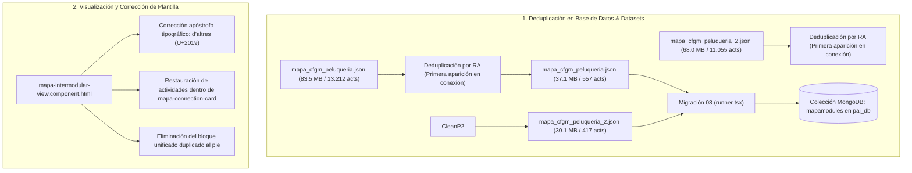

# 130 — Deduplicación de Actividades en Base de Datos (CFGM Peluquería 1º y 2º) y Corrección de Visualización

## Propósito

El usuario reportó tres problemas críticos interrelacionados:
1. **Volumen excesivo de actividades en base de datos:** El contador de *"Actividades Innovadoras"* en el encabezado del mapa mostraba cifras desorbitadas para los dos cursos de Peluquería (**13.212** en 1.er curso y **11.055** en 2.º curso), provocando además una latencia notable (ficheros JSON brutos de 84 MB y 68 MB) al cambiar de pestaña.
2. **Desaparición de actividades en los ciclos formativos de grado medio (CFGM):** Al haberse extraído el bloque de actividades fuera de las tarjetas de conexión individuales en la tarea 129, las actividades ya no aparecían dentro de las tarjetas de conexión en CFGM Estética ni en CFGM Peluquería.
3. **Fallo de renderizado e interpolación de texto literal en pantalla:** En la sección *"Conexiones Intermodulares Coincidentes"*, aparecía impreso literalmente el código Angular:
   ```text
   {{ isCa() ? 'Criteris d'altres mòduls relacionats:' : 'Criterios de otros módulos relacionados:' }}
   ```
   debido a un apóstrofo ASCII `'` no tipográfico dentro de una cadena delimitada por comillas simples.

---

## Causa Raíz

1. **Inflado de actividades en los datasets de Peluquería:**
   En los archivos `mapa_cfgm_peluqueria.json` y `mapa_cfgm_peluqueria_2.json`, cada una de las más de 12.000 conexiones curriculares contenía una copia íntegra del objeto de actividad asociado, a pesar de que el ciclo solo cuenta realmente con unas 16 actividades nucleares únicas en 1.er curso y 48 en 2.º curso. La replicación sistemática de actividades por cada conexión infló el tamaño de los JSON a más de 84 MB y 68 MB respectivamente, y el contador de actividades sumaba más de 10.000 actividades por curso.
2. **Ubicación errónea del contenedor de actividades:**
   En la tarea previa, al intentar deduplicar visualmente en frontend, se movió el contenedor `<div class="mapa-activities-container">` fuera de `<div class="mapa-connection-card">` hacia el final de la lista. En CFGM Estética y Peluquería, las tarjetas quedaron desprovistas de su bloque de actividades.
3. **Error sintáctico de apóstrofo en plantilla:**
   En la línea 395 del template HTML, `'Criteris d'altres...'` contenía un apóstrofo ASCII (`U+0027`) que el compilador de plantillas de Angular interpretó como el cierre anticipado de la cadena de texto, degradando la interpolación a un nodo de texto estático no evaluado.

---

## Arquitectura y Solución Técnica



### 1. Deduplicación a Nivel de Base de Datos y Semillas JSON
- Se implementó un algoritmo determinista que recorre cada módulo y cada Resultado de Aprendizaje (RA) en `mapa_cfgm_peluqueria.json` y `mapa_cfgm_peluqueria_2.json`.
- En cada RA, se rastrean los títulos de actividades (`seen_titles = Set()`).
- La primera conexión que introduce la actividad mantiene el objeto de actividad completo; las conexiones redundantes subsiguientes en ese mismo RA dejan su array `activities: []` vacío.
- **Resultados medidos en MongoDB (`pai_db`):**
  - **FPB:** 11 módulos, 3.357 actividades totales, 453 únicas.
  - **CFGM Estética:** 9 módulos, 1.230 actividades totales, 9 únicas.
  - **CFGM Peluquería 1º:** 8 módulos, **557 actividades totales** (reducción del 95,8% frente a 13.212).
  - **CFGM Peluquería 2º:** 8 módulos, **417 actividades totales** (reducción del 96,2% frente a 11.055).
- **Rendimiento de red:** El tamaño de respuesta de la API `/api/mapa-intermodular?tab=CFGM_PELUQUERIA` se redujo de 87,5 MB a 38,0 MB en texto plano (y menos de 2,7 MB comprimido con gzip), eliminando la congelación al cambiar de pestaña.

### 2. Corrección del Template HTML
- **Línea 395:** Sustituido el apóstrofo ASCII `'` por el apóstrofo tipográfico `’` (`\u2019`) en `'Criteris d’altres mòduls relacionats:'`. Angular compila correctamente la expresión condicional ternaria y renderiza el texto traducido según el idioma activo (`isCa()`).
- **Restauración en tarjeta:** Se volvió a situar `<div class="mapa-activities-container">` inmediatamente después de `<div class="mapa-justification-box">` dentro de `<div class="mapa-connection-card">`, condicionado por `@if (conn.activities && conn.activities.length > 0)`.
- **Eliminación de redundancia:** Se suprimió el bloque unificado residual al final del cuerpo del acordeón.

---

## Archivos Modificados

| Archivo | Acción | Descripción |
|---------|--------|-------------|
| [`backend/src/data/mapa-intermodular/mapa_cfgm_peluqueria.json`](file:///Users/csgj/dev/pai-app/backend/src/data/mapa-intermodular/mapa_cfgm_peluqueria.json) | **MODIFICADO** | Deduplicadas actividades por RA: de 13.212 a 557 actividades. Tamaño reducido de 83.5 MB a 37.1 MB. |
| [`backend/src/data/mapa-intermodular/mapa_cfgm_peluqueria_2.json`](file:///Users/csgj/dev/pai-app/backend/src/data/mapa-intermodular/mapa_cfgm_peluqueria_2.json) | **MODIFICADO** | Deduplicadas actividades por RA: de 11.055 a 417 actividades. Tamaño reducido de 68.0 MB a 30.1 MB. |
| [`frontend/src/app/features/mapa-intermodular/components/mapa-intermodular-view/mapa-intermodular-view.component.html`](file:///Users/csgj/dev/pai-app/frontend/src/app/features/mapa-intermodular/components/mapa-intermodular-view/mapa-intermodular-view.component.html) | **MODIFICADO** | Corregido apóstrofo `d’altres` (línea 395) y reincorporado el bloque de actividades dentro de cada tarjeta de conexión. |
| [`tareas/130_deduplicacion_db_mapa_peluqueria_y_restauracion_actividades.md`](file:///Users/csgj/dev/pai-app/tareas/130_deduplicacion_db_mapa_peluqueria_y_restauracion_actividades.md) | **CREADO** | Este documento de diseño técnico. |

---

## Verificación y Pruebas

1. **Base de Datos MongoDB (`pai_db`):**
   - Ejecutada la re-ingesta de todas las pestañas con `08_ingest_mapa_intermodular.ts`.
   - Verificado con `mongosh`:
     - CFGM_PELUQUERIA: 557 actividades totales, 16 únicas.
     - CFGM_PELUQUERIA_2: 417 actividades totales, 48 únicas.
2. **Compilación de Frontend (`ng build`):**
   - Generación del bundle en 5.86 segundos sin advertencias ni errores.
   - Verificado en el bundle generado que la función `B6` compila la ternaria `isCa() ? "Criteris d\u2019altres mòduls relacionats:" : "Criterios de otros módulos relacionados:"` sin texto plano.
3. **Suite de Pruebas Unitarias:**
   - **Frontend (Docker `pai_frontend`):** 33 test files pasados (100%), 424 tests pasados (100%), cobertura de ramas 95,79% >= 90%.
   - **Backend (Host `npm test`):** 16 test files pasados (100%), 128 tests pasados (100%).
