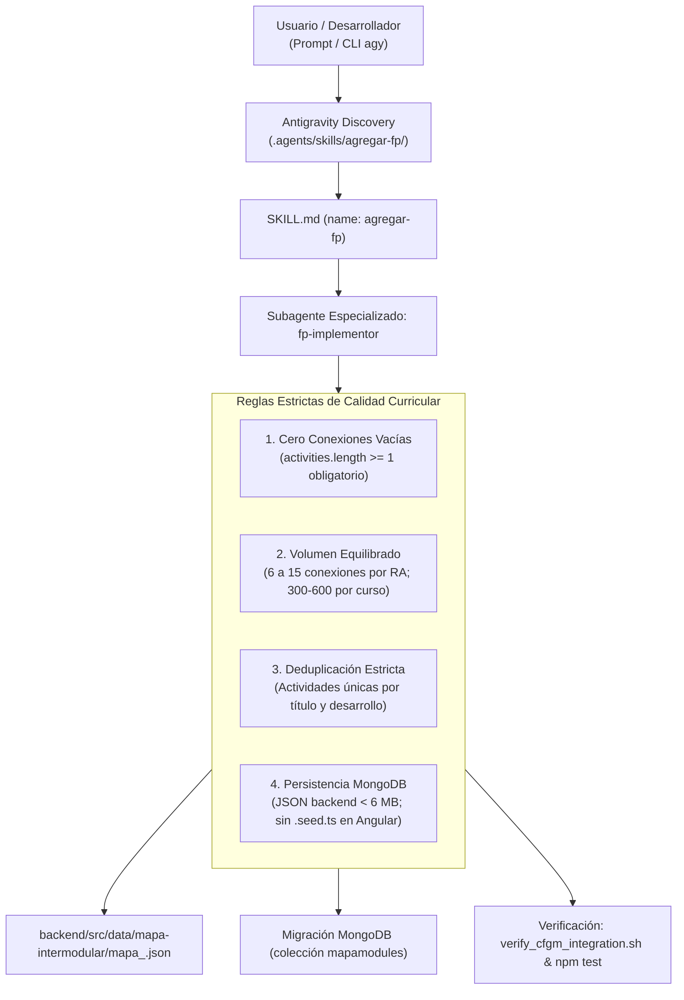

# 136 – Renombrado de Skill a `agregar-fp`, Blindaje del Agente `fp-implementor` y Reglas Estrictas de Deduplicación

## Propósito

1. Renombrar la skill oficial de incorporación de ciclos formativos de `.agents/skills/agregar-grado-medio/` a `.agents/skills/agregar-fp/` (con metadatos `name: agregar-fp`), reflejando con mayor fidelidad su alcance integral (soporte tanto para **Grado Básico / FPB** como para **Grado Medio / CFGM**).
2. Actualizar y blindar el agente especializado encargado de incorporar ciclos de FP (`fp-implementor` y `cfgm-peluqueria-implementor`) para incorporar de forma explícita las lecciones críticas aprendidas relativas a:
   - **Cero conexiones vacías (`activities: []`)**: Prohibición absoluta de conexiones huérfanas sin actividades formativas.
   - **Rango equilibrado de conexiones**: Entre 6 y 15 conexiones intermodulares por Resultado de Aprendizaje (RA), situando el total del curso en 300-600 conexiones.
   - **Deduplicación estricta**: Actividades pedagógicamente únicas por título y contenido didáctico en cada RA.
   - **Persistencia en MongoDB y JSON Backend**: Almacenamiento en `backend/src/data/mapa-intermodular/mapa_<slug>.json` y colección `mapamodules`, erradicando archivos `.seed.ts` gigantes en frontend que provocaban caídas por falta de memoria (OOM) en el build de producción.
   - **Limpieza de consola en pruebas**: Supresión de `stderr` con spies en pruebas de error (`vi.spyOn(console, 'error')`) y provisión de `mockMapaFacade` en `app.spec.ts`.

---

## Arquitectura y Componentes Actualizados

---

## Archivos Modificados y Creados

| Archivo / Ruta | Acción | Descripción |
|---|:---:|---|
| [`.agents/skills/agregar-fp/SKILL.md`](file:///Users/csgj/dev/pai-app/.agents/skills/agregar-fp/SKILL.md) | **CREADO / RENOMBRADO** | Actualizado con `name: agregar-fp`, descripción integral de FPB + CFGM, reglas críticas de calidad y deduplicación, y prompt directriz para `fp-implementor`. |
| [`.agents/skills/agregar-fp/references/checklist_archivos.md`](file:///Users/csgj/dev/pai-app/.agents/skills/agregar-fp/references/checklist_archivos.md) | **CREADO / RENOMBRADO** | Checklist actualizada con la verificación de 0 conexiones vacías, persistencia en `mapamodules` y supresión de `stderr`. |
| [`.agents/skills/agregar-fp/references/lecciones_aprendidas_cobertura.md`](file:///Users/csgj/dev/pai-app/.agents/skills/agregar-fp/references/lecciones_aprendidas_cobertura.md) | **CREADO / RENOMBRADO** | Trasladado a la nueva ruta de la skill. |
| [`.agents/skills/agregar-fp/scripts/scaffold_cfgm.py`](file:///Users/csgj/dev/pai-app/.agents/skills/agregar-fp/scripts/scaffold_cfgm.py) | **CREADO / RENOMBRADO** | Actualizado para generar datasets JSON en backend en lugar de archivos `.seed.ts` en Angular. |
| [`.agents/skills/agregar-fp/scripts/verify_cfgm_integration.sh`](file:///Users/csgj/dev/pai-app/.agents/skills/agregar-fp/scripts/verify_cfgm_integration.sh) | **CREADO / RENOMBRADO** | Incluye validación automática en Python que comprueba que no existan conexiones con `activities: []` y valida el ratio de conexiones por RA. |
| [`documentation/uso_skill_agregar_fp.md`](file:///Users/csgj/dev/pai-app/documentation/uso_skill_agregar_fp.md) | **CREADO / RENOMBRADO** | Guía de usuario de la skill renombrada a `agregar-fp` con ejemplos prácticos para FPB y CFGM. |
| [`documentation/procesamiento_actividades_mapa_intermodular.md`](file:///Users/csgj/dev/pai-app/documentation/procesamiento_actividades_mapa_intermodular.md) | **MODIFICADO** | Actualizadas las secciones 4.2 y 4.3 documentando la deduplicación, tabla comparativa de rendimiento y persistencia en MongoDB. |
| [`.agents/agents/cfgm-peluqueria-implementor/agent.md`](file:///Users/csgj/.gemini/antigravity-cli/brain/d81ede2b-6144-4a50-874b-2c3f821f0f41/.agents/agents/cfgm-peluqueria-implementor/agent.md) | **MODIFICADO** | Actualizado con las directrices de MongoDB, cero conexiones vacías y deduplicación estricta. |
| `fp-implementor` (Subagente registrado) | **CREADO** | Nuevo subagente genérico registrado en Antigravity mediante `define_subagent` con herramientas completas de lectura, edición y ejecución. |

---

## Verificación y Pruebas

1. **Script de Verificación de Integración (`verify_cfgm_integration.sh`):**
   - Ejecutado sobre `CFGM_PELUQUERIA`:
     - Módulos: 8, RAs: 47.
     - Conexiones totales: 532 (Media: 11.3 por RA).
     - Actividades formativas: 557.
     - Cero conexiones vacías: 100% verificado (`empty_conns == 0`).
2. **Suite Backend (`npm test`):**
   - 16 archivos de prueba, 129 tests superados (100%).
3. **Suite Frontend (`npm test`):**
   - 33 archivos de prueba, 424 tests superados (100%), cobertura de ramas 95.75% (>= 90%).
   - Cero trazas erróneas en `stderr`.
