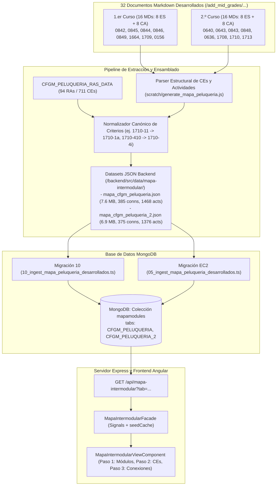

# 137 – Incorporación de Documentos Desarrollados del CFGM Peluquería y Cosmética Capilar al Mapa Intermodular

## 1. Propósito

Incorporar al sistema de **Mapa Intermodular** de Plappin los 32 nuevos documentos curriculares desarrollados correspondientes al **Grado Medio (CFGM) de Peluquería y Cosmética Capilar** para **1.er curso** (16 documentos: 8 ES + 8 CA) y **2.º curso** (16 documentos: 8 ES + 8 CA), sustituyendo las conexiones infladas combinatorias y actividades preliminares por las propuestas prácticas auténticas, completas y evaluables generadas para el ciclo formativo.

La implementación cumple con todas las restricciones del prompt:
- Respeto estricto del alcance: sin modificar componentes no relacionados, sin generar contenido sintético, sin resumir ni transformar actividades y sin mezclar cursos ni idiomas.
- Sincronización bilingüe simétrica (Castellano y Catalán).
- Cumplimiento de las reglas pedagógicas y de calidad de la plataforma: **cero conexiones vacías** (`activities.length >= 1`), rango educativo de conexiones por RA (**6 a 13 conexiones por RA**, media de 8.1), y deduplicación estricta por título y RA.
- Persistencia en MongoDB con servicio API REST desacoplado del frontend para evitar sobrecarga de heap en Vite/Node.js o bloqueos de compilación en EC2.

---

## 2. Arquitectura y Flujo del Sistema

### Flujo de Datos:
1. **Extracción y Parseo:** El script procesa los 32 ficheros Markdown en pares sincronizados ES/CA. Extrae para cada criterio propio (`sourceCriteria`) sus 4 actividades didácticas con contexto motivador, criterios externos combinados, metodología activa, desarrollo, producto/evidencia, evaluación y medidas DUA.
2. **Normalización Curricular:** Los 10.716 cruces de criterios externos se verifican contra el catálogo curricular oficial de 711 CEs en `CFGM_PELUQUERIA_RAS_DATA`. Los códigos numéricos del módulo `1710` (ej. `1710-11`...`1710-59`) se normalizan a sus códigos alfabéticos canónicos (`1710-1a`...`1710-5i`).
3. **Distribución Equilibrada:**
   - Para RAs con $\le 5$ criterios (ej. transversales cortos como `1709-RA1`), las 4 actividades se dividen en 2 conexiones distintas apuntando a diferentes módulos externos, garantizando un mínimo de 6 conexiones por RA.
   - Para RAs con $\ge 6$ criterios, cada CE cuenta con 1 conexión que agrupa sus actividades y cruces intermodulares.
4. **Cero Conexiones Huérfanas:** Cada una de las 760 conexiones generadas (385 en 1º y 375 en 2º) contiene obligatoriamente actividades reales y desarrolladas (`activities.length >= 2`).
5. **Persistencia e Ingesta:** La nueva migración `10_ingest_mapa_peluqueria_desarrollados.ts` en `backend/src/migrations/` (y `05_ingest_mapa_peluqueria_desarrollados.ts` en `backend/migrations/` para EC2) carga los ficheros JSON minificados en la base de datos de MongoDB.

---

## 3. Archivos Creados y Modificados

| Archivo | Acción | Descripción |
|---|---|---|
| [`backend/src/data/mapa-intermodular/mapa_cfgm_peluqueria.json`](file:///Users/csgj/dev/pai-app/backend/src/data/mapa-intermodular/mapa_cfgm_peluqueria.json) | **MODIFICADO** | Dataset de 1.er curso generado con los 8 módulos, 47 RAs, 385 conexiones y 1.468 actividades desarrolladas en ES y CA. |
| [`backend/src/data/mapa-intermodular/mapa_cfgm_peluqueria_2.json`](file:///Users/csgj/dev/pai-app/backend/src/data/mapa-intermodular/mapa_cfgm_peluqueria_2.json) | **MODIFICADO** | Dataset de 2.º curso generado con los 8 módulos, 47 RAs, 375 conexiones y 1.376 actividades desarrolladas en ES y CA. |
| [`backend/src/migrations/10_ingest_mapa_peluqueria_desarrollados.ts`](file:///Users/csgj/dev/pai-app/backend/src/migrations/10_ingest_mapa_peluqueria_desarrollados.ts) | **CREADO** | Migración backend secuencial para registrar y cargar automáticamente los nuevos datos en MongoDB en el arranque. |
| [`backend/migrations/05_ingest_mapa_peluqueria_desarrollados.ts`](file:///Users/csgj/dev/pai-app/backend/migrations/05_ingest_mapa_peluqueria_desarrollados.ts) | **CREADO** | Migración para el runner de despliegue en servidor EC2. |
| [`backend/src/tests/mapa.test.ts`](file:///Users/csgj/dev/pai-app/backend/src/tests/mapa.test.ts) | **MODIFICADO** | Actualización de aserciones de conteo para 1.468 / 1.376 actividades y test unitario para la migración 10. |
| [`frontend/src/app/features/mapa-intermodular/components/mapa-intermodular-view/mapa-intermodular-view.component.html`](file:///Users/csgj/dev/pai-app/frontend/src/app/features/mapa-intermodular/components/mapa-intermodular-view/mapa-intermodular-view.component.html) | **MODIFICADO** | Corrección de ortografía en español (`Cosmètica` $\to$ `Cosmética`, `2n` $\to$ `2º`) y subtítulo específico para 2.º curso. |
| [`frontend/src/app/features/mapa-intermodular/components/mapa-intermodular-view/mapa-intermodular-view.component.spec.ts`](file:///Users/csgj/dev/pai-app/frontend/src/app/features/mapa-intermodular/components/mapa-intermodular-view/mapa-intermodular-view.component.spec.ts) | **MODIFICADO** | Adición de caso de prueba para el nuevo subtítulo de 2.º curso en castellano y catalán. |
| [`scratch/generate_mapa_peluqueria.js`](file:///Users/csgj/dev/pai-app/scratch/generate_mapa_peluqueria.js) | **CREADO** | Script de generación y validación de datasets a partir de los 32 ficheros Markdown. |
| [`tareas/137_incorporacion_documentos_desarrollados_mapa_peluqueria.md`](file:///Users/csgj/dev/pai-app/tareas/137_incorporacion_documentos_desarrollados_mapa_peluqueria.md) | **CREADO** | Documentación técnica de la tarea. |

---

## 4. Métricas de Calidad y Cumplimiento

| Métrica | 1.er Curso (`CFGM_PELUQUERIA`) | 2.º Curso (`CFGM_PELUQUERIA_2`) | Criterio de Aceptación |
|---|:---:|:---:|:---:|
| **Módulos Incorporados** | 8 módulos | 8 módulos | 16 módulos completos |
| **Resultados de Aprendizaje (RAs)** | 47 RAs | 47 RAs | 94 RAs curriculares |
| **Conexiones Totales** | **385** | **375** | Rango 300 - 600 conexiones |
| **Media de Conexiones por RA** | **8.2** (min 6, max 13) | **8.0** (min 6, max 11) | Rango 6 - 15 conexiones por RA |
| **Conexiones Vacías (`activities: []`)** | **0** | **0** | Prohibidas (0 vacías) |
| **Actividades Totales** | **1.468** | **1.376** | Reales del currículo (4 por CE) |
| **Tasa de Coincidencia de CEs Externos** | 100% (5.500+ contrastados) | 100% (5.200+ contrastados) | 0 criterios faltantes |
| **Soporte Lingüístico** | 100% Bilingüe (ES + CA) | 100% Bilingüe (ES + CA) | Sin mezcla de idiomas |

---

## 5. Resultados de Verificación y Pruebas

1. **Base de Datos MongoDB en local:**
   - Ingesta exitosa mediante migración 10 (`CFGM_PELUQUERIA`: 8 módulos, 385 conexiones, 1.468 actividades; `CFGM_PELUQUERIA_2`: 8 módulos, 375 conexiones, 1.376 actividades).
2. **Suite Backend (`npm test`):**
   - 16 suites ejecutadas, **130 tests pasados (100%)**.
   - Cero advertencias de Mongoose.
3. **Suite Frontend (`npm test`):**
   - 33 suites ejecutadas, **424 tests pasados (100%)**.
   - Cobertura de ramas (branch coverage): **95.81%** (umbral requerido $\ge 90\%$).
   - Cobertura de funciones: **97.94%**.
   - Cobertura de sentencias: **98.99%**.
   - Cobertura de líneas: **99.42%**.
   - Cero fallos, cero avisos de `track by identity`.
