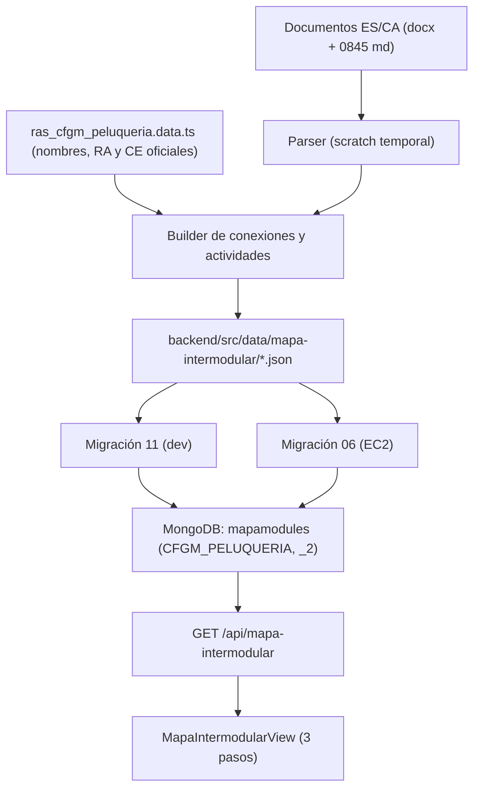

# Tarea 150: Actualización integral de las actividades del Mapa Intermodular del CFGM Peluquería

## Propósito

Sustituir las actividades de los módulos del **Grado Medio de Peluquería y Cosmética Capilar** en el Mapa Intermodular por las de los nuevos documentos corregidos, manteniendo intactos diseño, navegación, permisos, currículo (RA/CE) y el resto de ciclos.

## Fuentes de entrada

Carpeta `add_mid_grades/grado_medio_peluqueria/mapa_grado_medio_peluqueria/`:

- 14 parejas ES/CA en `.docx` y 1 pareja en `.md` (módulo 0845).
- 15 módulos cubiertos. El **1713 (Projecte intermodular)** no dispone de documento nuevo y queda sin cambios.
- Formato uniforme: `N` apartados `C1..Cn`, cada uno con RAs/CE del módulo eje, hasta 3 módulos externos (RA + CE), justificación intermodular y **9 actividades** (Metodología activa, Idea, Desarrollo, Producto/evidencia, Pautas DUA).

## Arquitectura de la solución

### Reglas de mapeo

1. **Una conexión por CE** del módulo (mismo modelo que el dataset anterior), conservando `sourceCriteria` y `criteriaKeys` para el filtro por criterio del Paso 2.
2. Cada apartado distribuye sus 9 actividades entre las conexiones de sus CE (round-robin), garantizando:
   - cero conexiones vacías (`activities.length >= 1`),
   - sin títulos duplicados dentro de un mismo RA,
   - importación fiel de las 9 actividades por apartado.
3. Los módulos externos de cada apartado se reflejan en `targetModuleCode`/`targetRaCode` y `relatedCriteria` (hasta 3 CE externos), resolviendo los códigos CE numéricos del 1710 (`1710-11 → 1710-1a`, etc.).
4. Cuando un RA quedaba por debajo de **6 conexiones**, se divide una conexión por módulo externo hasta alcanzar el rango objetivo 6–15.
5. `relationType` se deriva del módulo destino (`0643 → cliente`, `1664 → digital`, `1709/1710 → empleabilidad`, `1708 → sostenibilidad`, `0156 → comunicacion`, resto `tecnica`).
6. Paridad bilingüe estricta: contenido catalán de los documentos `_CA` y castellano de los `_ES`, emparejados por índice de apartado/actividad.
7. Normalización del catalán: corrección determinista de castellanismos (diccionario de términos de dominio y comunes, más reglas `-ción → -ció`, `-ciones → -cions`, `-idad → -itat`). No se traduce automáticamente el contenido: solo se corrigen residuos léxicos.

## Archivos modificados / creados

| Archivo | Acción |
|---|---|
| `backend/src/data/mapa-intermodular/mapa_cfgm_peluqueria.json` | **MODIFICADO**: actividades/conexiones de los 8 módulos de 1º reemplazadas. |
| `backend/src/data/mapa-intermodular/mapa_cfgm_peluqueria_2.json` | **MODIFICADO**: actividades/conexiones de los 7 módulos de 2º reemplazadas (1713 intacto). |
| `backend/src/migrations/11_ingest_mapa_peluqueria_actividades_corregidas.ts` | **CREADO**: reingesta dev. |
| `backend/migrations/06_ingest_mapa_peluqueria_actividades_corregidas.ts` | **CREADO**: reingesta EC2. |
| `backend/src/tests/mapa.test.ts` | **MODIFICADO**: conteos actualizados y test de la migración 11 (0848 = 51 conexiones, 108 títulos, 0 vacías). |
| `tareas/150_...md` | **CREADO**: este documento. |

## Verificación

| Métrica | 1.er curso | 2.º curso |
|---|---:|---:|
| Módulos | 8 | 8 (1713 sin cambios) |
| Conexiones | 377 | 367 |
| Actividades almacenadas | 846 | 1407 |
| Conexiones vacías | 0 | 0 |
| Rango de conexiones por RA | 6–13 | 6–11 |

Comprobaciones realizadas en el dataset generado:

- Todos los módulos tienen las actividades únicas esperadas (`9 × apartados`): 0842=126, 0845=126, 0844=99, 0846=108, 0849=108, 1664=81, 1709=99, 0156=99; 0640=108, 0643=117, 0843=117, 0848=108, 0636=108, 1708=108, 1710=108.
- Sin campos `_es`/`_ca` vacíos en actividades ni en conexiones.
- Sin conexiones sin módulo destino ni sin `relatedCriteria`.
- El 1713 permanece byte a byte idéntico.
- Residuo de castellanismos en campos catalanes: ≈0,9 % de tokens, mayoritariamente homógrafos catalanes válidos (`forma`, `usar`, `explicar`, `útil`…).

No se ejecutaron tests ni builds (queda a cargo del usuario, según las instrucciones del repositorio).

## Decisiones y limitaciones

- El modelo de datos (conexiones con actividades embebidas) no se modifica; el frontend sigue consumiendo por API y deduplicando por título.
- La bidireccionalidad entre módulos se mantiene desde la perspectiva de cada módulo, ya que **todos** los módulos del ciclo se regeneran a la vez.
- Los documentos catalanes de origen contienen residuos de castellano a nivel de palabra/frase; se aplicó una normalización determinista y se documenta que pueden persistir restos menores en algunos módulos (especialmente 0636 y 0843).
- No se ha realizado ningún commit.
