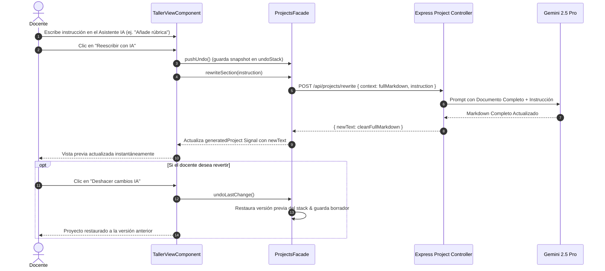

# Tarea 61: Reescritura Completa con IA en Taller Editor y Sistema de Deshacer (Undo)

## Propósito
Optimizar el flujo de trabajo del **Asistente IA** en el Taller Editor (`TallerViewComponent`):
1. **Eliminar la dependencia de selección manual de texto**: En lugar de requerir que el usuario seleccione fragmentos de texto en la vista previa del proyecto, ahora el prompt del docente envía el documento Markdown completo al backend y a la IA. La IA procesa y reescribe el documento entero según las indicaciones solicitadas, devolviendo el Markdown actualizado completo de forma transparente y sin manipulaciones de texto ni sustituciones propensas a errores.
2. **Sistema de Deshacer (Undo Stack)**: Implementar un historial local reactivo de versiones en el frontend (`ProjectsFacade.undoStack`) que guarda una instantánea del proyecto antes de cada modificación de la IA. Si el docente no queda satisfecho con el resultado, puede pulsar el botón **"Deshacer cambios IA"** para revertir inmediatamente a la versión anterior.

---

## Arquitectura y Flujo de Datos

---

## Archivos Modificados

1. `backend/src/controllers/project.controller.ts`:
   - En `rewriteSection`, se procesa el documento Markdown completo (`context`) junto con la `instruction`. Se eliminó la lógica de búsqueda y sustitución parcial en backend. Se devuelve `{ newText: cleanText, rewrittenPart: cleanText }`.
2. `backend/src/tests/projects.test.ts`:
   - Actualización de los tests unitarios para validar el endpoint `POST /api/projects/rewrite` con el documento completo.
3. `frontend/src/app/features/projects/services/projects.facade.ts`:
   - Creación del signal `undoStacksByProject = signal<Record<string, string[]>>({})` y computed reactivo `undoStack = computed(() => this.undoStacksByProject()[this.currentProjectId() || '__temp__'] || [])` junto con `canUndo = computed(() => this.undoStack().length > 0)`.
   - Implementación de `pushUndo()`, `popUndo()` y `undoLastChange()` aislados estrictamente por el ID del proyecto activo para evitar fugas entre proyectos.
   - Limpieza automática del stack al eliminar un proyecto (`deleteProject`).
   - Simplificación de `rewriteSection(instruction)` eliminando el argumento obsoleto `selectedText` y la función `applyRewrite`.
4. `frontend/src/app/features/projects/services/projects.facade.spec.ts`:
   - Tests de integración para `undoStack`, `canUndo`, `pushUndo`, `popUndo`, `undoLastChange`, aislamiento entre múltiples proyectos y limpieza en borrado.
5. `frontend/src/app/services/pai.service.ts`:
   - Actualización de la firma de `rewriteSection(context, instruction)`.
6. `frontend/src/app/services/pai.service.spec.ts`:
   - Actualización del test de llamada HTTP para `rewriteSection`.
7. `frontend/src/app/features/taller/components/taller-view/taller-view.component.ts`:
   - Eliminación de signals y métodos de captura de selección de texto (`capturedSelection`, `captureSelection`, `clearSelection`).
   - Actualización de `rewriteWithAI()` para operar sobre el proyecto completo con guardado en `pushUndo()` y reversión con `popUndo()` ante errores de red/servidor.
   - Implementación del método `undoAI()` que invoca `undoLastChange()` y emite notificación informativa.
8. `frontend/src/app/features/taller/components/taller-view/taller-view.component.html`:
   - Eliminación del evento `(mouseup)="captureSelection()"` del contenedor del documento.
   - Eliminación de la tarjeta azul de texto seleccionado en el panel lateral.
   - Inserción del botón `@if (projects.canUndo()) { <button (click)="undoAI()"> ... }`.
9. `frontend/src/app/features/taller/components/taller-view/taller-view.component.spec.ts`:
   - Cobertura completa de tests unitarios (>90%) para el nuevo flujo de reescritura completa, manejo de errores y acción de deshacer en castellano y catalán.
10. `frontend/src/app/services/translation.service.ts`:
   - Actualización de las instrucciones pedagógicas del asistente (`aiIntro`, `aiStep1`, `aiStep2`, `aiStep3`) y añadido de la clave `undoAiBtn` en castellano ("Deshacer cambios IA") y catalán ("Desfer canvis IA").

---

## Detalles Técnicos y Decisiones de Diseño

1. **Eliminación del problema de desajuste HTML vs Markdown**:
   Anteriormente, al seleccionar texto renderizado en pantalla (`window.getSelection()`), los caracteres formateados (encabezados `#`, negritas `**`, tablas `|`, listas, etc.) perdían su sintaxis Markdown, provocando fallos en la coincidencia `replace()` y causando el borrado accidental del resto del documento. Al enviar y devolver el documento completo, la IA mantiene la integridad global del documento sin requerir operaciones frágiles de reemplazo de cadenas.
2. **Aislamiento de Pilas de Deshacer por Proyecto (`undoStacksByProject`)**:
   El estado se almacena en un diccionario indexado por `projectId` (`Record<string, string[]>`). Al cambiar de proyecto en el taller, el computed `undoStack` y `canUndo` conmutan instantáneamente para reflejar únicamente las versiones del proyecto activo. Esto impide que cambios solicitados a la IA en un proyecto se apliquen o deshagan accidentalmente sobre otro proyecto distinto.
3. **Persistencia Automática tras Deshacer**:
   Cada vez que se deshace un cambio, el estado previo se guarda automáticamente como borrador contra el backend (`updateProjectStatus('borrador')`), asegurando persistencia inmediata sin sobrecargar la base de datos con ramas complejas.
4. **Calidad y Cobertura de Tests**:
   Se ejecutaron las suites de pruebas completas de frontend (Vitest) y backend, superando los umbrales de cobertura mínimos del 90% en sentencias, ramas, funciones y líneas.
