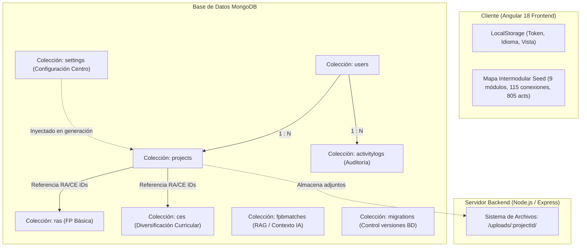

# Diseño Técnico: Arquitectura y Estructura de la Base de Datos

## Propósito
Proporcionar una radiografía completa, clara y exhaustiva de la arquitectura de persistencia de datos de la plataforma **PAI-App**. Este documento detalla qué entidades existen, qué información almacena cada colección en la base de datos MongoDB (con Mongoose ODM), cómo se relacionan entre sí, cómo se gestiona el almacenamiento de archivos físicos y qué datos residen en el cliente.

---

## Arquitectura General de Persistencia

La plataforma utiliza una estrategia de persistencia híbrida optimizada para rendimiento y desacoplamiento:

---

## Colecciones de la Base de Datos (MongoDB)

### 1. `users` (Usuarios y Control de Acceso)
- **Archivo:** `backend/src/models/User.ts`
- **Propósito:** Gestión de cuentas docentes, autenticación JWT y control granular de permisos de IA.
- **Campos:**
  | Campo | Tipo | Requerido | Descripción |
  |---|---|---|---|
  | `_id` | `ObjectId` | Sí | Identificador único autogenerado de MongoDB. |
  | `email` | `String` | Sí (Unique) | Correo electrónico del usuario (identificador de login). |
  | `password` | `String` | Sí | Hash de la contraseña con bcrypt. |
  | `name` | `String` | Sí | Nombre completo del docente / usuario. |
  | `role` | `String` | Sí | Rol de acceso: `pending` (por aprobar), `teacher` (docente) o `admin` (administrador). |
  | `canUseAi` | `Boolean` | Sí (Default: `true`) | Permiso para solicitar generación/reescritura a la IA. |
  | `createdAt` | `Date` | Sí | Fecha de registro. |

---

### 2. `projects` (Proyectos Pedagógicos e Historial)
- **Archivo:** `backend/src/models/Project.ts`
- **Propósito:** Almacena los proyectos de aprendizaje interdisciplinar (PAI), su estado en la cola de generación, los contenidos Markdown completos y sus metadatos.
- **Campos:**
  | Campo | Tipo | Descripción |
  |---|---|---|
  | `_id` | `ObjectId` | Identificador único del proyecto. |
  | `title` | `String` | Título del proyecto o reto didáctico. |
  | `modules` | `[String]` | Lista de módulos o materias involucradas en el proyecto. |
  | `ras` | `[String]` | Lista de descripciones o códigos de RAs / Criterios de Evaluación seleccionados. |
  | `methodology` | `String` | Metodología elegida: `ABP` (Aprendizaje Basado en Proyectos) o `APS` (Aprendizaje Servicio). |
  | `tipoNivel` | `String` | Nivel educativo: `FP_BASICA` o `DIVERSIFICACION_CURRICULAR`. |
  | `status` | `String` | Estado del ciclo de vida: `en_cola`, `generando`, `borrador`, `publicado`, `error`. |
  | `generatedContent.rawText` | `String` | Documento didáctico completo en formato Markdown (unidades de trabajo, temporalización, rúbricas). |
  | `generatedContent.jsonStructure` | `Object` | Estructura complementaria en formato JSON si aplica. |
  | `aiPrompt` | `String` | Prompt exacto enviado al modelo de lenguaje (Gemini). |
  | `aiInstruction` | `String` | Instrucciones adicionales del docente para la generación. |
  | `errorDetail` | `String` | Mensaje de error detallado en caso de fallo durante el procesamiento de la cola. |
  | `userId` | `ObjectId` (`ref: User`) | Docente propietario del proyecto. |
  | `createdAt` | `Date` | Fecha y hora de creación. |

---

### 3. `ras` (Resultados de Aprendizaje de FP Básica)
- **Archivo:** `backend/src/models/RA.ts`
- **Propósito:** Catálogo curricular de FP Básica en Peluquería y Estética para alimentar el formulario de selección y el prompt de la IA.
- **Campos:**
  | Campo | Tipo | Descripción |
  |---|---|---|
  | `_id` | `ObjectId` | Identificador único. |
  | `id` | `String` | Código identificador del RA (ej. `RA1`, `RA2`). |
  | `module` / `module_es` / `module_ca` | `String` | Nombre del módulo profesional en castellano y valenciano. |
  | `description` / `description_es` / `description_ca` | `String` | Descripción completa del Resultado de Aprendizaje. |
  | `criterios_es` / `criterios_ca` | `[String]` | Criterios de evaluación específicos asociados al RA. |

---

### 4. `ces` (Criterios de Evaluación de Diversificación Curricular / PDC)
- **Archivo:** `backend/src/models/CE.ts`
- **Propósito:** Catálogo curricular para Diversificación Curricular (ESO) organizado por ámbitos.
- **Campos:**
  | Campo | Tipo | Descripción |
  |---|---|---|
  | `_id` | `ObjectId` | Identificador único. |
  | `area` | `String` | Ámbito curricular (ej. `Ámbito Científico-Tecnológico`, `Ámbito Lingüístico y Social`). |
  | `subject` | `String` | Materia específica dentro del ámbito. |
  | `ce_id` | `String` | Identificador del criterio (ej. `CE1`). |
  | `description_es` / `description_ca` | `String` | Descripción del criterio en castellano y valenciano. |
  | `criterios_es` / `criterios_ca` | `Array` | Criterios operativos desglosados. |

---

### 5. `fpbmatches` (RAG y Documentos de Coincidencias FPB)
- **Archivo:** `backend/src/models/FpbMatch.ts`
- **Propósito:** Almacena los textos de las plantillas y coincidencias curriculares ingeridas (`Plantillas coincidencias FPB/`) para proporcionar contexto de enriquecimiento semántico a la IA.
- **Campos:**
  | Campo | Tipo | Descripción |
  |---|---|---|
  | `fileName` | `String` | Nombre del archivo origen `.docx`. |
  | `title` | `String` | Título del bloque o coincidencia. |
  | `code` | `String` | Código del módulo o punto de cruce. |
  | `rawText` | `String` | Contenido de texto extraído. |
  | `type` | `String` | Tipo de documento: `coincidencia`, `actividad_ampliada`, `relacion_criterios`, `prompt_coincidencias`. |
  | `timestamps` | `Date` | Fechas de creación y actualización. |

---

### 6. `settings` (Configuración Global del Centro Educativo)
- **Archivo:** `backend/src/models/Settings.ts`
- **Propósito:** Parámetros institucionales que se inyectan en el prompt de la IA para contextualizar los proyectos al centro educativo.
- **Estructura (Singleton):**
  | Campo | Tipo | Descripción |
  |---|---|---|
  | `schoolName` | `String` | Nombre oficial del centro educativo. |
  | `schoolCity` | `String` | Localidad / Municipio del centro. |
  | `schoolContext` | `String` | Entorno socioeconómico, características del alumnado e infraestructura disponible. |
  | `isSingleton` | `Boolean` (Unique: `true`) | Asegura la existencia de un único registro global. |

---

### 7. `activitylogs` (Auditoría de Actividad)
- **Archivo:** `backend/src/models/ActivityLog.ts`
- **Propósito:** Registro cronológico de acciones relevantes de los usuarios para auditoría y estadísticas de uso.
- **Campos:**
  | Campo | Tipo | Descripción |
  |---|---|---|
  | `userId` | `ObjectId` (`ref: User`) | Usuario que ejecutó la acción. |
  | `action` | `String` | Acción realizada (ej. `GENERATE_PROJECT`, `DELETE_PROJECT`, `LOGIN`). |
  | `projectId` | `ObjectId` (`ref: Project`) | Proyecto afectado (si aplica). |
  | `details` | `Mixed (JSON)` | Metadatos adicionales (tiempos de respuesta, tokens, etc.). |
  | `createdAt` | `Date` | Timestamp de la acción. |

---

### 8. `migrations` (Historial de Migraciones del Esquema)
- **Archivo:** `backend/src/models/Migration.ts`
- **Propósito:** Control automático de scripts de migración ejecutados al arrancar el backend (`migrations/runner.ts`).
- **Campos:**
  | Campo | Tipo | Descripción |
  |---|---|---|
  | `name` | `String` (Unique) | Nombre identificador de la migración (ej. `01_create_admin_user`, `02_update_ras`). |
  | `executedAt` | `Date` | Fecha y hora de ejecución exitosa. |

---

## Almacenamiento de Archivos en Disco (Filesystem)

Los archivos adjuntos cargados por los docentes en el Taller Editor no se almacenan como binarios en la base de datos para no saturar el buffer de MongoDB, sino que se gestionan en el sistema de archivos del servidor:

- **Ruta en Servidor:** `backend/uploads/:projectId/:filename`
- **Controlador:** [`files.controller.ts`](file:///Users/csgj/dev/pai-app/backend/src/controllers/files.controller.ts)
- **Operaciones:**
  - `POST /api/files/upload/:id`: Sube un archivo asociado al proyecto `:id`.
  - `GET /api/files/:id`: Lista nombres, tamaños y fechas de los archivos del proyecto.
  - `GET /api/files/:id/:filename`: Descarga segura del archivo.
  - `DELETE /api/files/:id/:filename`: Eliminación física del archivo en disco.

---

## Estado y Persistencia en Cliente (Frontend)

1. **`LocalStorage` del Navegador:**
   - `pai_token`: Token JWT de autenticación.
   - `pai_user`: Datos básicos del usuario conectado en formato JSON.
   - `pai_lang`: Idioma seleccionado (`castellano` o `valenciano`).
   - `pai_view`: Vista activa de la interfaz (`home`, `generator`, `history`, `taller`, `admin`, `mapa`).

2. **Catálogo Curricular Estático del Mapa Intermodular:**
   - **Archivo:** [`mapa-intermodular.seed.ts`](file:///Users/csgj/dev/pai-app/frontend/src/app/features/mapa-intermodular/data/mapa-intermodular.seed.ts)
   - Contiene la estructura inmutable y optimizada de **9 módulos**, **115 puntos de cruce** y **805 actividades prácticas** completas, permitiendo una exploración instantánea y determinista sin llamadas innecesarias a la base de datos ni consumo de IA.

3. **Pilas de Deshacer del Asistente IA (Backups en Memoria / Signals):**
   - **Archivo:** [`projects.facade.ts`](file:///Users/csgj/dev/pai-app/frontend/src/app/features/projects/services/projects.facade.ts)
   - **Estructura:** `Signal<Record<string, string[]>>` (`undoStacksByProject`).
   - **Funcionamiento:**
     - Cada vez que el docente solicita una modificación al Asistente IA en el Taller Editor, se guarda una captura íntegra del Markdown previo en la pila exclusiva del proyecto activo (`undoStacksByProject[projectId].push(markdownPrevio)`).
     - Al pulsar **"Deshacer cambio de IA"**, se recupera el último snapshot (`popUndo()`) y se restaura el contenido original.
     - **Aislamiento por Proyecto:** Cada proyecto tiene su propia pila en memoria, evitando que los cambios de un proyecto afecten o sobreescriban a otro al navegar entre ellos.
     - **Ciclo de vida:** Vive en la memoria RAM de la sesión del navegador mientras la SPA está activa (si se borra un proyecto, su pila se limpia automáticamente).
