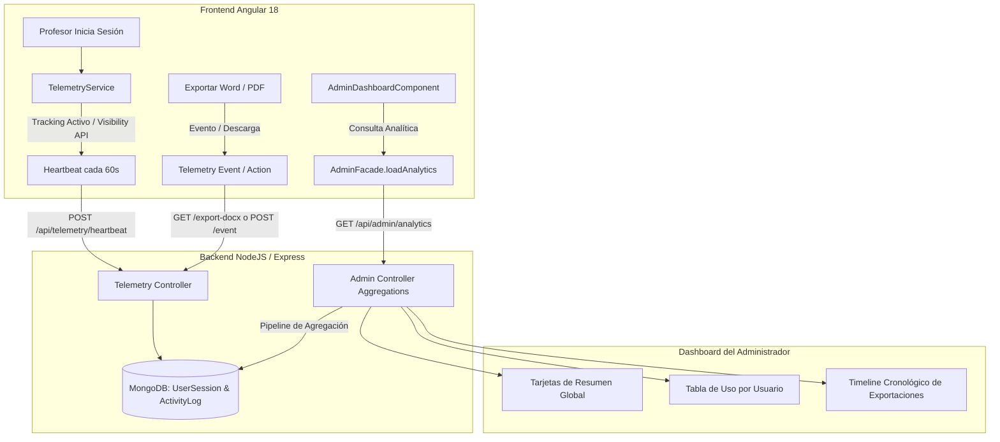

# Tarea 65: Sistema de Telemetría y Panel de Analítica de Uso

## Propósito
Implementar un sistema integral de **Telemetría y Analíticas de Uso** para monitorizar en tiempo real el uso efectivo de la plataforma PAI por parte del profesorado. El sistema registra de manera fiable el tiempo real activo por usuario y sesión (evitando contabilizar tiempos muertos cuando las pestañas no están visibles), así como la trazabilidad de eventos clave como la exportación de proyectos a Word (.docx), PDF y generación con IA.

---

## Arquitectura y Flujo de Datos

---

## Detalles Técnicos

### 1. Modelo de Datos y Base de Datos (MongoDB)
- **`UserSession` (`backend/src/models/UserSession.ts`):**
  - `userId`: Referencia al usuario.
  - `sessionId`: Identificador único de sesión en cliente (`sessionStorage`).
  - `startTime`, `lastHeartbeat`, `endTime`.
  - `durationSeconds`: Contador acumulativo de segundos de uso activo real.
  - `pagesVisited`: Historial de vistas visitadas (`generator`, `taller`, `mapa`, `history`).
  - `userAgent`: Información del navegador/SO.
- **`ActivityLog` (`backend/src/models/ActivityLog.ts`):**
  - Registro de eventos como `EXPORT_DOCX`, `EXPORT_PDF`, `GENERATE_PROJECT`.

### 2. Backend (Endpoints & Pipelines de Agregación)
- **`POST /api/telemetry/heartbeat` (`telemetry.controller.ts`):** Acumula tiempo activo y actualiza páginas visitadas y cierre de sesión.
- **`POST /api/telemetry/event` (`telemetry.controller.ts`):** Registro de eventos específicos del cliente.
- **Trazabilidad en `docx.controller.ts`:** Al descargar el archivo Word (`/export-docx`), se crea automáticamente un registro en `ActivityLog`.
- **`GET /api/admin/analytics` (`admin.controller.ts`):**
  - Pipelines de agregación para:
    - Métricas globales de uso (tiempo total, sesiones totales, proyectos generados, exportaciones Word/PDF).
    - Desglose por usuario (tiempo total acumulado formateado, sesiones, exportaciones Word y fecha de última actividad).
    - Timeline de las últimas 50 exportaciones con usuario, título del proyecto y fecha.

### 3. Frontend (Servicio de Telemetría y Panel UI)
- **`TelemetryService` (`frontend/src/app/services/telemetry.service.ts`):**
  - Control de tiempo con `document.visibilityState` (pausa la acumulación si la pestaña se oculta o minimiza).
  - Heartbeat periódico cada 60s en background fuera de la zona Angular (`runOutsideAngular`).
  - Cierre ordenado mediante `beforeunload` con soporte para `navigator.sendBeacon`.
- **`AdminFacade` (`frontend/src/app/features/admin/services/admin.facade.ts`):**
  - Signal `analyticsData`, método `loadAnalytics()` y formateador `formatDuration(seconds)` (ej: `2h 15m`, `45s`).
- **`AdminDashboardComponent` (`frontend/src/app/features/admin/components/admin-dashboard/admin-dashboard.component.ts`):**
  - **Tarjetas Globales:** Tiempo total de uso, sesiones totales, exportaciones Word, exportaciones PDF y proyectos IA.
  - **Tabla de Usuarios:** Tiempo de uso individual, sesiones, descargas Word y última actividad.
  - **Timeline de Exportaciones:** Listado en tiempo real de exportaciones Word/PDF con etiquetas distintivas.

---

## Archivos Modificados / Creados

### Backend
1. `backend/src/models/UserSession.ts` (Creado)
2. `backend/src/controllers/telemetry.controller.ts` (Creado)
3. `backend/src/routes/telemetry.routes.ts` (Creado)
4. `backend/src/controllers/docx.controller.ts` (Modificado: registro automático de `EXPORT_DOCX`)
5. `backend/src/controllers/admin.controller.ts` (Modificado: endpoint `getAnalytics`)
6. `backend/src/routes/admin.routes.ts` (Modificado: ruta `/analytics`)
7. `backend/src/server.ts` (Modificado: montaje de `/api/telemetry`)
8. `backend/src/tests/telemetry.test.ts` (Creado: tests unitarios completos)

### Frontend
9. `frontend/src/app/services/telemetry.service.ts` (Creado)
10. `frontend/src/app/services/telemetry.service.spec.ts` (Creado)
11. `frontend/src/app/features/admin/models/admin.model.ts` (Modificado: interfaces de analítica)
12. `frontend/src/app/features/admin/services/admin.facade.ts` & `.spec.ts` (Modificado: signals, carga y formateo)
13. `frontend/src/app/features/admin/components/admin-dashboard/admin-dashboard.component.ts` & `.spec.ts` (Modificado: visualización de métricas, tablas y timeline)
14. `frontend/src/app/app.facade.ts` & `.spec.ts` (Modificado: inicio/fin de telemetría y tracking de vistas)
15. `frontend/src/app/app.spec.ts` (Modificado: mocks de analítica)
16. `frontend/src/app/features/taller/components/taller-view/taller-view.component.ts` & `.spec.ts` (Modificado: registro de evento `EXPORT_PDF`)

---

## Cobertura y Verificación

- **Backend Vitest:** 12 suites, **67 tests pasados (100%)**.
  - Statements: 97.45%
  - Branches: 90.26%
  - Functions: 100%
  - Lines: 98.14%
- **Frontend Vitest:** 27 suites, **285 tests pasados (100%)**.
  - Statements: 99.03%
  - Branches: 94.56%
  - Functions: 97.41%
  - Lines: 99.71%
- **Frontend Build:** Compilación limpia con `npm run build` (0 errores, 0 warnings).