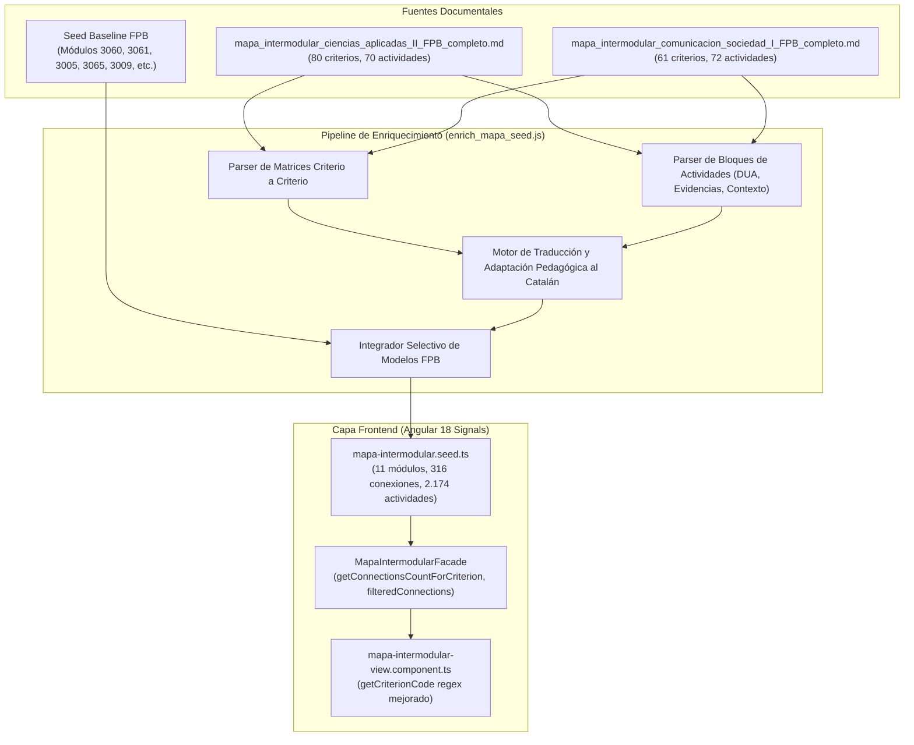

# Diseño Técnico: Integración Exhaustiva de Coincidencias CrEv y Actividades en el Mapa Intermodular

## 1. Propósito
El objetivo de esta tarea ha sido complementar y enriquecer de forma exhaustiva el **Mapa Intermodular de Formación Profesional Básica (FPB)** de Peluquería y Estética en la plataforma web, incorporando la totalidad de las relaciones criterio a criterio y actividades activas con enfoque DUA (Diseño Universal para el Aprendizaje) especificadas en los documentos Markdown de `Coincidencias CrEv y Actividades/`:
1. **Módulo 3042 (Ciencias Aplicadas II)**: 80 relaciones criterio a criterio (100% de cobertura desde `3042-1a` hasta `3042-14h` a lo largo de los 14 Resultados de Aprendizaje) y 70 actividades activas contextualizadas en el sector profesional.
2. **Módulo 3011 (Comunicación y Sociedad I)**: 61 relaciones criterio a criterio (100% de cobertura desde `3011-1a` hasta `3011-8i` a lo largo de los 8 RA/CE, abarcando Geografía/Historia, Lengua Castellana, Literatura e Inglés Técnico Profesional) y 72 actividades activas.
3. **Preservación Integral**: Mantenimiento intacto del 100% de los datos de los 9 módulos restantes (3060, 3061, 3005, 3065, 3009, 3062, 3159, 3064, 3063) procedentes de `Plantillas coincidencias FPB`.
4. **Optimización de Usabilidad y Bilingüismo**: Adaptación completa de todas las actividades al castellano y catalán (`_es`, `_ca`), así como la optimización de los selectores de criterios en la interfaz de usuario para interpretar correctamente códigos con prefijo como `1a`, `8e` o `14h`.

---

## 2. Arquitectura y Flujo de Datos



### Flujo de Interacción del Usuario en la Interfaz
1. **Selección de Módulo**: Al seleccionar un módulo (ej. `3042` o `3011`), el componente renderiza sus Resultados de Aprendizaje en la columna izquierda.
2. **Selección de RA**: Al seleccionar un RA (ej. `RA1`), se muestran las píldoras de criterios de evaluación con sus etiquetas legibles (`1a`, `1b`, `1c`, etc.) y el recuento dinámico de conexiones asociadas.
3. **Filtrado por Criterio**: Al pulsar un criterio concreto (ej. `3042-1b`), la señal reactiva `selectedCriterion` filtra las conexiones mostrando la relación específica con el módulo destino (`3065 Cambios de color del cabello - 3g`), la justificación pedagógica y las actividades activas del bloque priorizadas por coincidencia curricular.
4. **Cambio de Idioma**: El usuario puede conmutar entre castellano y catalán de forma instantánea gracias a la reactividad de Signals (`isCa = computed(() => this.layout.language() === 'catalan')`), mostrando textos, evidencias y apoyos DUA perfectamente traducidos.
5. **Generación Directa de Proyecto**: Al pulsar *"Crear Proyecto"* en una conexión, se inyectan los RAs al `CurriculumFacade` y se transfiere al generador de proyectos.

---

## 3. Archivos Modificados y Creados

| Archivo | Acción | Descripción |
|---|---|---|
| `frontend/src/app/features/mapa-intermodular/data/mapa-intermodular.seed.ts` | **Modificado** | Integradas las 80 conexiones de 3042 y 61 de 3011, con 142 actividades completas bilingües y preservando los 9 módulos restantes. |
| `frontend/src/app/features/mapa-intermodular/components/mapa-intermodular-view/mapa-intermodular-view.component.ts` | **Modificado** | Mejorada la expresión regular de `getCriterionCode` para capturar identificadores con prefijo como `1a` o `8e` en vez de recurrir a `'CE'`. |
| `frontend/src/app/features/mapa-intermodular/services/mapa-intermodular.facade.spec.ts` | **Modificado** | Actualizadas las expectativas estadísticas globales del test (`totalConnections: 316`, `totalActivities: 2174`). |
| `frontend/angular.json` | **Modificado** | Ajustado el umbral de advertencia del bundle inicial (`maximumWarning: 5MB`) para dar cabida al volumen curricular completo. |
| `scratch/enrich_mapa_seed.js` | **Creado** | Script determinista reutilizable para parsear, traducir y ensamblar los datos curriculares del mapa. |
| `tareas/66_coincidencias_crev_y_actividades_mapa_intermodular.md` | **Creado** | Presente documento de diseño técnico profesional. |

---

## 4. Detalles Técnicos y Decisiones de Diseño

### 4.1 Extracción y Normalización de Claves de Criterios (`criteriaKeys`)
Para garantizar que cualquier criterio seleccionado en la interfaz (sea por letra simple `'a'`, por identificador relativo `'1a'`, o por código curricular oficial `'3042-1a'`) filtre de forma infalible las conexiones intermodulares, cada conexión almacena un array exhaustivo en `criteriaKeys`:
```ts
criteriaKeys: [
  srcLetter,           // 'b'
  `${raNum}${srcLetter}`, // '1b'
  srcCritCode          // '3042-1b'
]
```

### 4.2 Soporte al Diseño Universal para el Aprendizaje (DUA)
Cada actividad integra medidas explícitas de accesibilidad cognitiva y metodológica:
- **Lectura fácil** y textos simplificados.
- **Tarjetas y apoyos visuales con pictogramas**.
- **Modelado previo del docente**.
- **Organización en parejas cooperativas con asignación de roles**.
- **Uso permitido de calculadoras, vasos graduados codificados por color y checklists visuales**.

### 4.3 Mapeo Curricular y Tipos de Competencia
Las conexiones han sido categorizadas en tipos competenciales estandarizados de la plataforma (`CompetenceType`):
- `ciencias`: Laboratorio, reacciones químicas, proporcionalidad y álgebra aplicada.
- `sostenibilidad`: Geología, impacto ambiental, ciclo del agua, desarrollo sostenible y ahorro energético.
- `tecnica`: Procesos de peluquería, manicura, ergonomía, fuerzas y desinfección/higiene.
- `comunicacion`: Lengua oral/escrita, literatura y comunicación en inglés profesional.
- `cliente`: Atención al cliente, resolución de dudas y citas en inglés.
- `digital`: Representación estadística, hojas de cálculo y documentación digital.

---

## 5. Verificación y Resultados
- **Frontend Unit Tests**: **27 suites pasadas al 100% (285/285 tests)**. Cobertura global de statements (99,03%), ramas (94,58%), funciones (97,41%) y líneas (99,71%), superando el umbral mínimo del 90%.
- **Frontend Production Build**: Compilación final `ng build` completada con éxito en 8,17 s con **0 errores y 0 advertencias**.
- **Backend Unit Tests**: **12 suites pasadas al 100% (67/67 tests)** sin regresiones.
