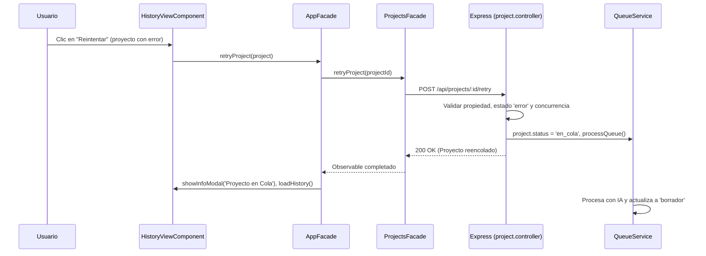

# Diseño Técnico: Acordeón Vertical con Headers Sticky en Mapa Intermodular, Módulos en Columna Única, Sidebar Colapsado por Defecto y Botón Reintentar en Historial

## Propósito
1. **Mapa Intermodular en Escritorio:** Modificar la visualización de los 3 pasos curriculares del Mapa Intermodular (`mapa-intermodular-view`) para que se dispongan verticalmente como un acordeón de 3 pasos independientes y colapsables con encabezados *sticky* apilados en cascada (`top: 0`, `top: 46px`, `top: 92px`).
2. **Módulos en Columna Única Vertical:** La lista de módulos del Paso 1 (`mapa-modules-list`) se estructura en una sola columna vertical (`display: flex; flex-direction: column`) en lugar de rejilla muticolumna, comportándose cada tarjeta de módulo como un acordeón independiente con chevron indicador (`▼`/`▶`) y contador de RAs.
3. **Sidebar Izquierdo Colapsado por Defecto:** En `LayoutService`, configurar `isSidebarCollapsed = signal<boolean>(true)` para que el menú lateral de navegación de la aplicación inicie plegado por defecto, maximizando el espacio de trabajo disponible en pantalla.
4. **Reintentar Proyectos con Error:** Implementar la capacidad de reintentar la generación de proyectos cuyo estado sea `error`. Añadir un botón visible "Reintentar" inmediatamente a la izquierda del botón "Ver Error" en la lista de proyectos de `history-view`, conectándolo a un nuevo endpoint en el backend que reencola el proyecto en el sistema de colas (`queue.service`).

---

## Arquitectura y Flujo

### 1. Mapa Intermodular: Acordeones Verticales con Headers Sticky
- **Estructura en DOM:** Los 3 headers y los 3 cuerpos son hijos directos del contenedor común `.mapa-vertical-accordions`. Al pertenecer al mismo contenedor padre que abarca toda la longitud de la página, los encabezados no son expulsados cuando su cuerpo correspondiente termina de hacer scroll, permitiendo un apilamiento perfecto (*stacked sticky headers*).
- **Offsets Sticky:**
  - Header 1 (Módulos y RAs): `top: 0px; z-index: 30;`
  - Header 2 (RA y Criterios): `top: 46px; z-index: 20;`
  - Header 3 (Conexiones Intermodulares): `top: 92px; z-index: 10;`
- **Módulos en Columna Única (Paso 1):** `.mapa-modules-list` apila verticalmente las tarjetas de módulos (`.mapa-module-card`). Cada tarjeta cuenta con su cabecera `.mapa-module-header` interactiva que actúa como toggle de acordeón, mostrando el chevron `▼`/`▶`, el código del módulo, el nombre completo y la píldora con el recuento de RAs (`{{ mod.learningOutcomes.length }} RAs`). Al pulsar sobre él, se expande la lista de RAs `.mapa-ra-list`.
- **Estado Reactivo (Signals Angular 18):** Se definen los signals `step1Open`, `step2Open` y `step3Open` (todos `true` por defecto). Al hacer clic en un header de paso, se invoca `toggleStep(step)` alternando la visibilidad del cuerpo correspondiente mediante la clase `.collapsed` (`display: none`), manteniendo intacto el estado y scroll interno del DOM.
- **Auto-expansión Contextual:** Cuando el usuario hace clic en un RA del Paso 1 (`onSelectRa`), los pasos 2 y 3 se auto-expanden (`this.step2Open.set(true); this.step3Open.set(true);`).

### 2. Sidebar Izquierdo Colapsado por Defecto
- En `LayoutService`, `isSidebarCollapsed` se inicializa como `signal<boolean>(true)`.
- En pantallas de escritorio, el sidebar se renderiza con ancho compacto (72px) con iconos accesibles mediante tooltips nativos.
- El usuario puede desplegarlo manualmente pulsando el botón de alternancia en cualquier momento.

### 3. Botón "Reintentar" en Historial y Backend

---

## Archivos Modificados y Creados

1. **`frontend/src/app/features/mapa-intermodular/components/mapa-intermodular-view/mapa-intermodular-view.component.html` (Nuevo):**
   - Extracción de la plantilla HTML desacoplada del archivo `.ts`.
   - Implementación de los 3 pasos de acordeón con encabezados interactivos, chevrons indicadores (`▼`/`▶`), metadatos contextuales y cuerpos colapsables.
   - Lista de módulos en columna vertical única donde cada tarjeta funciona como un acordeón plegable con chevron y contador de RAs.
2. **`frontend/src/app/features/mapa-intermodular/components/mapa-intermodular-view/mapa-intermodular-view.component.ts`:**
   - Refactorización modular: reducción de 479 líneas a 140 líneas (cumpliendo estrictamente el límite de 200 líneas de las reglas del proyecto).
   - Extracción de la función auxiliar `findCurriculumMatch` fuera de la clase (todas las funciones < 25 líneas).
   - Incorporación de los signals `step1Open`, `step2Open`, `step3Open` y método `toggleStep(step)`.
3. **`frontend/src/app/features/mapa-intermodular/components/mapa-intermodular-view/mapa-intermodular-view.component.scss`:**
   - Definición de `--mapa-step-header-h: 46px` y reglas `position: sticky` con apilamiento vertical (`top: 0`, `top: 46px`, `top: 92px`).
   - `.mapa-modules-list` definido como `display: flex; flex-direction: column; gap: 8px; width: 100%`.
   - Estilos para cabeceras de acordeón de módulos (`.mapa-module-header`), chevrons y etiquetas de contador.
4. **`frontend/src/app/features/mapa-intermodular/components/mapa-intermodular-view/mapa-intermodular-view.component.spec.ts`:**
   - Cobertura unitaria de los 3 acordeones de pasos, acordeones de módulos, eventos de toggle en DOM, auto-expansión al seleccionar RA y edge cases de coincidencia curricular.
5. **`frontend/src/app/services/layout.service.ts` y `layout.service.spec.ts`:**
   - `isSidebarCollapsed` configurado por defecto a `true`.
   - Tests actualizados para validar el estado colapsado inicial y alternancias.
6. **`backend/src/controllers/project.controller.ts`:**
   - Creación del controlador `retryProject` y funciones auxiliares (`validateRetryAccess`, `hasPendingGeneration`, `reenqueueProject`).
   - Verificación de permisos (dueño o admin), validación de que el estado actual sea `error`, control de concurrencia (evitar más de 1 generación simultánea) y reactivación de `processQueue()`.
7. **`backend/src/routes/project.routes.ts`:**
   - Registro de la ruta `POST /api/projects/:id/retry` protegida con middlewares `requireApproved` y `requireAiAccess`.
8. **`backend/src/tests/projects.test.ts`:**
   - Tests unitarios completos para `/api/projects/:id/retry`: éxito 200, 404 no encontrado, 403 usuario ajeno, 400 estado no error, 429 concurrencia, reintento por admin y manejo de errores 500.
9. **`frontend/src/app/services/translation.service.ts`:**
   - Adición de `retryBtn: 'Reintentar'` en diccionarios de Castellano y Catalán.
10. **`frontend/src/app/features/projects/services/projects.facade.ts` y `projects.facade.spec.ts`:**
    - Implementación y test del método `retryProject(projectId)`.
11. **`frontend/src/app/app.facade.ts` y `app.facade.spec.ts`:**
    - Implementación del método `retryProject(project)` con gestión de modal informativo y modal de error.
12. **`frontend/src/app/features/history/components/history-view/history-view.component.ts` y `history-view.component.spec.ts`:**
    - Renderizado del botón "Reintentar" inmediatamente a la izquierda del botón "Ver Error" para proyectos con estado `error`.
    - Tests de interacción de botones verificando la llamada a `appFacade.retryProject(project)`.
13. **`frontend/src/app/features/notifications/services/notifications.facade.spec.ts`:**
    - Inclusión de test de desuscripción y limpieza en logout para garantizar >90% de cobertura en ramas.

---

## Detalles Técnicos y Decisiones de Diseño

### 1. Apilamiento Sticky con Sibling Elements
En CSS, un elemento `position: sticky` solo puede permanecer fijo dentro del área visible de su elemento padre contenedor.
Al colocar los 3 headers y sus 3 bodies como hijos directos de `.mapa-vertical-accordions`:
- El padre permanece visible en el viewport mientras cualquiera de sus hijos esté a la vista.
- Los offsets calculados (`top: 0`, `top: 46px`, `top: 92px`) permiten que los 3 encabezados se congelen en cascada en la parte superior sin solaparse entre sí.
- Se fijó `height: 46px` y `box-sizing: border-box` para asegurar la precisión milimétrica del apilamiento.

### 2. Acordeones Anidados para Módulos en Columna Única
- El Paso 1 contiene 11 módulos oficiales FPB.
- Al apilarse en una única columna vertical al 100% de ancho, cada módulo se muestra cerrado por defecto o abierto según la selección activa.
- La cabecera del módulo muestra un indicador chevron (`▼`/`▶`), el badge con el código coloreado, el nombre descriptivo y una píldora con el recuento de RAs contenidos.

### 3. Separación de Responsabilidades en Cabeceras: Botón Colapsar vs Activación/Desplazamiento
- **Botón Exclusivo de Colapso (`.mapa-step-toggle-btn`):** Es el único punto interactivo que alterna el estado plegado/desplegado (`toggleStep(step, $event)`). Ejecuta `$event.stopPropagation()` para evitar que el clic se propague a la cabecera.
- **Activación y Enfoque (`activateStep(step)`):** El clic en cualquier otra parte del encabezado `.mapa-step-header` garantiza la apertura del paso (`stepOpen.set(true)`), desplazando suavemente el scroll hacia el cuerpo correspondiente (`scrollIntoView({ behavior: 'smooth', block: 'start' })`) y aplicando el foco accesible (`focus()`).
- **Atributos de Accesibilidad:** Los cuerpos cuentan con `tabindex="-1"` para permitir el foco programático, y los botones incluyen `aria-expanded` y `aria-label` dinámicos bilingües.

### 4. Métricas y Cobertura de Tests
- **Backend:** 76/76 tests superados, Statements: 97.59%, Branches: 90.74%, Functions: 100%, Lines: 98.24%.
- **Frontend:** 299/299 tests superados, Statements: 99.11%, Branches: 95.11%, Functions: 97.53%, Lines: 99.72%.
- **Pre-push Hook:** Ejecución automática de ambas suites validada con código de salida 0.
