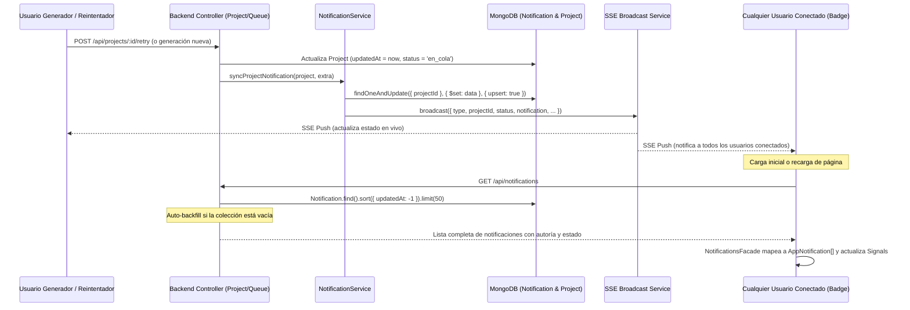

# Diseño Técnico: Persistencia de Notificaciones en MongoDB y Visibilidad Global para Todos los Usuarios

## Propósito
1. **Solución a proyectos reintentados ausentes en notificaciones:** Al reintentar la generación de un proyecto fallido mediante la acción "Reintentar", el proyecto no aparecía en el panel de notificaciones porque su fecha de creación original (`createdAt`) superaba el filtro estricto de 24 horas y no se emitían actualizaciones de notificación ni actualización de marcas temporales (`updatedAt`).
2. **Persistencia y Visibilidad Multi-Usuario:** Las notificaciones previas residían únicamente en la memoria volátil del navegador y en eventos SSE efímeros por usuario. Con este diseño se implementa una colección dedicada en MongoDB (`Notification`) que registra el estado del proyecto, autoría, módulos y tiempos de generación, haciéndola persistente y visible para todos los usuarios del sistema al iniciar sesión o refrescar, sincronizándose además en tiempo real a través de SSE Broadcast.

---

## Arquitectura y Flujo

---

## Componentes y Decisiones Técnicas

### 1. Modelo de Datos `Notification` (`backend/src/models/Notification.ts`)
- `projectId`: Referencia al ID del proyecto en MongoDB.
- `userId` y `userName`: Datos del usuario que creó/reintentó el proyecto (ej. "Carlos", "Profesor").
- `modules`: Módulos o materias vinculadas al proyecto.
- `status`: Estado del proyecto (`en_cola`, `generando`, `borrador`, `publicado`, `error`).
- `type`: Tipo semántico del evento (`PROJECT_COMPLETED`, `PROJECT_ERROR`, `PROJECT_STATUS`, `INFO`).
- `generationTimeMs` y `generationStartedAt`: Métricas temporales para el cálculo del contador y el tiempo IA.
- `readBy`: Array de IDs de usuarios que han leído la notificación, permitiendo control de no leídos por usuario de forma individual.
- `updatedAt`: Marca temporal esencial para ordenar las notificaciones más recientes arriba, garantizando que un proyecto reintentado se sitúe siempre en la parte superior del feed.

### 2. Servicio de Notificaciones (`backend/src/services/notification.service.ts`)
- **Upsert Determinista:** Emplea `Notification.findOneAndUpdate({ projectId }, { $set: updateData }, { upsert: true, returnDocument: 'after' })`. De esta forma, cada proyecto cuenta con una tarjeta única y reactiva en "Actividad Reciente" que transiciona de forma fluida a través de sus fases (`en_cola` -> `generando` -> `borrador` / `error`), evitando spam de duplicados.
- **Limpieza en Cascada:** `deleteProjectNotification(projectId)` asegura la eliminación de la notificación cuando el usuario borra un proyecto.

### 3. Emisión Global SSE (`backend/src/services/sse.service.ts`)
- Se implementó la función `broadcast(data)`, la cual itera sobre todos los clientes conectados a la plataforma a través de Server-Sent Events, transmitiendo eventos de cambio de estado a todos los usuarios activos concurrentes con control de excepciones por socket cerrado.

### 4. Controlador y Rutas (`notification.controller.ts` y `notification.routes.ts`)
- `GET /api/notifications`: Recupera las últimas 50 notificaciones ordenadas por `updatedAt: -1`. Incluye mecanismo de **auto-backfill** a partir de proyectos preexistentes en la base de datos si la colección de notificaciones se encuentra vacía.
- `POST /api/notifications/read-all`: Registra el `userId` en el array `readBy` mediante `$addToSet` sin sobreescribir las lecturas de otros usuarios.

### 5. Actualización en Reintento de Proyecto (`project.controller.ts`)
- En `reenqueueProject`:
  - Se actualiza expresamente `project.updatedAt = new Date()`.
  - Se resetean errores previos (`error: null`, `lastError: null`).
  - Se invoca `syncProjectNotification(project, { type: 'PROJECT_STATUS', message: 'Proyecto reencolado...' })`.
  - Se notifica inmediatamente por SSE broadcast, garantizando que el proyecto reintentado aparezca al instante en las notificaciones de todos los usuarios.

### 6. Frontend: `NotificationsFacade` y `NotificationMapper`
- `NotificationsFacade`:
  - Inyección de `HttpClient` para cargar de forma asíncrona `/api/notifications` al iniciar sesión.
  - `mergeNotification`: Combina actualizaciones de SSE preservando la identidad del registro y ordenando descendentemente por fecha (`timestamp` / `updatedAt`).
  - `markAllAsRead`: Actualiza el estado reactivo localmente y sincroniza la llamada a `/api/notifications/read-all`.
- `NotificationMapper`:
  - Incorpora `fromDbEntity(db, currentUserId)` para mapear entidades de MongoDB a `AppNotification`, evaluando el estado de lectura particular del usuario logueado mediante `db.readBy`.

### 7. Frontend: `NotificationsBadgeComponent`
- **Fuente de Datos Unificada:** El componente consume directamente `notificationsFacade.notifications()` para determinar `recentProjects`, `activeCount`, `generatingProject` y `unreadCount`.
- **Desacoplamiento Reactivo con `untracked()`:** El cálculo de proyectos recientes emplea `untracked(() => this.now())` para evitar que el tic-tac del cronómetro (`1000ms`) re-ejecute innecesariamente el efecto o destruya y recree el intervalo.
- **Presentación Visual Mejorada:** Muestra los módulos asociados, el autor del proyecto (`por ${userName}`), la hora de la última modificación (`shortTime`), el cronómetro dinámico (`⏱️ mm:ss`) si está en proceso y la duración de la IA en milisegundos (`Completado (14.5s)`).

---

## Archivos Modificados y Creados

1. `backend/src/models/Notification.ts` (Nuevo)
2. `backend/src/models/Project.ts` (Modificado)
3. `backend/src/services/sse.service.ts` (Modificado)
4. `backend/src/services/notification.service.ts` (Nuevo)
5. `backend/src/controllers/notification.controller.ts` (Nuevo)
6. `backend/src/routes/notification.routes.ts` (Nuevo)
7. `backend/src/server.ts` (Modificado)
8. `backend/src/controllers/project.controller.ts` (Modificado)
9. `backend/src/services/queue.service.ts` (Modificado)
10. `backend/src/tests/notifications.test.ts` (Nuevo)
11. `backend/src/tests/sse.service.test.ts` (Modificado)
12. `backend/src/tests/queue.service.test.ts` (Modificado)
13. `frontend/src/app/features/notifications/models/notification.model.ts` (Modificado)
14. `frontend/src/app/features/notifications/mappers/notification.mapper.ts` (Modificado)
15. `frontend/src/app/features/notifications/mappers/notification.mapper.spec.ts` (Modificado)
16. `frontend/src/app/features/notifications/services/notifications.facade.ts` (Modificado)
17. `frontend/src/app/features/notifications/services/notifications.facade.spec.ts` (Modificado)
18. `frontend/src/app/features/notifications/components/notifications-badge/notifications-badge.component.ts` (Modificado)
19. `frontend/src/app/features/notifications/components/notifications-badge/notifications-badge.component.spec.ts` (Modificado)

---

## Verificación de Límites y Cobertura

- **Límites de Código:**
  - Componentes/Archivos: Todos inferiores a 200 líneas (ej. `NotificationsBadgeComponent`: 180 líneas, `NotificationsFacade`: 94 líneas, `NotificationMapper`: 81 líneas).
  - Funciones/Métodos: Todos inferiores a 25 líneas (ej. `mergeNotification`: 13 líneas, `syncProjectNotification`: 24 líneas).
- **Cobertura de Tests:**
  - **Backend:** 86 tests pasados (14 suites).
    - Statements: 97.86% (> 90%)
    - Branches: 90.82% (> 90%)
    - Functions: 100% (> 90%)
    - Lines: 98.44% (> 90%)
  - **Frontend:** 305 tests pasados (27 suites).
    - Statements: 99.13% (> 90%)
    - Branches: 95.23% (> 90%)
    - Functions: 97.66% (> 90%)
    - Lines: 99.73% (> 90%)
  - **Hook Pre-push:** Ejecución completa sin fallos (código de salida 0).
