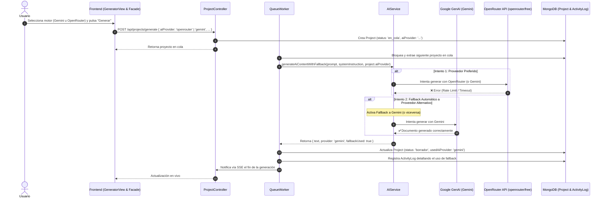

# Diseño Técnico: Selección de IA (Gemini / OpenRouter) y Fallback Automático

## Propósito
1. **Soporte Multi-Proveedor de IA:** Permitir al usuario elegir con qué inteligencia artificial generar su proyecto intermodular, incorporando OpenRouter (`openrouter/free`) como alternativa a Google Gemini (`gemini-3.6-flash`).
2. **Proveedor Predeterminado:** Google Gemini permanece como la IA por defecto en toda la aplicación.
3. **Mecanismo de Resiliencia / Fallback Automático:** Si el proveedor preferido por el usuario experimenta un fallo (errores de cuota, saturación de red, timeouts, errores de API 4xx/5xx), el sistema conmuta automáticamente al proveedor alternativo (de Gemini a OpenRouter, o de OpenRouter a Gemini) antes de marcar el proyecto en error.
4. **Trazabilidad y Auditoría:** Almacenar en el modelo de datos de `Project` tanto la IA solicitada (`aiProvider`) como la IA que efectivamente generó el documento (`usedAiProvider`), dejando constancia en los logs del sistema (`ActivityLog`) en caso de que se haya activado el fallback.

---

## Arquitectura y Flujo

---

## Componentes y Decisiones Técnicas

### 1. Integración de OpenRouter (`backend/src/services/ai.service.ts`)
- **Cliente Nativo:** Se utilizó `fetch` nativo de Node.js contra `https://openrouter.ai/api/v1/chat/completions`, eliminando dependencias externas pesadas.
- **Autenticación:** Lee la variable de entorno `OPENROUTER_API_KEY`.
- **Modelo Gratuito:** Utiliza el identificador `openrouter/free` por defecto, con cabeceras `HTTP-Referer` y `X-Title` requeridas por OpenRouter.
- **Modularidad:** El envío de la petición HTTP se desacopló en `requestOpenRouterApi`, manteniendo todas las funciones por debajo del límite estricto de 25 líneas.

### 2. Algoritmo de Fallback Bidireccional (`generateAiContentWithFallback`)
- Determina dinámicamente el orden de invocación:
  - Si el usuario eligió `openrouter`, el orden es `['openrouter', 'gemini']`.
  - Si el usuario eligió `gemini`, el orden es `['gemini', 'openrouter']`.
- Si el primer proveedor lanza una excepción, se registra un `console.warn`, se conmuta al siguiente y, en caso de éxito, retorna el texto junto con la metadata `{ provider, fallbackUsed: true }`. Solo si ambos proveedores fallan se propaga la excepción.

### 3. Modelo de Datos y Cola (`Project.ts` y `queue.service.ts`)
- **Campos en `Project`:**
  - `aiProvider`: `'gemini' | 'openrouter'` (por defecto `'gemini'`).
  - `usedAiProvider`: Registra el proveedor que realmente completó la generación.
- **Worker de la Cola:**
  - Pasa `project.aiProvider || 'gemini'` como proveedor preferido a `generateAiContentWithFallback`.
  - Si `fallbackUsed` es verdadero, añade una nota explícita en `ActivityLog.details`: `"... (fallback: openrouter)"` o `"... (fallback: gemini)"`.

### 4. Controlador de Proyectos (`project.controller.ts`)
- `generateProject`: Admite `req.body.aiProvider` y lo almacena al crear el proyecto.
- `chatProject` (reescritura / taller): Conmutado a `generateAiContentWithFallback` para beneficiarse también de la resiliencia ante caídas de servicio.
- `retryProject`: Permite opcionalmente recibir `req.body.aiProvider` al reintentar o conserva el proveedor preexistente del proyecto.

### 5. Configuración de Entornos Docker (`docker-compose.yml` y `docker-compose.prod.yml`)
- Se expuso la variable `OPENROUTER_API_KEY=${OPENROUTER_API_KEY}` en los servicios de backend tanto de desarrollo como de producción.

### 6. Frontend: Signals y Selector en Generador
- **`TranslationService`:** Añadidas las traducciones `generatorAiLabel`, `aiGemini` y `aiOpenRouter` en castellano y catalán.
- **`ProjectsFacade`:** Incorporado el signal reactivo `selectedAi = signal<'gemini' | 'openrouter'>('gemini')`, inyectándolo en el cuerpo de `generateProject()`.
- **`GeneratorViewComponent`:** Añadido un desplegable `<select id="generator-ai-select">` en la fila de configuración de nivel y metodología, enlazado bidireccionalmente con `projects.selectedAi`.
- **Límites de Código:** `GeneratorViewComponent` consta de 107 líneas (<200) y sus métodos no superan las 4 líneas (<25).

---

## Archivos Modificados y Creados

### Backend
1. `backend/src/models/Project.ts`: Schema ampliado con `aiProvider` y `usedAiProvider`.
2. `backend/src/services/ai.service.ts`: Implementación de `generateOpenRouterContent`, `generateAiContentWithFallback`, helpers y types.
3. `backend/src/services/queue.service.ts`: Integración de fallback en el worker y auditoría de proveedor en `ActivityLog`.
4. `backend/src/controllers/project.controller.ts`: Asignación de `aiProvider` en generación, chat y reintento.
5. `backend/src/tests/ai.service.test.ts`: Tests unitarios para OpenRouter y combinaciones de fallback.
6. `backend/src/tests/queue.service.test.ts`: Tests para generación con fallback y guardado de `usedAiProvider`.
7. `backend/src/tests/projects.test.ts`: Tests de endpoints con `aiProvider`.
8. `docker-compose.yml` y `docker-compose.prod.yml`: Inyección de `OPENROUTER_API_KEY`.

### Frontend
1. `frontend/src/app/services/translation.service.ts`: Diccionario de etiquetas i18n para selección de IA.
2. `frontend/src/app/features/projects/services/projects.facade.ts`: Signal `selectedAi` y payload enriquecido en `generateProject`.
3. `frontend/src/app/features/projects/services/projects.facade.spec.ts`: Tests verificando el envío de `aiProvider` ('gemini' y 'openrouter').
4. `frontend/src/app/features/generator/components/generator-view/generator-view.component.ts`: Dropdown de selección de IA y método `onAiChange`.
5. `frontend/src/app/features/generator/components/generator-view/generator-view.component.spec.ts`: Tests unitarios para el evento de selección de IA.
6. `frontend/src/app/app.spec.ts`: Actualización del mock de `ProjectsFacade` con `selectedAi`.

---

## Verificación y Calidad

- **Backend:** 14 suites de test ejecutadas con éxito (95 tests).
  - Statements: 97.97% (>= 90%)
  - Branches: 90.77% (>= 90%)
  - Functions: 100% (>= 90%)
  - Lines: 98.52% (>= 90%)
- **Frontend:** 27 suites de test ejecutadas con éxito (306 tests).
  - Statements: 99.14% (>= 90%)
  - Branches: 95.14% (>= 90%)
  - Functions: 97.67% (>= 90%)
  - Lines: 99.73% (>= 90%)
- **Hook `pre-push`:** Ejecución íntegra y limpia con código de retorno 0.
