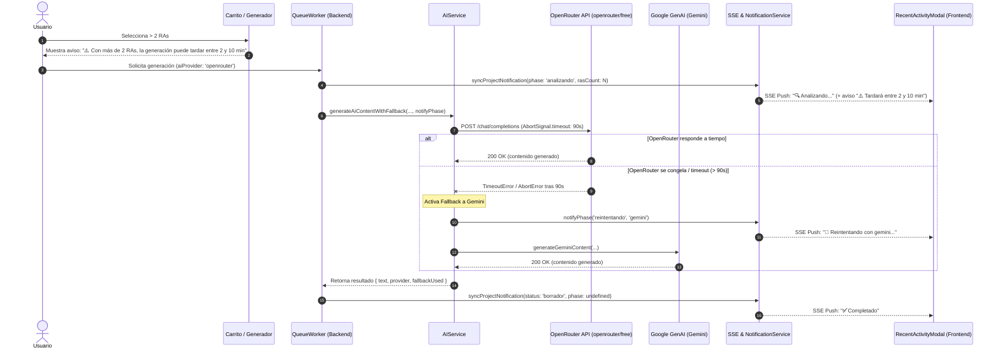

# Diseño Técnico: Timeout en OpenRouter, Fases en Notificaciones ("Analizando"/"Reintentando") y Aviso de Duración (>2 RAs)

## Propósito
1. **Diagnóstico y Solución de Bloqueos en OpenRouter:** Al seleccionar `openrouter/free`, algunas solicitudes tardaban más de 7 minutos o quedaban colgadas. Esto ocurría porque el cliente nativo `fetch` de Node.js no incluye timeout por defecto, sumado a la saturación o encolamiento en los servidores compartidos del tier gratuito de OpenRouter. Al no cerrarse la conexión con error, el fallback automático a Gemini nunca se activaba. Se incorpora un timeout estricto de 90 segundos con `AbortSignal.timeout(90_000)` para abortar peticiones bloqueadas y conmutar a Gemini de inmediato.
2. **Visibilidad de Fases en Notificaciones:** Mostrar información granular en tiempo real durante la generación del proyecto:
   - **`Analizando...`**: Fase inicial de lectura de competencias y contextualización pedagógica.
   - **`Reintentando...`**: Activación visual del fallback si el primer proveedor de IA falla o agota el tiempo límite.
3. **Aviso de Tiempo Estimado para Proyectos Complejos (>2 RAs):** Si el proyecto incluye más de 2 Resultados de Aprendizaje o Criterios de Evaluación, la carga cognitiva y el volumen de texto aumentan sustancialmente. Se presenta el mensaje explicativo: *"Tardará entre 2 y 10 minutos"* tanto en la tarjeta del selector previo como en el feed de notificaciones.
4. **Refactorización y Modularidad:** Extracción del diálogo modal de actividad reciente desde `NotificationsBadgeComponent` hacia un nuevo componente independiente `RecentActivityModalComponent`, reduciendo drásticamente las líneas por archivo (< 120 líneas) y garantizando el cumplimiento de las reglas de arquitectura.

---

## Arquitectura y Flujo

---

## Componentes y Decisiones Técnicas

### 1. Control de Timeout en OpenRouter (`backend/src/services/ai.service.ts`)
- Se implementó `AbortSignal.timeout(90_000)` en la función `requestOpenRouterApi`.
- En caso de que OpenRouter no responda en 90 segundos, se captura la excepción `TimeoutError` o `AbortError` y se lanza un error descriptivo:
  `"Timeout en OpenRouter (90s): el proveedor gratuito no respondió a tiempo"`.
- Este error es capturado por el bucle de `generateAiContentWithFallback`, lo que desencadena de inmediato la conmutación al siguiente motor (Google Gemini).

### 2. Notificación Reactiva de Fases (`PhaseCallback`)
- `generateAiContentWithFallback` acepta ahora una función de retrollamada `onPhaseChange?: PhaseCallback`.
- Al iniciar la generación se notifica `'analizando'`. Si se produce una excepción y se pasa al siguiente motor, se notifica `'reintentando'`.
- En `queue.service.ts`, `createPhaseNotifier` y `startProjectGeneration` emiten eventos SSE y actualizan la base de datos de notificaciones para mantener sincronizados a todos los usuarios.

### 3. Modelo de Datos y Notificaciones (`Project.ts`, `Notification.ts` y `notification.service.ts`)
- Se añadieron los campos:
  - `phase: String`: Estado intermedio (`'analizando'` | `'reintentando'`).
  - `rasCount: Number`: Número total de RAs/CEs involucrados en el proyecto.
- `buildUpdateData` en `notification.service.ts` extrae automáticamente `rasCount` del array `project.ras` y propaga `phase` tanto a MongoDB como al payload de `broadcast()` SSE.

### 4. Modularización del Frontend (`RecentActivityModalComponent`)
- Se extrajo el diálogo modal de historial reciente a `frontend/src/app/features/notifications/components/recent-activity-modal/recent-activity-modal.component.ts` (129 líneas).
- `NotificationsBadgeComponent` quedó simplificado a 112 líneas (< 200 líneas).
- Incorpora insignias visuales con iconos para las fases:
  - `🔍 Analizando...` (azul `#0284c7`)
  - `🔄 Reintentando...` (ámbar `#d97706`)
  - Aviso contextual: `⚠️ Tardará entre 2 y 10 minutos` cuando `rasCount > 2`.

### 5. Aviso Preventivo en Selector de Currículum (`curriculum-selector.component.ts`)
- Si el usuario selecciona más de 2 RAs (`facade.selectedItemsDetails().length > 2`), el carrito flotante muestra un banner preventivo encima del botón de generación avisando del tiempo estimado.

---

## Archivos Modificados y Creados

### Backend
1. `backend/src/models/Project.ts`: Añadido campo `phase`.
2. `backend/src/models/Notification.ts`: Añadidos campos `phase` y `rasCount`.
3. `backend/src/services/ai.service.ts`: Timeout de 90s con `AbortSignal.timeout` y `PhaseCallback`.
4. `backend/src/services/notification.service.ts`: Mapeo y broadcast de `phase` y `rasCount`.
5. `backend/src/services/queue.service.ts`: Manejo de fases `analizando` y `reintentando`.
6. `backend/src/tests/ai.service.test.ts`: Tests unitarios para `TimeoutError` y llamadas de `onPhaseChange`.

### Frontend
1. `frontend/src/app/services/translation.service.ts`: Claves `notificationAnalyzing`, `notificationRetrying`, `longGenerationNotice` y `longGenerationNoticePlural` en ES y CA.
2. `frontend/src/app/features/notifications/models/notification.model.ts`: Campos `phase` y `rasCount` en modelos de notificación.
3. `frontend/src/app/features/notifications/mappers/notification.mapper.ts`: Mapeo de `phase` y `rasCount`.
4. `frontend/src/app/features/notifications/components/recent-activity-modal/recent-activity-modal.component.ts`: Nuevo componente modal desacoplado.
5. `frontend/src/app/features/notifications/components/recent-activity-modal/recent-activity-modal.component.spec.ts`: Suite de pruebas del modal.
6. `frontend/src/app/features/notifications/components/notifications-badge/notifications-badge.component.ts`: Refactorizado para delegar en el nuevo modal.
7. `frontend/src/app/features/notifications/components/notifications-badge/notifications-badge.component.spec.ts`: Actualizado para validar nueva fase.
8. `frontend/src/app/features/curriculum/components/curriculum-selector/curriculum-selector.component.ts`: Banner informativo de tiempo cuando `selectedRas > 2`.

---

## Verificación y Calidad

- **Backend:** 14 suites ejecutadas con éxito (97 tests).
  - Statements: **98.18%** (>= 90%)
  - Branches: **91.71%** (>= 90%)
  - Functions: **100%** (>= 90%)
  - Lines: **98.72%** (>= 90%)
- **Frontend:** 28 suites ejecutadas con éxito (311 tests).
  - Statements: **99.01%** (>= 90%)
  - Branches: **95.22%** (>= 90%)
  - Functions: **97.93%** (>= 90%)
  - Lines: **99.57%** (>= 90%)
- **Pre-push Hook:** Ejecutado y verificado con código de salida `0`.
