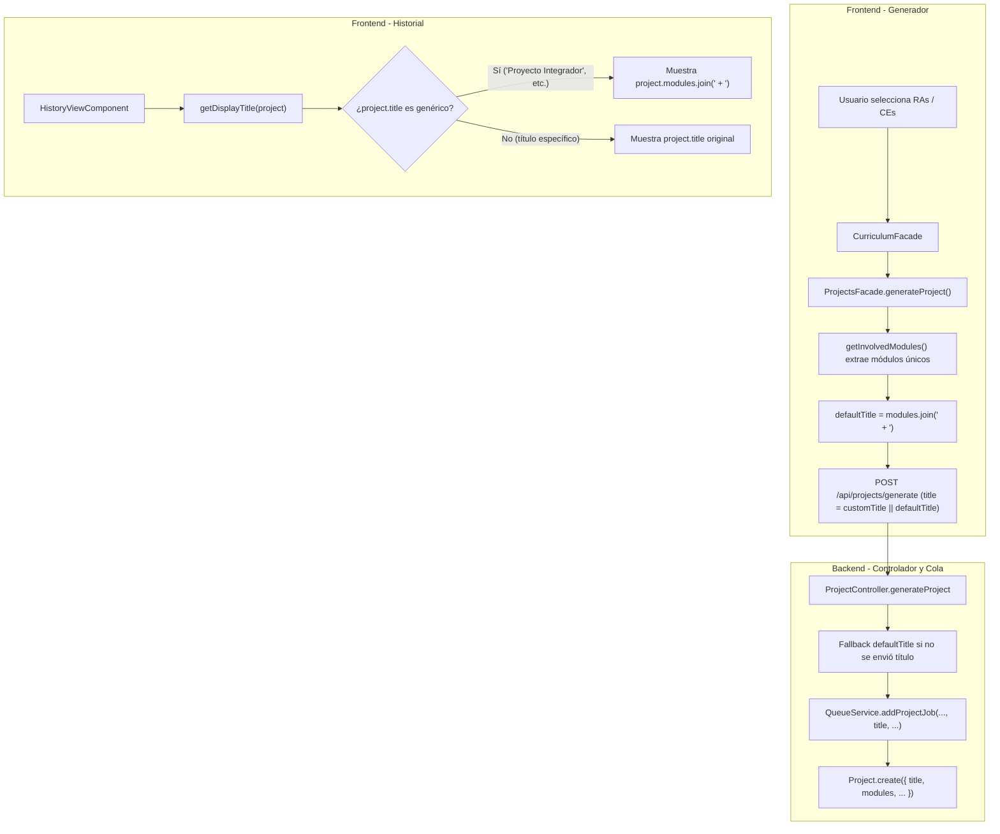

# Tarea 80: Título Dinámico de Proyectos según Módulos Seleccionados y Compatibilidad Retrospectiva

## Propósito
Anteriormente, al generar un proyecto desde el Generador o en segundo plano, el título por defecto quedaba registrado con un valor genérico hardcodeado como `"Proyecto Integrador"` (o `"Proyecto de ESO"`).
El objetivo de esta tarea ha sido hacer que el nombre por defecto del proyecto refleje exactamente las asignaturas o módulos seleccionados por el usuario (por ejemplo: `"3060 - Ciencias Aplicadas + 3061 - Comunicación y Sociedad"` o `"Matemáticas + Biología y Geología"`), garantizando además que en la vista de Historial los proyectos generados previamente con títulos genéricos se visualicen mostrando los nombres de sus módulos seleccionados.

---

## Arquitectura y Flujo

---

## Archivos Modificados / Creados

1. **`backend/src/controllers/project.controller.ts`**:
   - Ajustada la resolución del título inicial por defecto en `generateProject`: en lugar de fijar un string genérico, utiliza `(modules && modules.length > 0 ? modules.join(' + ') : 'Proyecto Generado')`.
2. **`frontend/src/app/features/projects/services/projects.facade.ts`**:
   - Implementado el método auxiliar privado `getInvolvedModules(tipoNivel, selectedRas)` respetando la restricción de < 25 líneas.
   - En `generateProject()`, calcula `defaultTitle` a partir de `modules.join(' + ')` (con fallback a `'Proyecto Integrador'` si la lista está vacía).
   - Envía el payload con `title: title || defaultTitle`.
3. **`frontend/src/app/features/history/components/history-view/history-view.component.ts`**:
   - Añadido el método `getDisplayTitle(project: any): string` que detecta títulos genéricos (`'Proyecto Integrador'`, `'Proyecto de ESO'`, `'Proyecto Generado'`, vacío o nulo) y devuelve los módulos concatenados con ` + `.
   - Modificada la plantilla para invocar `getDisplayTitle(project)`.
4. **`frontend/src/app/features/history/components/history-view/history-view.component.spec.ts`**:
   - Añadidos tests unitarios exhaustivos para comprobar que `getDisplayTitle` resuelve tanto títulos personalizados como genéricos y arrays de módulos vacíos.
5. **`frontend/src/app/features/projects/services/projects.facade.spec.ts`**:
   - Pruebas añadidas para cubrir tanto la generación con título personalizado como el cálculo dinámico del título por módulos para FP Básica y ESO/Diversificación, y casos extremos sin módulos.

---

## Detalles Técnicos y Decisiones de Diseño

1. **Extracción y Deduplicación de Módulos**:
   - Los RAs y Criterios seleccionados contienen información del módulo o asignatura (`ra.module` en FP Básica y `ce.subject` en ESO/Diversificación).
   - Se procesan con `Array.from(new Set(...))` para evitar duplicados si se han elegido varios criterios del mismo módulo.
2. **Compatibilidad Retrospectiva (Backward Compatibility)**:
   - Proyectos ya guardados en MongoDB con el título antiguo `"Proyecto Integrador"` se benefician inmediatamente de `getDisplayTitle()`, mostrando al usuario de forma clara qué módulos componen el proyecto sin necesidad de migraciones destructivas en la base de datos.
3. **Reglas de Calidad y Cobertura**:
   - Se mantuvo la cobertura global y por fichero por encima del 90% (Branches > 95%, Statements > 99%).
   - Se respetaron estrictamente las directrices de tamaño: métodos de menos de 25 líneas y ficheros compactos.
