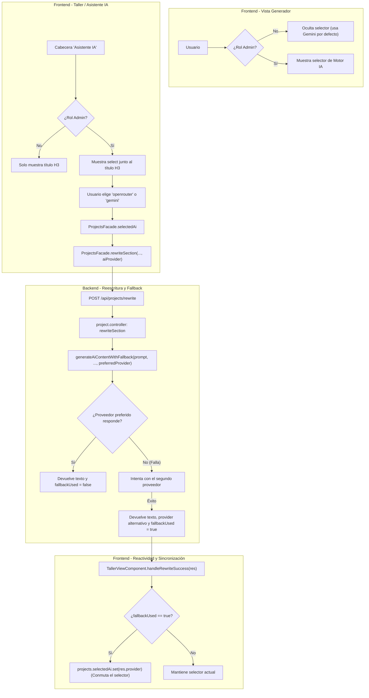

# Tarea 81: Selector de Motor IA en Asistente (Taller), Fallback Reactivo y Visibilidad Exclusiva para Administradores

## Propósito
1. **Control de Acceso:** Restringir la visualización y selección de motores de Inteligencia Artificial (Google Gemini vs OpenRouter) de manera que **únicamente los usuarios administradores** puedan ver y alternar los selectores de motor IA tanto en el Generador como en el Asistente IA del Taller.
2. **Selector en Asistente IA:** Incorporar a la derecha del título "Asistente IA" en el Taller un selector interactivo con los dos motores de IA disponibles.
3. **Alternancia Automática ante Fallos (Fallback):** Integrar la selección de IA y el mecanismo de fallback en la reescritura del Asistente (`/api/projects/rewrite`). Si el motor seleccionado falla o agota cuotas, el sistema intenta automáticamente con el otro motor y, al tener éxito, conmuta reactivamente el selector en el frontend para reflejar el motor que ha respondido.

---

## Arquitectura y Flujo

---

## Archivos Modificados / Creados

1. **`backend/src/controllers/project.controller.ts`**:
   - Se adaptó `rewriteSection` para aceptar `aiProvider` (`'gemini' | 'openrouter'`) en el cuerpo de la petición.
   - Se desacopló la construcción del prompt en la función auxiliar `buildRewritePrompt` (manteniendo métodos < 25 líneas).
   - Se invoca `generateAiContentWithFallback` pasando el motor preferido.
   - Devuelve la respuesta incluyendo `{ newText, rewrittenPart, provider, fallbackUsed }`.
2. **`backend/src/tests/projects.test.ts`**:
   - Añadidos tests unitarios para verificar la llamada a `/api/projects/rewrite` con `aiProvider` explícito y la comprobación de los metadatos `provider` y `fallbackUsed`.
3. **`frontend/src/app/features/projects/services/projects.facade.ts`**:
   - Se actualizó el método `rewriteSection(instruction, aiProvider?)` para enviar `aiProvider: aiProvider || this.selectedAi()` al backend.
4. **`frontend/src/app/features/projects/services/projects.facade.spec.ts`**:
   - Añadidos tests para cubrir el envío de `aiProvider` por defecto y explícito.
5. **`frontend/src/app/features/generator/components/generator-view/generator-view.component.ts`**:
   - Inyectado `AuthFacade`.
   - Se envolvió el bloque del selector de motor de IA dentro de `@if (auth.currentUser()?.role === 'admin')`.
6. **`frontend/src/app/features/generator/components/generator-view/generator-view.component.spec.ts`**:
   - Actualizado el fixture con `mockAuthFacade` para validar que el selector es visible solo para administradores y permanece oculto para profesores/usuarios estándar.
7. **`frontend/src/app/features/taller/components/taller-view/taller-view.component.html`**:
   - Se convirtió la cabecera de "Asistente IA" en un contenedor flexible (`display: flex; align-items: center; justify-content: space-between`).
   - Se añadió a la derecha el `<select id="taller-ai-select">` con opciones de Gemini y OpenRouter, condicionado a `@if (auth.currentUser()?.role === 'admin')`.
8. **`frontend/src/app/features/taller/components/taller-view/taller-view.component.ts`**:
   - Añadido el manejador `onAiChange(event: Event)` para sincronizar la selección con `projects.selectedAi`.
   - En `handleRewriteSuccess(res)`: si `res.fallbackUsed` es verdadero y viene `res.provider`, se actualiza automáticamente `this.projects.selectedAi.set(res.provider)`.
   - Refactorizados los métodos (`handleRewriteSuccess`, `handleRewriteError`, `showInfoModal`) manteniendo todos los métodos por debajo de 20 líneas y el fichero en 197 líneas (< 200 líneas).
9. **`frontend/src/app/features/taller/components/taller-view/taller-view.component.spec.ts`**:
   - Pruebas unitarias añadidas para comprobar:
     - `onAiChange` actualiza `projects.selectedAi`.
     - `rewriteWithAI` conmuta `selectedAi` al motor secundario cuando `fallbackUsed` es `true`.
     - El selector `#taller-ai-select` se renderiza para administradores y no se muestra para no administradores.

---

## Detalles Técnicos y Decisiones de Diseño

1. **Gestión de Estado Centralizada con Signals**:
   - `projects.selectedAi` es un `signal<'gemini' | 'openrouter'>('gemini')` en `ProjectsFacade`. Tanto el Generador como el Taller se enlazan reactivamente al mismo estado. Si el usuario conmuta el motor en cualquiera de las vistas o la IA conmuta por fallback, ambas vistas permanecen sincronizadas sin acoplamientos innecesarios.
2. **Control de Acceso Declarativo en Plantillas**:
   - La directiva `@if (auth.currentUser()?.role === 'admin')` asegura que los elementos DOM de los selectores ni siquiera se instancien para usuarios no administradores, respetando la seguridad visual y evitando cualquier modificación no autorizada de parámetros.
3. **Resiliencia y Fallback Transparente**:
   - La infraestructura de `generateAiContentWithFallback` en backend garantiza que un fallo por sobrecarga o límite de cuota en Gemini intente de inmediato con OpenRouter (y viceversa), evitando que el usuario reciba un error innecesario. Al sincronizar `selectedAi` con el proveedor que resolvió la petición, el usuario administrador tiene visibilidad inmediata del cambio.
