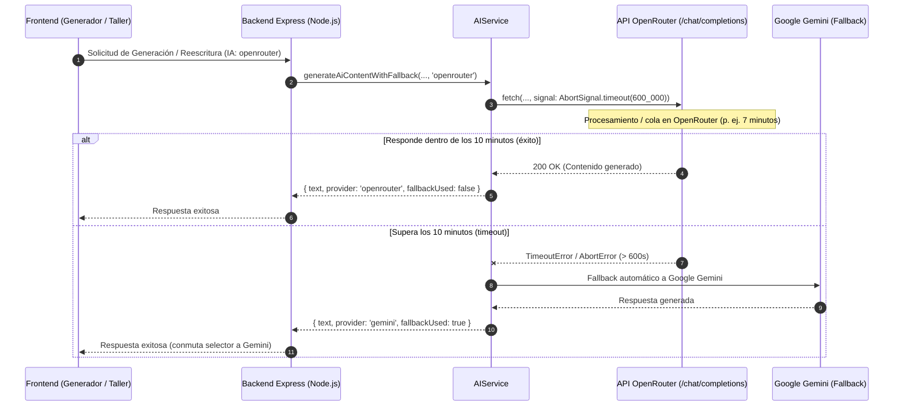

# Tarea 82: Ampliación del Timeout de OpenRouter a 10 Minutos y Ajuste de Servidor HTTP

## Propósito
En entornos reales de generación y reescritura, el tier gratuito de OpenRouter (`openrouter/free`) puede tardar más de 7 minutos en procesar y generar respuestas completas debido a la alta demanda y colas de inferencia en sus proveedores.
El timeout previo de 90 segundos provocaba que peticiones legítimas se abortaran de manera prematura con error de timeout.
Por tanto, se ha ampliado el timeout de OpenRouter a **10 minutos (600.000 ms)** y se ha ajustado el `requestTimeout` del servidor HTTP Node.js para permitir respuestas prolongadas sin cortes de conexión.

---

## Arquitectura y Flujo

---

## Archivos Modificados

1. **`backend/src/services/ai.service.ts`**:
   - `requestOpenRouterApi`: El parámetro por defecto `timeoutMs` pasó de `90_000` a `600_000` (10 minutos).
   - Mensaje de error actualizado a: `Timeout en OpenRouter (10m): el proveedor gratuito no respondió a tiempo`.
2. **`backend/src/server.ts`**:
   - En el arranque del servidor HTTP (`app.listen`), se configuró explícitamente `server.requestTimeout = 660_000` (11 minutos) y `server.headersTimeout = 670_000` para evitar que el timeout por defecto de Node.js (5 minutos) corte peticiones síncronas entrantes como las de reescritura.

---

## Detalles Técnicos y Decisiones de Diseño

1. **`AbortSignal.timeout(600_000)`**:
   - Se emplea la API nativa de Node.js/Web Standards `AbortSignal.timeout`. Esto garantiza que los sockets de red no queden zombis indefinidamente si OpenRouter cae, pero otorga un margen holgado de 10 minutos para absorber las esperas de los modelos gratuitos más lentos.
2. **Coordinación con el Servidor Node.js y Nginx**:
   - Node.js 18+ implementa por defecto un `requestTimeout` de 300 segundos (5 minutos) en el servidor HTTP. Sin el ajuste en `server.ts`, una reescritura síncrona que tardase 7 minutos habría recibido un `ECONNRESET` o `socket hang up` a los 5 minutos. Con `server.requestTimeout = 660_000`, la conexión permanece abierta.
   - Nginx en producción ya cuenta con `proxy_read_timeout 3600s` (1 hora), por lo que no es cuello de botella.
3. **Mecanismo de Resiliencia Intacto**:
   - Si tras los 10 minutos OpenRouter no devuelve respuesta, el fallback hacia Google Gemini se activa de manera limpia y sin bloquear el hilo de ejecución.
