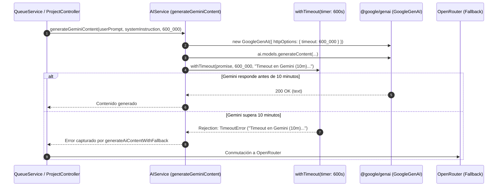

# Tarea 83: Ampliación del Timeout de Gemini a 10 Minutos y Homogeneización de Resiliencia

## Propósito
Homogeneizar el comportamiento de los motores de Inteligencia Artificial en la plataforma dotando a **Google Gemini** de la misma tolerancia de tiempo que a OpenRouter: un límite de **10 minutos (600.000 ms)**.
Esto previene bloqueos indefinidos o desconexiones prematuras en proyectos con gran cantidad de Resultados de Aprendizaje (RAs) o Criterios de Evaluación (CEs), garantizando además que, si Gemini llega al límite de los 10 minutos, se dispare de forma limpia el timeout y se active el fallback automático a OpenRouter.

---

## Arquitectura y Flujo

---

## Archivos Modificados

1. **`backend/src/services/ai.service.ts`**:
   - Se añadió la función modular `withTimeout` (< 15 líneas) que combina `Promise.race` con un temporizador `setTimeout` y limpieza automática del `clearTimeout` en `.finally()`.
   - Se actualizó `generateGeminiContent` para aceptar `timeoutMs = 600_000` (10 minutos por defecto).
   - Se configuró `httpOptions: { timeout: timeoutMs }` en la inicialización de `new GoogleGenAI(...)`.
   - Se aplicó `withTimeout` a la promesa de `ai.models.generateContent`.
   - Se captura `TimeoutError` devolviendo el mensaje homogéneo: `Timeout en Gemini (10m): el proveedor no respondió a tiempo`.
2. **`backend/src/tests/ai.service.test.ts`**:
   - Se agregaron tests unitarios específicos para verificar:
     - El funcionamiento de `generateGeminiContent` ante retrasos superiores al timeout configurado (disparando el `TimeoutError`).
     - La correcta propagación de otros errores no relacionados con timeout.

---

## Detalles Técnicos y Decisiones de Diseño

1. **Doble Capa de Protección contra Bloqueos**:
   - **Capa HTTP del SDK:** Se envía `httpOptions: { timeout: timeoutMs }` a `@google/genai`, lo que indica a las peticiones subyacentes del SDK que aborten si se excede el tiempo.
   - **Capa Runtime con `withTimeout`:** Debido a que clientes externos o SDKs en ocasiones pueden colgarse antes de enviar la petición o en el procesamiento interno, `withTimeout` garantiza a nivel de Event Loop de Node.js que la promesa rechazará de forma no bloqueante tras los 10 minutos exactos.
2. **Sincronización Total del Fallback**:
   - Ambos motores (Gemini y OpenRouter) operan ahora con la misma ventana de 10 minutos y mensajes de timeout estandarizados (`Timeout en Gemini (10m)...` y `Timeout en OpenRouter (10m)...`), permitiendo al servicio de fallback (`generateAiContentWithFallback`) registrar analíticas consistentes y conmutar de uno a otro transparentemente.
