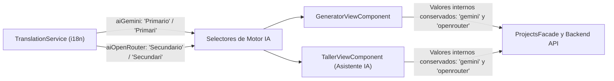

# Tarea 84: Renombrado de Motores IA a "Primario" y "Secundario" en la Interfaz

## Propósito
Simplificar y homogeneizar la denominación de los motores de Inteligencia Artificial que se presentan a los usuarios administradores en los selectores del Generador y del Asistente IA (Taller):
- **Motor principal (Google Gemini):** Renombrado a **"Primario"** (en catalán: **"Primari"**).
- **Motor alternativo (OpenRouter):** Renombrado a **"Secundario"** (en catalán: **"Secundari"**).

---

## Arquitectura y Flujo

Los identificadores y contratos internos de API (`'gemini'` y `'openrouter'`) se mantienen intactos para preservar la compatibilidad con la base de datos, el enrutador de colas y los servicios de backend. La modificación aplica a la capa de presentación mediante el servicio de internacionalización (`TranslationService`).

---

## Archivos Modificados

1. **`frontend/src/app/services/translation.service.ts`**:
   - En el diccionario de **Catalán**:
     - `aiGemini`: `'Primari'`
     - `aiOpenRouter`: `'Secundari'`
   - En el diccionario de **Castellano**:
     - `aiGemini`: `'Primario'`
     - `aiOpenRouter`: `'Secundario'`

---

## Detalles Técnicos y Decisiones de Diseño

1. **Separación entre Clave Interna y Etiqueta Visual**:
   - Las opciones de los selectores mantienen sus valores técnicos (`value="gemini"` y `value="openrouter"`), garantizando que las llamadas a los controladores de backend, las analíticas de telemetría y los modelos en MongoDB no sufran rupturas ni requieran migraciones de datos.
2. **Soporte Bilingüe Homogéneo**:
   - Tanto en catalán como en castellano los términos son concisos, profesionales y autoexplicativos respecto a la jerarquía de fallback automático del sistema.
