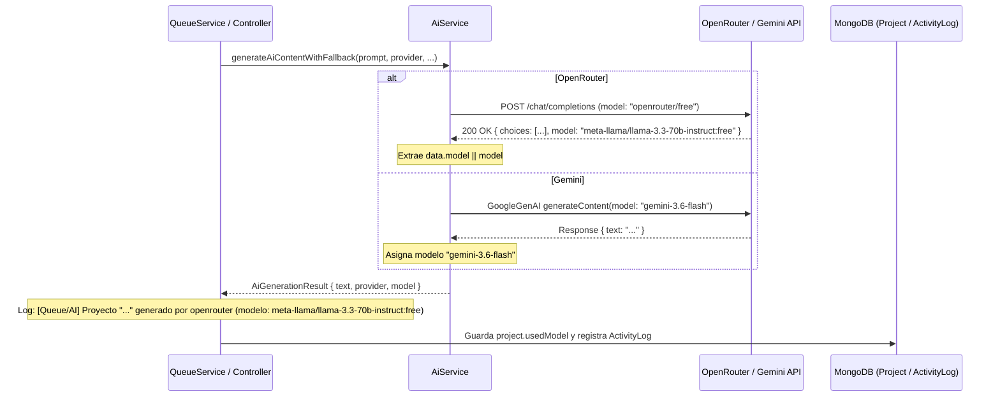

# Tarea 85: Registro del Modelo IA Exacto en Logs y Base de Datos

## Propósito
Registrar en los logs del sistema (y persistir en la base de datos) el modelo de Inteligencia Artificial exacto utilizado para la generación y reescritura de proyectos.
En particular:
- En el caso de **OpenRouter** (`openrouter/free`), extraer el modelo subyacente asignado dinámicamente que reporta el proveedor en el campo `model` de su respuesta JSON (por ejemplo, `meta-llama/llama-3.3-70b-instruct:free`).
- En el caso de **Gemini**, registrar el modelo específico en ejecución (`gemini-3.6-flash`).
- Reflejar esta información de forma transparente en los logs de consola de `ai.service`, `queue.service` y `project.controller`, así como en `usedModel` dentro de la colección `Project` y `ActivityLog`.

---

## Arquitectura y Flujo

---

## Archivos Modificados

1. **`backend/src/models/Project.ts`**:
   - Incorporado el campo `usedModel?: string` al esquema de MongoDB para almacenar el modelo concreto con el que se generó el proyecto.
2. **`backend/src/services/ai.service.ts`**:
   - Introducida la interfaz interna `SingleAiResult { text: string; model: string }`.
   - Modificado `generateGeminiContent` para retornar `{ text, model: 'gemini-3.6-flash' }`.
   - Modificado `generateOpenRouterContent` para extraer `data.model || model` del payload devuelto por OpenRouter y retornar `{ text, model }`.
   - Actualizada la interfaz `AiGenerationResult` con la propiedad obligatoria `model: string`.
   - Ajustado `generateAiContentWithFallback` para registrar en consola: `[AI Service] Respuesta obtenida de <provider> (modelo exacto: <model>)`.
3. **`backend/src/services/queue.service.ts`**:
   - `handleProjectSuccess` recibe el argumento opcional `model?: string`, almacena `project.usedModel = model` en el documento y lo persiste en `ActivityLog`.
   - Log enriquecido: `[Queue/AI] Proyecto "<title>" (<id>) generado por <provider> [modelo: <model>]...`.
   - `executeProjectGeneration` pasa `result.model` a `handleProjectSuccess`.
4. **`backend/src/controllers/project.controller.ts`**:
   - En `rewriteSection`: loguea `[Project/Rewrite] Reescritura completada con proveedor <provider> (modelo: <model>)` y devuelve `model: result.model` en la respuesta JSON.
5. **`backend/src/tests/ai.service.test.ts`**:
   - Pruebas unitarias actualizadas para validar que `generateGeminiContent` y `generateOpenRouterContent` devuelven el modelo exacto (incluyendo fallback a model especificado si `data.model` no viniese).
6. **`backend/src/tests/queue.service.test.ts`**:
   - Comprobaciones añadidas para validar la persistencia de `usedModel` en el proyecto y el formato de los logs en la cola.
7. **`backend/src/tests/projects.test.ts`**:
   - Comprobación de que el endpoint `/api/projects/rewrite` retorna el campo `model`.

---

## Detalles Técnicos y Decisiones de Diseño

1. **Extracción Dinámica del Modelo en OpenRouter**:
   - La API de OpenRouter redirige la petición de `openrouter/free` al modelo gratuito disponible con mejor latencia o cuota en ese instante (ej. `meta-llama/llama-3.3-70b-instruct:free`, `mistralai/mistral-7b-instruct:free`, etc.). El cuerpo JSON de respuesta siempre incluye `model: "<id-real>"`. Al capturar `data.model`, se audita con precisión quirúrgica qué LLM fue el autor de cada generación.
2. **Propagación Limpia sin Romper Interfaces**:
   - Se tiparon las estructuras intermedias (`SingleAiResult` y `AiGenerationResult`) asegurando consistencia estricta en TypeScript sin superar los límites de 25 líneas por método.
3. **Trazabilidad Completa**:
   - Los registros se reflejan en tiempo real en consola para monitorización de operaciones (`stdout`), y quedan guardados tanto en el proyecto como en el historial de actividades para auditorías posteriores.
