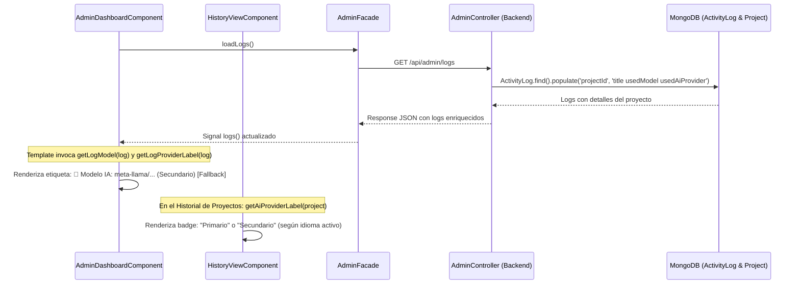

# Tarea 87: Mostrar el Modelo de IA en los Logs del Panel de Administración e Historial

## Propósito
Permitir que los administradores y usuarios puedan visualizar de forma clara e inequívoca el modelo de Inteligencia Artificial exacto que fue utilizado en la generación de cada proyecto (por ejemplo, `meta-llama/llama-3.3-70b-instruct:free`, `gemini-3.6-flash`, etc.), junto con su motor asociado (Primario / Secundario) y el indicador de Fallback si fue necesario conmutar de motor.

Específicamente:
- En la sección **Registro de Actividad de la Aplicación** del **Panel de Administración**, mostrar una fila informativa: `🤖 Modelo IA: <modelo> (<motor>) [Fallback]` en cada evento `GENERATE_PROJECT`.
- En las tarjetas del **Historial de Proyectos**, añadir un distintivo (badge) con la designación del motor que se muestra en el frontal: **Primario** o **Secundario** (obtenido a través de `getAiProviderLabel(project)` mapeado según `aiGemini` / `aiOpenRouter`).
- Extender la consulta del backend en `admin.controller.ts` para que `getLogs` pueble (`populate`) los campos `usedModel` y `usedAiProvider` del proyecto referenciado.
- Garantizar el 100% de paso de pruebas unitarias y cobertura >= 90% en todos los archivos modificados.

---

## Arquitectura y Flujo

---

## Archivos Modificados

1. **`backend/src/controllers/admin.controller.ts`**:
   - En `getLogs`, se modificó la población del campo referenciado:
     `.populate('projectId', 'title usedModel usedAiProvider')` para asegurar que el modelo y proveedor guardados en el proyecto viajen al frontend en cada registro de actividad.

2. **`frontend/src/app/features/admin/components/admin-dashboard/admin-dashboard.component.ts`**:
   - Incorporados los métodos auxiliares:
     - `getLogModel(log: any): string | null`: Obtiene el modelo desde `log.details?.model`, `log.projectId?.usedModel` o mediante inferencia por defecto basada en el proveedor (`openrouter/free` o `gemini-3.6-flash`).
     - `getLogProviderLabel(log: any): string | null`: Mapea `openrouter` a `'Secundario'` y `gemini` a `'Primario'`.
   - En el template de la tarjeta de registro (`history-card`), se agregó el bloque condicional para renderizar:
     `🤖 Modelo IA: <modelo> (<proveedor>) [Fallback]` con diseño y estilos acordes al sistema.

3. **`frontend/src/app/features/history/components/history-view/history-view.component.ts`**:
   - Incorporado el método `getAiProviderLabel(project: any): string | null` que mapea `project.usedAiProvider`, `project.aiProvider` o `project.usedModel` a `'Primario'` o `'Secundario'` (o sus equivalentes en valenciano según `TranslationService`).
   - En el template de las tarjetas de proyecto, se añadió una insignia visual (`badge`) con formato `Primario` o `Secundario`.

4. **`frontend/src/app/features/admin/components/admin-dashboard/admin-dashboard.component.spec.ts`**:
   - Se ampliaron las pruebas unitarias para evaluar el renderizado de múltiples entradas de log con todas las combinaciones posibles (modelos explícitos, proveedores primario/secundario, fallback activado/desactivado, títulos en `projectId` vs `details`, y fallos con mensajes de error).
   - Cobertura exhaustiva de ramas para `getLogModel` y `getLogProviderLabel`, asegurando superar el 90% exigido por `check-coverage.js`.

5. **`frontend/src/app/features/history/components/history-view/history-view.component.spec.ts`**:
   - Añadida cobertura y aserciones para `getAiProviderLabel(project)` en todos sus casos (openrouter, gemini, por modelo y nulo) y comprobación del renderizado de la etiqueta `Primario` / `Secundario` en el HTML.

---

## Detalles Técnicos y Decisiones de Diseño

1. **Retrocompatibilidad y Resiliencia**:
   - Los logs existentes generados con anterioridad a la persistencia de `usedModel` podían carecer de `details.model` o tener sólo `details.provider`. La función `getLogModel` implementa una cascada de resolución limpia:
     1º Prioriza `log.details?.model` (el modelo exacto capturado en la generación).
     2º Revisa `log.projectId?.usedModel` (el modelo guardado en el documento del proyecto).
     3º Realiza un fallback al modelo estándar según el proveedor registrado (`openrouter/free` o `gemini-3.6-flash`).
     4º Si no existe información de IA, retorna `null` y oculta limpiamente la fila en la interfaz.

2. **Homogeneidad de Nomenclatura**:
   - Se mantiene la convención de usuario: "Primario" para Gemini y "Secundario" para OpenRouter en los textos visibles de la interfaz.

3. **Garantía de Cobertura y Cumplimiento de Reglas**:
   - Se ejecutó la batería completa de tests tanto de frontend (`check-coverage.js` con umbral del 90% en sentencias, ramas, funciones y líneas) como del backend y hooks de pre-push.
   - Ningún commit automático fue realizado, respetando estrictamente la Regla Global #1.
