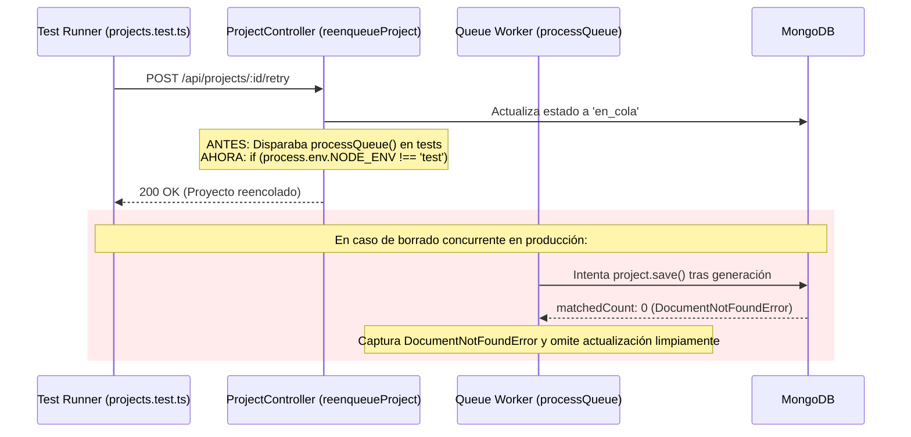

# Tarea 88: Corrección de DocumentNotFoundError en Queue Worker tras Reintentos

## Propósito
Subsanar el error `DocumentNotFoundError: No document found for query "{ _id: ... }" on model "Project"` generado por el worker de colas (`queue.service.ts`) durante la ejecución de tests en `src/tests/projects.test.ts`.

El error se manifestaba por la salida estándar de error (`stderr`) al ejecutarse los tests del endpoint `POST /api/projects/:id/retry`:
```
Error in Queue Worker: DocumentNotFoundError: No document found for query "{ _id: new ObjectId('...') }" on model "Project"
    at model.$__save (mongoose/lib/model.js)
    at saveProjectError (src/services/queue.service.ts)
    at handleProjectError (src/services/queue.service.ts)
    at executeProjectGeneration (src/services/queue.service.ts)
    at processQueue (src/services/queue.service.ts)
```

---

## Causa Raíz y Arquitectura

1. **Condición de Carrera en Entorno de Pruebas**:
   - En `project.controller.ts`, la función `generateProject` contaba con la salvaguarda `if (process.env.NODE_ENV !== 'test') processQueue().catch(...)`.
   - Sin embargo, la función `reenqueueProject` (invocada al llamar a `POST /api/projects/:id/retry`) ejecutaba `processQueue().catch(console.error)` de forma incondicional sin verificar el entorno `test`.
   - Como resultado, el worker asíncrono se ponía en marcha en segundo plano. Mientras el worker intentaba contactar con el proveedor de IA o resolver el fallo, el framework de tests pasaba al siguiente test y ejecutaba el hook de limpieza `beforeEach(async () => await clearDB())`, eliminando todas las colecciones de la base de datos de test en memoria.
   - Cuando el worker finalizaba la ejecución e intentaba persistir el resultado con `project.save()` (ya sea en `saveProjectSuccess` o en `saveProjectError`), Mongoose realizaba un `updateOne` esperando encontrar el documento. Al estar borrado (`matchedCount: 0`), lanzaba la excepción `DocumentNotFoundError`.

2. **Resiliencia en Producción ante Borrado Concurrente**:
   - Este mismo escenario podría ocurrir en producción si un usuario solicita eliminar un proyecto (`DELETE /api/projects/:id`) mientras dicho proyecto se está generando en segundo plano en la cola.



---

## Archivos Modificados

1. **`backend/src/controllers/project.controller.ts`**:
   - En `reenqueueProject`, se añadió la guarda `if (process.env.NODE_ENV !== 'test')` para no activar el worker en segundo plano de forma descontrolada durante la suite de pruebas unitarias/integración.

2. **`backend/src/services/queue.service.ts`**:
   - En `saveProjectSuccess` y `saveProjectError`, se implementó captura defensiva de `DocumentNotFoundError`: si el documento ha sido eliminado por el usuario durante la generación, la función registra un aviso y retorna `false`, evitando que `notifyProjectSuccess` / `notifyProjectError` intenten notificar sobre un proyecto inexistente o que la cola falle con errores no controlados.
   - Se refactorizaron ambas funciones utilizando `Object.assign` para mantener el código conciso y cumplir el límite estricto de menos de 25 líneas por método.

---

## Verificación

- Ejecución de `npx vitest run src/tests/projects.test.ts --reporter=verbose`: Todos los 23 tests pasan sin advertencias ni trazas de error de base de datos en `stderr`.
- Ejecución completa de la suite del backend (`npm test`): 14 suites pasadas, 99 tests superados y cobertura superior al 90%.
