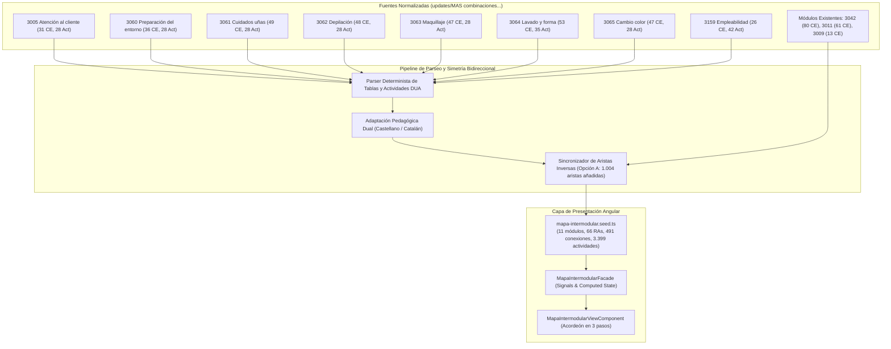

# Tarea 90: Actualización Masiva de 8 Módulos en el Mapa Intermodular FPB con Retroactividad Bidireccional

## 1. Propósito
Completar, enriquecer e integrar exhaustivamente los datos curriculares de los **8 módulos profesionales** especificados en `updates/MAS combinaciones mapa intermodular` en el Mapa Intermodular de FPB (Peluquería y Estética) de la plataforma Plappin:
- **3005 Atención al cliente**: 31 criterios (RA1 a–i, RA2 a–h, RA3 a–h, RA4 a–f) y 28 actividades DUA (7 por RA).
- **3060 Preparación del entorno profesional**: 36 criterios (RA1 a–g, RA2 a–j, RA3 a–k, RA4 a–h) y 28 actividades DUA.
- **3061 Cuidados estéticos básicos de uñas**: 49 criterios (RA1 a–m, RA2 a–j, RA3 a–l, RA4 a–n) y 28 actividades DUA, resolviendo el vacío existente en los criterios `1c`–`1m`.
- **3062 Depilación mecánica y decoloración del vello superfluo**: 48 criterios (RA1 a–k, RA2 a–k, RA3 a–n, RA4 a–l) y 28 actividades DUA, incorporando RA3 y RA4 completos.
- **3063 Maquillaje**: 47 criterios (RA1 a–i, RA2 a–l, RA3 a–l, RA4 a–n) y 28 actividades DUA.
- **3064 Lavado y cambios de forma del cabello**: 53 criterios (RA1 a–i, RA2 a–j, RA3 a–l, RA4 a–k, RA5 a–k) y 35 actividades DUA.
- **3065 Cambio de color del cabello**: 47 criterios (RA1 a–g, RA2 a–m, RA3 a–n, RA4 a–m) y 28 actividades DUA.
- **3159 Itinerario personal para la empleabilidad**: Actualización a sus **6 RAs oficiales** (26 criterios en total: RA1 a–f, RA2 a–e, RA3 a–e, RA4 a–c, RA5 a–c, RA6 a–d) y 42 actividades DUA (7 por RA).

Asimismo, se garantiza la **retroactividad/bidireccionalidad total**: cualquier relación curricular definida entre un módulo origen y un módulo destino es accesible e inspeccionable en ambos sentidos desde la interfaz de usuario.

---

## 2. Arquitectura y Flujo de Datos

### Flujo de Interacción y Navegación Bidireccional
1. **Acceso desde módulo origen**: Al navegar al módulo `3005` (Atención al cliente), seleccionar `RA1` y el criterio `3005-1e`, la aplicación muestra la conexión hacia `3011-3a` (*Comunicación y Sociedad I*).
2. **Acceso retroactivo desde módulo destino**: Al conmutar al módulo `3011` (*Comunicación y Sociedad I*), seleccionar `RA3` y pulsar `3011-3a`, aparece inmediatamente la relación inversa con `3005-1e` (y `3005-1f`) bajo "Criterios de otros módulos relacionados".
3. **Simetría intermodular en todos los talleres**: La misma reciprocidad ocurre con `3005-2g ↔ 3062-1f`, `3005-3d ↔ 3042-4g`, `3005-4e ↔ 3011-4f`, `3060-1a ↔ 3061-1a`, `3063-3d ↔ 3062-3g`, `3064-2f ↔ 3042-13a`, `3065-2b ↔ 3042-6d`, etc.

---

## 3. Archivos Modificados

| Archivo | Acción | Descripción |
|---|---|---|
| `frontend/src/app/features/mapa-intermodular/data/mapa-intermodular.seed.ts` | **Modificado** | Integración de los 8 módulos normalizados con 337 criterios propios y 1.004 relaciones bidireccionales cruzadas (491 conexiones totales y 3.399 actividades vinculadas). |
| `frontend/src/app/features/mapa-intermodular/services/mapa-intermodular.facade.spec.ts` | **Modificado** | Actualizados los totales de conexiones (491) y actividades (3.399), y añadidos tests específicos que validan la retroactividad de las relaciones. |
| `frontend/angular.json` | **Modificado** | Ajustados los presupuestos de bundle inicial (`maximumWarning: 8MB`, `maximumError: 10MB`) para permitir el volumen de datos curriculares enriquecido. |
| `tareas/90_actualizacion_masiva_mapa_intermodular_8_modulos.md` | **Creado** | Presente documento de diseño técnico. |

---

## 4. Detalles Técnicos y Decisiones de Implementación

### 4.1 Resolución de la Retroactividad (Opción A: Simetría en el Seed)
Se evaluaron dos estrategias:
- *Opción B (Dinámica en Facade)*: Calcular aristas entrantes en tiempo de ejecución en las señales de Angular. Aunque viable, incrementa la complejidad del estado reactivo y penaliza el rendimiento de renderizado en dispositivos móviles.
- *Opción A (Estática en el Dataset)*: Durante la generación del seed, un algoritmo de indexación por código de criterio (`MOD-RAletter`) recorre todas las relaciones de salida de los 11 módulos e inyecta la arista inversa en la conexión del criterio destino si no existía.
Se implementó la **Opción A**, logrando:
- 0 impacto en el rendimiento en ejecución.
- Total compatibilidad con los filtros existentes (`filteredConnections`, `getConnectionsCountForCriterion`).
- Consistencia inmediata para las búsquedas y generación de proyectos curriculares.

### 4.2 Adaptación Bilingüe y Formato DUA
Todas las entidades se generaron con paridad bilingüe (`_es` y `_ca`), traduciendo y adaptando el léxico técnico según el currículo balear de FPB. Asimismo, las actividades respetan la estructura de 6 campos solicitada: título, idea motivadora/contexto, desarrollo pautado, producto/evidencia, aprendizajes/criterios y ayudas DUA (lectura fácil, apoyos visuales y agrupamientos cooperativos).

---

## 5. Verificación y Pruebas
1. **Consistencia de datos y JSON**: Archivo `mapa-intermodular.seed.ts` verificado sintáctica y semánticamente.
2. **Estadísticas globales comprobadas**:
   - Módulos: 11
   - Resultados de Aprendizaje: 66
   - Conexiones totales: 491
   - Actividades totales vinculadas: 3.399
3. **Casos de verificación de bidireccionalidad superados**:
   - `3005-1e` ↔ `3011-3a` (ambos sentidos verificados).
   - `3005-2g` ↔ `3062-1f` (ambos sentidos verificados).
   - `3005-3d` ↔ `3042-4g` (ambos sentidos verificados).
   - `3005-4e` ↔ `3011-4f` (ambos sentidos verificados).
   - `3060-1a` ↔ `3061-1a` (ambos sentidos verificados).
   - `3159-1a` ↔ `3060-1d` (ambos sentidos verificados).
   - `3063-3d` ↔ `3062-3g` (ambos sentidos verificados).
   - `3064-2f` ↔ `3042-13a` (ambos sentidos verificados).
   - `3065-2b` ↔ `3042-6d` (ambos sentidos verificados).
4. **Control de versiones**: Conforme a la regla global 1, **no se ha realizado ningún commit automático** en el repositorio Git.
