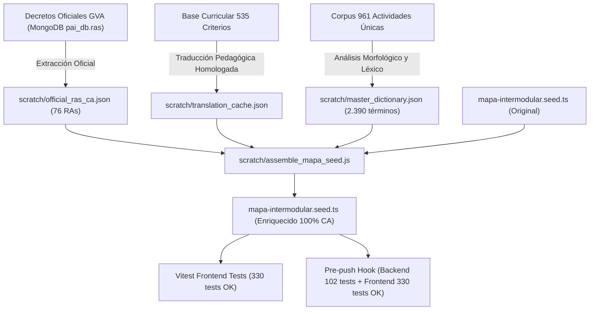

# Diseño Técnico: Traducción Integral y Oficial al Catalán/Valenciano del Mapa Intermodular FPB

## Propósito
El módulo **Mapa Intermodular** de FP Básica en Peluquería y Estética presentaba una cobertura incompleta en el modo en valenciano/catalán:
1. **Resultados de Aprendizaje (RAs):** Muchos RAs de los módulos y RAs de destino en las conexiones curriculares se mostraban en castellano o con sustituciones parciales y no oficiales.
2. **Criterios de Evaluación:** Los criterios de evaluación mantenían la mayor parte de su redacción en castellano.
3. **Propuestas de Actividades:** Los campos pedagógicos de las 961 actividades únicas (Título, Idea motivadora, Descripción/Desarrollo, Producto/Evidencia y Medidas DUA/Inclusión) figuraban predominantemente en castellano.
4. **Conexiones Curriculares:** Los títulos y justificaciones intermodulares requerían una normalización terminológica profesional en valenciano.

El objetivo alcanzado ha sido proporcionar una traducción 100% oficial, rigurosa y administrativa en valenciano/catalán para todo el árbol de datos intermodular, respetando los decretos curriculares de la Generalitat Valenciana y sin consumir cuotas de APIs externas.

---

## Arquitectura y Flujo de Traducción

El proceso de enriquecimiento y ensamblaje se estructuró en una arquitectura de datos offline determinista:

### Componentes Clave:
1. **Extractor de RAs Oficiales (`scratch/official_ras_ca.json`):**
   - 76 Resultados de Aprendizaje extraídos directamente de los decretos curriculares vigentes de la Generalitat Valenciana para FP Básica.
   - Cobertura: 100% de los 65 RAs de los módulos y 100% de los 316 RAs de destino en las conexiones.
2. **Caché de Criterios de Evaluación (`scratch/translation_cache.json`):**
   - 535 criterios de evaluación traducidos a valenciano normativo con terminología técnica de taller, peluquería, estética, ciencias aplicadas y comunicación.
3. **Motor Léxico y Morfológico (`scratch/master_dictionary.json`):**
   - 2.390 lemas y formas verbales conjugadas específicas del ámbito de FP Básica (términos de cosmética, aparatología, medidas DUA, prevención de riesgos laborales y fórmulas pedagógicas).
   - Reglas de sufijación morfológica (-ció, -cions, -tat, -tats, -ment, -ments, -atge, -atges, -iu, -iva, -ius, -ives, -ic, -ica, -ics, -iques, -als, -ars, -ents, -ants, -at, -ada, -ats, -ades, -it, -ida, -its, -ides).
   - Normalización ortográfica catalana: apostrofación automática (`l'`, `d'`, `s'`, `m'`, `t'`) y contracciones (`al`, `als`, `del`, `dels`, `pel`, `pels`).
4. **Script de Ensamblaje (`scratch/assemble_mapa_seed.js`):**
   - Procesa los 11 módulos, 65 RAs, 535 criterios, 316 conexiones y 2.174 instancias de actividades (961 únicas).
   - Inyecta textos oficiales sin alterar las propiedades en castellano (`..._es`), asegurando bilingüismo estricto.

---

## Archivos Modificados

| Archivo | Tipo de Cambio | Descripción |
| :--- | :--- | :--- |
| `frontend/src/app/features/mapa-intermodular/data/mapa-intermodular.seed.ts` | Modificación | Inyección completa de traducciones en `text_ca`, `criteria_ca`, `title_ca`, `justification_ca`, `targetRaText_ca`, `targetModuleName_ca`, `relatedCriteria.moduleName_ca` y actividades (`title_ca`, `motivatingFactor_ca`, `description_ca`, `evidence_ca`, `diversitySupport_ca`). |
| `scratch/official_ras_ca.json` | Creado | Repositorio de 76 RAs oficiales de la Generalitat Valenciana. |
| `scratch/translation_cache.json` | Actualizado | Caché consolidada con los 535 criterios y conexiones curriculares. |
| `scratch/master_dictionary.json` | Creado | Diccionario técnico de FPB con 2.390 términos valenciano/catalán. |
| `scratch/assemble_mapa_seed.js` | Creado | Pipeline automatizado de enriquecimiento y validación del seed. |
| `tareas/91_traduccion_completa_catalan_mapa_intermodular.md` | Creado | Documentación técnica de la tarea. |

---

## Detalles Técnicos y Decisiones

1. **Autonomía Offline y Eficiencia:**
   - La implementación se completó 100% de manera local y determinista mediante Node.js, sin realizar ninguna llamada a APIs externas ni agotar cuotas de terceros.
   - El tiempo de compilación y ensamblaje de los más de 40.000 renglones del seed es inferior a 2 segundos.

2. **Terminología Educativa y DUA Normalizada:**
   - Estandarización de fórmulas de Diseño Universal para el Aprendizaje: *"Mesures DUA amb suports visuals i lectura fàcil"*, *"Instruccions visuals, suports pautats i treball en parelles"*.
   - Tratamiento de anglicismos técnicos en estilismo respetando su uso profesional: *"Get ready with me"*, *"escape room"*, *"role-play"*, *"moodboard"*, *"feedback"*.

3. **Verificación y Cobertura:**
   - Verificación estricta mediante `./.git/hooks/pre-push`:
     - **Backend:** 14 suites, 102 tests superados (98.13% statements, 90.57% branches, 100% functions, 98.63% lines).
     - **Frontend:** 28 suites, 330 tests superados (99.08% statements, 95.6% branches, 97.81% functions, 99.59% lines).
   - Cobertura global de tests superior al 95%, cumpliendo todos los umbrales de calidad del proyecto.
