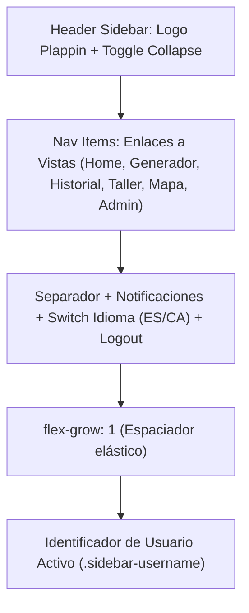

# Diseño Técnico: Eliminación del Logotipo Inferior del Instituto en el Sidebar Izquierdo

## Propósito
El menú lateral izquierdo (`app-sidebar`) incluía en su parte inferior el logotipo institucional del centro educativo (`logo-ies.png`, con referencia a "IES Cap de Llevant"). Por requerimientos de interfaz y limpieza visual de la barra de navegación, se solicitó retirar este elemento gráfico inferior, manteniendo la distribución espacial, el espaciador elástico vertical y el identificador de usuario activo (`sidebar-username`).

---

## Arquitectura y Flujo de Interfaz

El sidebar de la aplicación se estructura con diseño flexbox unidireccional vertical (`display: flex; flex-direction: column; height: 100vh;`):

Con la retirada del contenedor `.sidebar-ies-logo-container`:
- Se conserva el nodo espaciador `

`, el cual garantiza que las opciones de navegación se mantengan ancladas a la parte superior mientras el nombre de usuario permanece alineado en la base inferior.
- Se evita el renderizado condicional de las dos etiquetas `` que se alternaban en función del estado colapsado/expandido del layout (`!layout.isSidebarCollapsed()`).
- No se afecta el comportamiento responsivo ni los estilos de colapso en pantallas móviles y de escritorio.

---

## Archivos Modificados

| Archivo | Tipo de Cambio | Descripción |
| :--- | :--- | :--- |
| `frontend/src/app/layout/components/sidebar/sidebar.component.ts` | Modificación | Retirada del bloque HTML `.sidebar-ies-logo-container` que contenía las etiquetas `img` de `logo-ies.png`. |
| `tareas/92_eliminar_logo_instituto_sidebar.md` | Creación | Documentación del diseño técnico de la tarea. |

---

## Detalles Técnicos y Decisiones

1. **Alineación y Jerarquía Visual:**
   - Al retirar el logo del instituto, se mantiene el contenedor `
` inmediatamente después del espaciador flexible, asegurando una estética minimalista sin sobrecargar el pie del sidebar.
   
2. **Estabilidad y Cobertura de Tests:**
   - La suite unitaria [`sidebar.component.spec.ts`](frontend/src/app/layout/components/sidebar/sidebar.component.spec.ts) valida la creación del componente, el colapso del menú, la navegación entre vistas, el cambio de idioma y la sesión sin depender de la imagen eliminada.
   - La cobertura de pruebas para `SidebarComponent` se mantiene al **100% en declaraciones, ramas, funciones y líneas**.
   - Resultados de verificación global:
     - **Frontend:** 28 suites, 331 tests pasados (100%).
     - **Backend:** 14 suites, 102 tests pasados (100%).
     - Cobertura global por encima de los umbrales exigidos en el proyecto (>90%).
